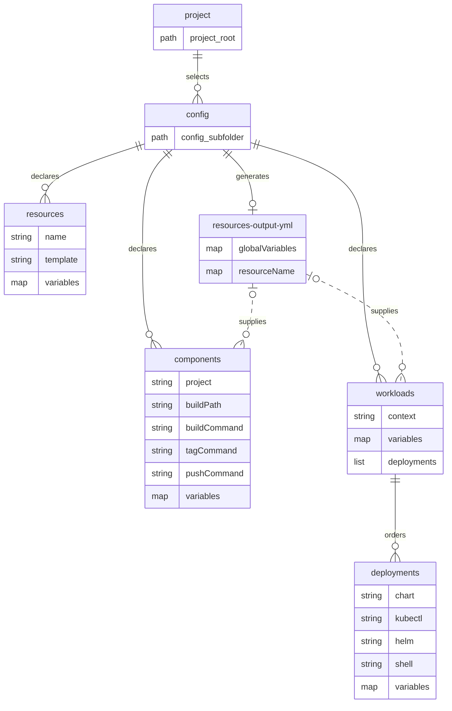
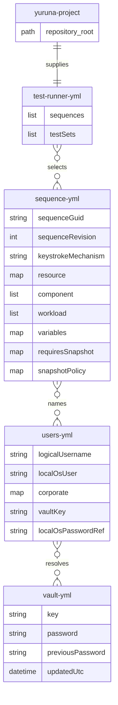

# Configuration data model

These views describe the project configuration records, generated outputs, and separate test identities consumed by the current engine.

The entities represent filesystem scopes and YAML records, not database tables.
Paths and dynamic mapping keys are identified in the prose below; cardinalities
show containment and references. See [Architecture](../architecture.md) for the
phase model.

## Project deployment records

```mermaid
erDiagram
    project ||--o{ config : selects
    config ||--o{ resources : declares
    config ||--o{ components : declares
    config ||--o{ workloads : declares
    config ||--o| resources-output-yml : generates
    workloads ||--o{ deployments : orders
    %% optional: later phases consume resource outputs when the file exists.
    resources-output-yml |o..o{ components : supplies
    resources-output-yml |o..o{ workloads : supplies
    project {
        path project_root
    }
    config {
        path config_subfolder
    }
    resources {
        string name
        string template
        map variables
    }
    components {
        string project
        string buildPath
        string buildCommand
        string tagCommand
        string pushCommand
        map variables
    }
    workloads {
        string context
        map variables
        list deployments
    }
    deployments {
        string chart
        string kubectl
        string helm
        string shell
        map variables
    }
    resources-output-yml {
        map globalVariables
        map resourceName
    }
```

This seven-entity view groups each phase document with its list entries.
`resources`, `components`, and `workloads` show entry fields; each corresponding
YAML document can also contain `globalVariables`. A deployment contains one
registered kind (`chart`, `kubectl`, `helm`, or `shell`), rather than all four.
`resourceName` denotes a dynamic output key derived from `resources[].name`;
it is not a literal required field. Each resource's OpenTofu outputs retain
objects containing their `value`.

Sources: [Yuruna.Resource](../../automation/Yuruna.Resource.psm1),
[Yuruna.Component](../../automation/Yuruna.Component.psm1),
[Yuruna.Workload](../../automation/Yuruna.Workload.psm1),
[Yuruna.Validation](../../automation/Yuruna.Validation.psm1),
[Yuruna.VariableExpansion](../../automation/Yuruna.VariableExpansion.psm1), and
[Yuruna.DeploymentKind](../../automation/Yuruna.DeploymentKind.psm1).
The companion repository supplies the concrete
[template configuration](https://github.com/alissonsol/yuruna-project/tree/main/template/config/localhost)
and website
[resources.yml](https://github.com/alissonsol/yuruna-project/blob/main/example/website/config/localhost/resources.yml),
[components.yml](https://github.com/alissonsol/yuruna-project/blob/main/example/website/config/localhost/components.yml), and
[workloads.yml](https://github.com/alissonsol/yuruna-project/blob/main/example/website/config/localhost/workloads.yml).

| Reference | Resolution in the engine |
| --- | --- |
| `project_root` | Selects a project root such as `example/website/` or `template/` in the companion repository. The template is itself a project root. |
| `config_subfolder` | Selects `config/<config_subfolder>/` below that root. Website configurations exist for `localhost`, `aws`, and `azure`; the template contains `localhost`. |
| `resources[].template` | Resolves project `resources/<template>/` first, then framework `global/resources/<template>/`. An empty template names an existing resource. |
| `resources[].name` | Becomes the expanded output key and `.yuruna/<config>/resources/<name>/` work-folder name. |
| `components[].project` / `buildPath` | Identifies the component and selects `components/<buildPath>/`; an omitted `buildPath` defaults to `project`. |
| Component commands | `buildCommand`, `tagCommand`, and `pushCommand` use direct entry fields with phase-global fallbacks. `preProcessor` and `postProcessor` come from merged variables, including `components[].variables`. |
| `workloads[].context` | Selects a Kubernetes context; the module restores the caller's original context afterward. |
| `deployments[].chart` | Selects `workloads/<chart>/`; `variables.installName` names the Helm installation and its work folder. |

Component variables combine resource output globals and resource-qualified
outputs, component-document globals, and component variables, in that order.
Workload deployments add workload-document globals, workload variables, and
finally deployment variables over resource outputs. Later layers override
matching names. Resource output values are exposed through names such as
`<resource-name>.<output-name>`.

`config/<config>/resources.output.yml` records ownership before an apply can
partially create infrastructure, so a resource entry may initially be empty.
The [cleanup module](../../automation/Yuruna.Clear.psm1) uses this manifest and
resource work folders to find managed resources; the existence of the manifest
alone does not mean all output values are available.

The current [resource templates](../../global/resources/) and
[website configurations](https://github.com/alissonsol/yuruna-project/tree/main/example/website/config)
cover localhost, AWS, and Azure. GCP deployment templates and project
configuration are planned, with no implemented resource/configuration path to
include in this model. Google Artifact Registry authentication is already
implemented separately, as described below.

## Test sequences and identities

```mermaid
erDiagram
    yuruna-project ||--|| test-runner-yml : supplies
    test-runner-yml }o..o{ sequence-yml : selects
    sequence-yml }o..o{ users-yml : names
    users-yml }o..o{ vault-yml : resolves
    yuruna-project {
        path repository_root
    }
    test-runner-yml {
        list sequences
        list testSets
    }
    sequence-yml {
        string sequenceGuid
        int sequenceRevision
        string keystrokeMechanism
        map resource
        list component
        list workload
        map variables
        map requiresSnapshot
        map snapshotPolicy
    }
    users-yml {
        string logicalUsername
        string localOsUser
        map corporate
        string vaultKey
        string localOsPasswordRef
    }
    vault-yml {
        string key
        string password
        string previousPassword
        datetime updatedUtc
    }
```

This five-entity view separates harness credentials from deployment data.
Sources: the companion [cycle plan](https://github.com/alissonsol/yuruna-project/blob/main/test/test.runner.yml)
and [website sequences](https://github.com/alissonsol/yuruna-project/tree/main/example/website/test),
framework [sequence resolver](../../test/modules/Test.SequenceResolve.psm1),
[sequence schema](../../test/schemas/sequence.schema.yml),
[users schema](../../test/schemas/users.schema.yml),
[vault schema](../../test/schemas/vault.schema.yml), and
[authentication extension](../../test/extension/authentication/default.psm1).

The repository-level `test/test.runner.yml` selects named sequences and groups
alternative selections in `testSets`. `sequenceGuid` is a persistent identity;
`sequenceRevision` identifies the sequence's shape. Sequence `resource`,
`component`, and `workload` sections describe test prerequisites and actions,
and are distinct from the three deployment configuration files.
`keystrokeMechanism` chooses `gui` or `ssh`. Optional `requiresSnapshot` selects
a saved disk snapshot, while `snapshotPolicy` adds age and provenance rules.

`logicalUsername` and `key` denote mapping keys beneath `users`, rather than
literal record fields. Sequence expressions such as
`${ext:authentication.GetPassword(${username})}` resolve logical identities
through the authentication extension. `vaultKey` chooses a login password;
`localOsPasswordRef` can choose a different secret for the local guest account.
An explicit reference must resolve to an existing secret. The `strict` setting
belongs to the users document and controls validation of active identities and
references.

The extension resolves runtime files under
`test/status/extension/authentication/users.yml` and `vault.yml` in the framework
checkout. These files are separate from the companion project's deployment
configuration. This view describes their schema without including secret values.

Registry authentication is another boundary:
[Yuruna.Component.Registry](../../automation/Yuruna.Component.Registry.psm1)
uses [Yuruna.CredentialProvider](../../automation/Yuruna.CredentialProvider.psm1)
for Azure ACR, AWS ECR, Google Artifact Registry, Docker Hub, or generic Docker
registries. It uses the selected provider's CLI/environment credentials, without
implicitly loading the harness vault. Configured workload commands can create
Kubernetes Secrets, as the website workloads demonstrate.

[Start-ConfigService](../../test/service/Start-ConfigService.ps1) also resolves
pool and stash storage passwords through the harness vault. It combines them
with `networkStorage` paths and usernames from `test.config.yml` and serves them
over the authenticated guest channel shown in [Deployment](06-deployment.md).

---

[Architecture](../architecture.md) | [Design overview](README.md)
