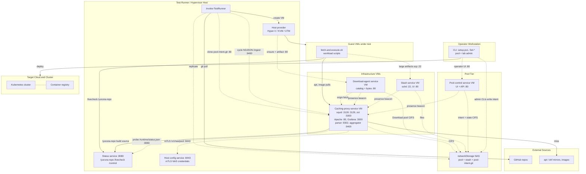

# Deployment topology

> One sentence: how the parts run and talk over the network when fully
> deployed, grouped into seven network nodes.

See [Design overview](00-index.md) · [Yuruna Architecture](../architecture.md).

Derived from `test/Invoke-TestRunner.ps1`, the
`test/Start-{StatusService,ConfigService}.ps1` and
`test/Start-{CachingProxyServiceVM,StashServiceVM,PoolControlServiceVM,DownloadAgentServiceVM}.ps1`
scripts,
`host/vmconfig/{caching-proxy-service,stash-service,pool-control-service,download-agent-service}.base.user-data`,
`test/extension/{pool-aggregator-service,pool-control-service,stash-service,download-agent-service}`,
`host/modules/Yuruna.DownloadAgent.psm1`,
`test/modules/{Test.PoolSync,Test.PoolStorage,Test.ExtensionService,Test.VMUtility}.psm1`, and
`test/test.config.yml.template`. Mermaid has no deployment-diagram type, so
each network node is a `subgraph`.

**The caching-proxy-service VM is the busiest box.** It co-locates squid (HTTP proxy
:3128, ssl-bump :3129, plus PROXY-protocol variants :3138/:3139 that macOS
maps host→VM), the zot OCI pull-through cache (:5000), Apache (:80), Grafana
(:3000), the Go access-log parser (:9302), the **pool-aggregator-service** (:9400) and
loopback-only Loki (127.0.0.1:3100) and Prometheus (127.0.0.1:9090), reachable
only through Grafana. Only :3128 is a hard runner dependency. Apache :80 serves
the CA certificates, `/squid-meta`, `/ypool-nas-status`, and the read-only
`/pool-intent.git` alias.

**Two edges run opposite to the obvious direction.** The cache VM is the
*client* of the config service: its cloud-init curls
`https://<san>:8443/v1/nas/pool` with `--cacert/--cert/--key` and writes the
CIFS credential at runtime, so a rotated NAS password propagates without a
rebuild. `Start-CachingProxyServiceVM.ps1` refuses to build the VM when
`configService` is enabled but not accepting on :8443. The stash,
pool-control-service and download-agent-service VMs do **not** use this path —
their CIFS credentials are baked into their cloud-init seeds, and
`/v1/nas/stash` is served but never called. Likewise, the
pool-aggregator-service's primary data path is a **pull**: it harvests IPs from
the squid access log and probes each one's status service on :8080 for
`/runtime/status.json`, then fetches `host.registration.json`,
`cycle.events.ndjson` and `/yuruna-repo/VERSION`. The `/ingest` push is a
supplement.

**The pool-intent store lives on the NAS**, not on the pool-control-service VM:
`pool-intent.git` sits under the pool share, the cache VM's Apache serves it
read-only over :80, and each runner clones from there every cycle.
The pool-control service writes to the same bytes through its own CIFS mount. The
operator's admin CLIs also write the intent directly — the pool-control-service daemon
shelling out to those same CLIs server-side is an internal detail, not an
operator-to-daemon call.

**All four infra VMs bootstrap from the deploying host's status service**:
each seed reads `/etc/yuruna/host.env` and probes `/livecheck` first. They
differ in what they pull — the cache VM fetches per-file Go source from
`/yuruna-repo`, while the stash, pool-control-service and download-agent-service
VMs pull the whole framework as `/yuruna-archive.tar.gz`. That is why the
launchers must start the status server before creating the VM. Only one edge is
drawn to keep the diagram readable.

**The download-agent tier is an optimization with no authority.** The VM is
disposable — stopping the service destroys it and starting it rebuilds from the
base image — because the durable part is the Download pool on the NAS, which
the rebuilt agent adopts again. Its Go daemon is compiled *inside* the guest, so
no host needs a `go` toolchain. The `provider -.-> agent` edge is the whole
point of the tier: `host/*/guest.*/Get-Image.ps1` asks the agent before any
publisher, so one lab-wide download replaces one per host. A host that already
holds the current artifact is told `skipped` and stops immediately; a host that
needs bytes takes them off the LAN with `Range` resume; anything else falls back
to the publisher path with the same output and exit codes as a lab running no
agent. Reads (UI, catalog, metadata, bytes, `/healthz`) are open to the trusted
LAN; refresh, delete and prune need the rotating Lab token or the lab-auth
token, which is the `writeGate: lab-token` its manifest declares. Nothing
structurally stops two machines on one NAS from each running an agent, so the
agents hold a lease at `images/.agent-lease.json` and a losing agent goes
read-only — correctness never depends on it, since content-addressed generations
make concurrent writers safe on their own; the lease only makes duplicate work
rare.

**Ports and remaps.** The 8022→22 remap belongs to the **caching-proxy-service** VM
(its SSH jump-host access); the stash-service VM's SSH sink is reached directly on
port 22, with the guest disabling the OS sshd to free it. On Windows the cache
VM is exposed through kernel `netsh interface portproxy` plus firewall rules
with no host process; on macOS `host/macos.utm/Start-CachingProxyServiceForwarder.ps1`
is a real long-lived host process, and it prepends a HAProxy PROXY v1 header
(host :3128/:3129 → VM :3138/:3139, the `require-proxy-header` listeners) so
squid still logs the real client IP rather than the host's NAT-side one.

The client-IP limitation belongs to the **Linux KVM NAT fallback**: there
`systemd-socket-proxyd` re-originates every connection from the host, so squid
records one client IP for the whole LAN, the pool-aggregator-service discovers no
hosts, and the pool dashboard shows "No data". Caching still works on that
path; the multi-host pool view needs the cache VM **bridged**, which is why
the UTM and Hyper-V dashboards populate.

`Start-PoolControlServiceVM.ps1 -HostSideProof` adds a third listener on the runner
host (:8090, deliberately clear of :8080) and needs a local `go` toolchain.

A dashboard correction does **not** require rebuilding the cache VM:
`test/Sync-PoolDashboardOnProxy.ps1` pushes the canonical
`grafana-pool-dashboard.json` onto a running proxy from the host that holds the
harness SSH key, rewriting the `AGGREGATOR_BASE_PLACEHOLDER` from the guest's own
address and letting Grafana's 30-second file provider pick it up without a
restart.

`%% planned` **Each dashed edge has its own gate — there is no single pool
switch.** `pool.enabled` (default `false`) gates only the pool-intent pull.
The `/ingest` push is gated on a stored `lab-auth-token` plus a reachable
proxy; the NAS `replicate` edge on `pool.networkReplicate` (default `false`);
the stash tier on the three `networkStorage.stash*` keys (empty by default).
The download-agent tier is gated in two places, which is easy to read
as one: `downloadAgentService.enabled` is consulted only by `install/setup.ps1`,
deciding whether a guided run brings the service up at all, while
`Start-DownloadAgentServiceVM.ps1` itself gates on the **pool credential** — a
NAS user with no *stored* password is a hard stop before anything is built,
because a mapped-but-unstored vault key would make the seed bake a value the NAS
rejects and the VM would come up serving an empty pool. A credential that is
stored but does not authenticate right now is a warning only: the daemon runs
fine against an offline share and reports `poolAvailable:false`. Neither
`Start-PoolControlServiceVM.ps1` nor `Start-CachingProxyServiceVM.ps1`
consults `pool.enabled` — the VMs are brought up by their own launchers
regardless.

A single machine commonly hosts both **Operator Workstation** and
**Test-Runner / Hypervisor Host**.

---

LICENSEURI https://yuruna.link/license

Copyright (c) 2019-2026 by Alisson Sol et al.

Last review: 2026.08.06
