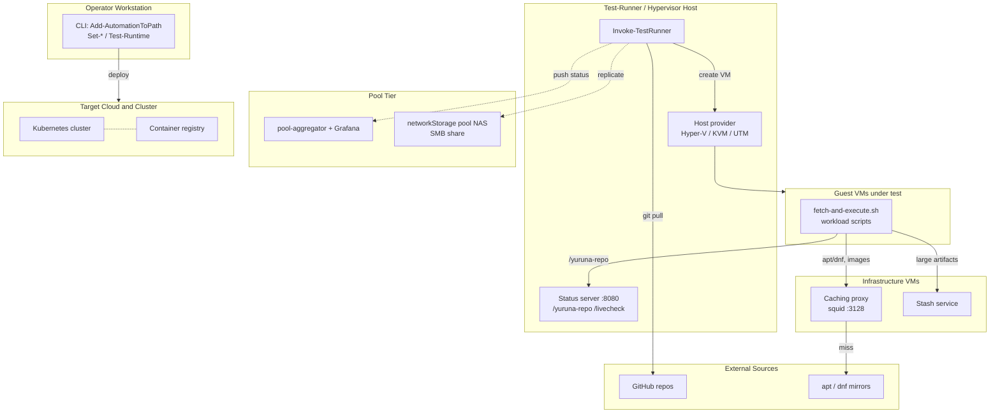

# Deployment topology

> One sentence: how the parts run and talk over the network when fully
> deployed, grouped into seven network nodes.

See [Design overview](00-index.md) · [Yuruna Architecture](../architecture.md).

Derived from `test/Invoke-TestRunner.ps1`, the status/caching/stash start
scripts under `test/`, `automation/fetch-and-execute.sh`, the pool tier
(`test/pool/`, `test/extension/pool-aggregator`), and `test.config.yml`
(`statusService`, `networkStorage`, `pool`). Mermaid has no deployment-diagram
type, so each network node is a `subgraph`.

`%% planned` The **Pool Tier** is gated by `pool.enabled` (default `false` in
`test.config.yml`); `pool.networkReplicate` (default `false`) governs the NAS
`replicate` edge but only takes effect once the pool is enabled. The dashed
edges to the pool tier and to the target cluster activate only when those tiers
are configured. A single machine commonly hosts both **Operator Workstation**
and **Test-Runner / Hypervisor Host**.

---

Copyright (c) 2019-2026 by Alisson Sol et al.

Last review: 2026.07.03
