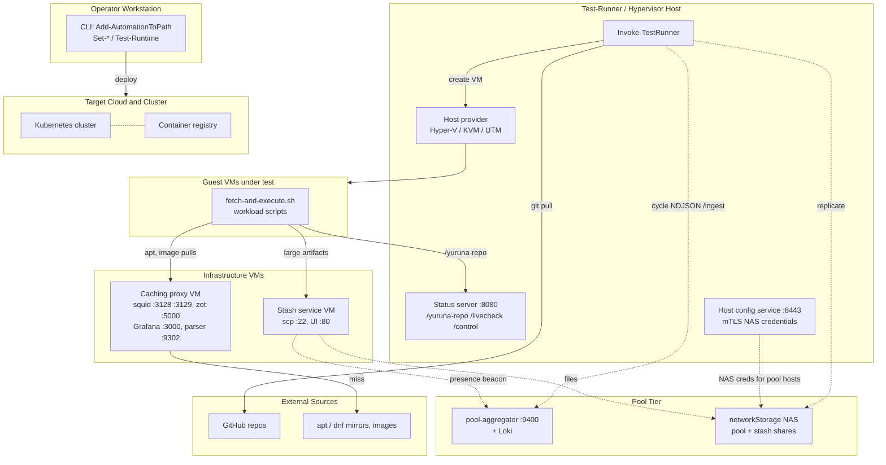

# Deployment topology

> One sentence: how the parts run and talk over the network when fully
> deployed, grouped into seven network nodes.

See [Design overview](00-index.md) · [Yuruna Architecture](../architecture.md).

Derived from `test/Invoke-TestRunner.ps1`, the
`test/Start-{StatusService,CachingProxy,StashServer,HostConfigService}.ps1`
scripts, `host/vmconfig/caching-proxy.base.user-data`,
`test/extension/{pool-aggregator,stash-service}`, and
`test.config.yml.template` (`statusService`, `configService`,
`networkStorage`, `pool`). Mermaid has no deployment-diagram type, so each
network node is a `subgraph`.

The caching-proxy VM co-locates squid (HTTP proxy :3128, ssl-bump :3129,
CA cert served on :80), the zot OCI pull-through cache (:5000), Grafana
(:3000), and the Go access-log parser (:9302); :3128 is the only port the
runner hard-depends on. The stash VM's SSH sink is reached through an
8022→22 port remap when NAT'd, and its presence beacon announces the host
to the pool-aggregator. The host config service (`configService`, default
port 8443) hands NAS credentials to pool hosts over mTLS.

`%% planned` The **Pool Tier** is gated by `pool.enabled` (default `false`
in `test.config.yml`); `pool.networkReplicate` (default `false`) governs
the NAS `replicate` edge, and the `networkStorage` pool/stash paths are
empty by default. The dashed edges activate only when those tiers are
configured. A single machine commonly hosts both **Operator Workstation**
and **Test-Runner / Hypervisor Host**.

---

LICENSEURI https://yuruna.link/license

Copyright (c) 2019-2026 by Alisson Sol et al.

Last review: 2026.07.22
