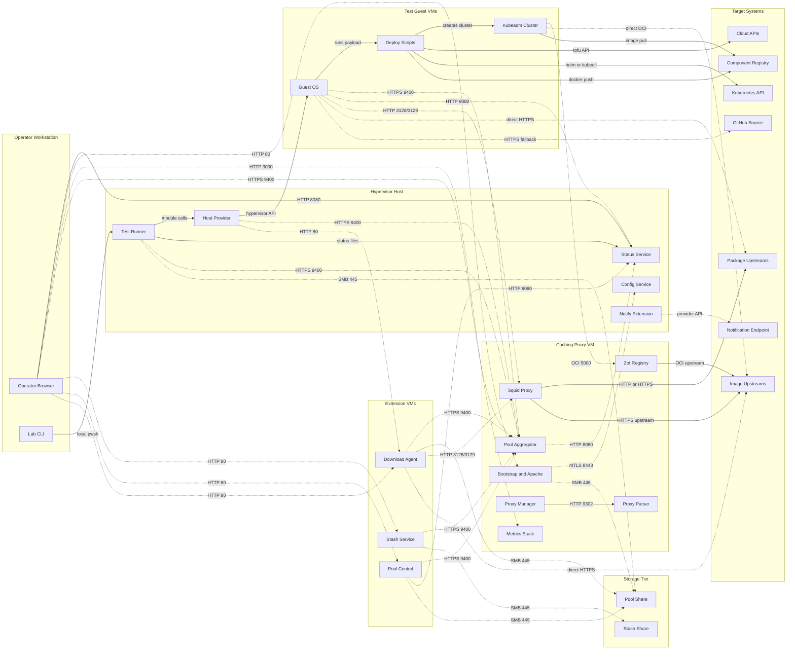

# Deployment topology

This topology places the current runner, providers, guests, optional lab services, storage shares, and deployment targets on their runtime nodes.

[Yuruna Architecture](../architecture.md) | [Design index](00-index.md) | [Data flows](03-data-flows.md)

```mermaid
flowchart LR
  subgraph operator-workstation["Operator Workstation"]
    operator-browser["Operator Browser"]
    lab-cli["Lab CLI"]
  end

  subgraph hypervisor-host["Hypervisor Host"]
    test-runner["Test Runner"]
    host-provider["Host Provider"]
    status-service["Status Service"]
    config-service["Config Service"]
    notify-extension["Notify Extension"]
  end

  %% optional -- the runner supports operation without the cache VM
  subgraph caching-proxy-vm["Caching Proxy VM"]
    cache-gateway["Bootstrap and Apache"]
    squid-proxy["Squid Proxy"]
    zot-registry["Zot Registry"]
    pool-aggregator["Pool Aggregator"]
    proxy-manager["Proxy Manager"]
    proxy-parser["Proxy Parser"]
    metrics-stack["Metrics Stack"]
  end

  %% optional -- extension VMs are enabled independently
  subgraph extension-vms["Extension VMs"]
    stash-service["Stash Service"]
    pool-control["Pool Control"]
    download-agent["Download Agent"]
  end

  subgraph test-guest-vms["Test Guest VMs"]
    guest-os["Guest OS"]
    guest-scripts["Deploy Scripts"]
    kube-cluster["Kubeadm Cluster"]
  end

  %% optional -- network storage can use local fallback or be disabled
  subgraph storage-tier["Storage Tier"]
    pool-share["Pool Share"]
    stash-share["Stash Share"]
  end

  subgraph target-systems["Target Systems"]
    cloud-apis["Cloud APIs"]
    kube-api["Kubernetes API"]
    component-registry["Component Registry"]
    package-upstreams["Package Upstreams"]
    image-upstreams["Image Upstreams"]
    github-source["GitHub Source"]
    notification-endpoint["Notification Endpoint"]
  end

  lab-cli -->|"local pwsh"| test-runner
  test-runner -->|"module calls"| host-provider
  host-provider -->|"hypervisor API"| guest-os
  test-runner -->|"status files"| status-service
  guest-os -->|"runs payload"| guest-scripts
  guest-scripts -->|"creates cluster"| kube-cluster
  operator-browser -->|"HTTP 8080"| status-service

  %% optional -- proxy UI exists only with the cache VM
  operator-browser -.->|"HTTP 80"| cache-gateway
  %% optional -- Grafana exists only with the cache VM
  operator-browser -.->|"HTTP 3000"| metrics-stack
  %% optional -- pool UI exists only with the cache VM
  operator-browser -.->|"HTTPS 9400"| pool-aggregator
  %% optional -- extension UIs exist only when their VMs run
  operator-browser -.->|"HTTP 80"| stash-service
  %% optional -- extension UIs exist only when their VMs run
  operator-browser -.->|"HTTP 80"| pool-control
  %% optional -- extension UIs exist only when their VMs run
  operator-browser -.->|"HTTP 80"| download-agent

  %% optional -- cache bootstrap syncs when config service is enabled
  cache-gateway -.->|"mTLS 8443"| config-service
  %% optional -- aggregator polls enrolled host status
  pool-aggregator -.->|"HTTP 8080"| status-service
  %% optional -- runner event push requires pool enrollment
  test-runner -.->|"HTTPS 9400"| pool-aggregator
  %% optional -- providers discover an enrolled download agent
  host-provider -.->|"HTTPS 9400"| pool-aggregator
  %% optional -- providers use the agent when available
  host-provider -.->|"HTTP 80"| download-agent
  %% optional -- host discovery uses the pool directory when configured
  guest-os -.->|"HTTPS 9400"| pool-aggregator
  %% optional -- guest framework fetch prefers host status
  guest-os -.->|"HTTP 8080"| status-service
  %% optional -- package proxy variables are configuration controlled
  guest-os -.->|"HTTP 3128/3129"| squid-proxy
  %% optional -- kube mirror is configured with the cache VM
  kube-cluster -.->|"OCI 5000"| zot-registry

  proxy-manager -->|"HTTP 9302"| proxy-parser
  squid-proxy -->|"HTTP or HTTPS"| package-upstreams
  squid-proxy -->|"HTTPS upstream"| image-upstreams
  zot-registry -->|"OCI upstream"| image-upstreams
  %% optional -- packages go direct when cache is absent
  guest-os -.->|"direct HTTPS"| package-upstreams
  %% optional -- images go direct when mirror is absent
  kube-cluster -.->|"direct OCI"| image-upstreams

  %% optional -- extension presence beacons require an aggregator URL
  stash-service -.->|"HTTPS 9400"| pool-aggregator
  %% optional -- extension presence beacons require an aggregator URL
  pool-control -.->|"HTTPS 9400"| pool-aggregator
  %% optional -- extension presence beacons require an aggregator URL
  download-agent -.->|"HTTPS 9400"| pool-aggregator
  %% optional -- pool control calls enrolled hosts
  pool-control -.->|"HTTP 8080"| status-service

  %% optional -- runner archives use configured pool storage
  test-runner -.->|"SMB 445"| pool-share
  %% optional -- cache services mount only pool storage
  cache-gateway -.->|"SMB 445"| pool-share
  %% optional -- pool control state uses pool storage
  pool-control -.->|"SMB 445"| pool-share
  %% optional -- download state uses pool storage
  download-agent -.->|"SMB 445"| pool-share
  %% optional -- stash uses its separate configured share
  stash-service -.->|"SMB 445"| stash-share

  guest-scripts -->|"tofu API"| cloud-apis
  guest-scripts -->|"helm or kubectl"| kube-api
  guest-scripts -->|"docker push"| component-registry
  kube-cluster -->|"image pull"| component-registry
  %% optional -- download agent normally uses the configured proxy
  download-agent -.->|"HTTP 3128/3129"| squid-proxy
  %% optional -- direct HTTPS is the download-agent fallback
  download-agent -.->|"direct HTTPS"| image-upstreams
  %% optional -- GitHub is the framework fallback
  guest-os -.->|"HTTPS fallback"| github-source
  %% optional -- notifications are provider and threshold gated
  notify-extension -.->|"provider API"| notification-endpoint
```

## Node grounding

- The **Hypervisor Host** runs `test/Start-TestRunner.ps1`, imports one
  `host/<platform>/modules/Yuruna.Host.psm1`, and can run
  `test/service/{Start-StatusService,Start-ConfigService}.ps1` on ports 8080 and
  8443. `Test.Notify.psm1` dispatches active notification extensions from the host.
  The operator workstation and hypervisor host are logical nodes and can be the
  same physical machine.
- The **Caching Proxy VM** is built from provider
  `host/<platform>/guest.caching-proxy-service/{Get-Image,New-VM}.ps1` files and
  `host/vmconfig/caching-proxy-service.base.user-data`. Its LAN surfaces are Apache
  80, Grafana 3000, parser 9302, pool aggregator 9400, and Squid 3128/3129.
  Bootstrap and Apache are folded into one box to keep this parent at seven
  children: Apache receives LAN traffic on 80 and proxies the landing page to the
  manager's internal 9310 listener. The manager calls the parser on 9302. Zot
  listens on 5000 for guest registry mirrors.
- The three **Extension VMs** are started by
  `test/service/Start-{StashService,PoolControlService,DownloadAgentService}VM.ps1`,
  use provider folders with matching `guest.*-service` names, and run the Go
  services under `test/extension/`.
- **Test Guest VMs** are created through the provider contract, seeded from
  `host/vmconfig/`, and execute current scripts under `guest/` plus the selected
  project's test payload. The deployment phase calls shown at the right come from
  `automation/Yuruna.{Resource,Component,Workload}.psm1`. Those phases can also be
  launched directly on an operator workstation; the diagram places them in the
  guest because that is the fully automated test-cycle topology.
- The **Storage Tier** is configured by `test/modules/Test.PoolStorage.psm1` and
  `test/test.config.yml`. Pool and stash are distinct SMB shares; the cache VM
  mounts the pool share and explicitly does not mount the stash share.
- **Target Systems** are current OpenTofu provider APIs, Kubernetes APIs, component
  registries, package/image origins, GitHub source, and the configured notification
  transport. No GCP cluster is shown because no current GCP resource tree exists.

## Optional topology

The dashed links and their adjacent `%% optional` comments are current feature
gates, not planned work. Guided `install/setup.ps1` brings up the cache VM, but a
standalone runner can run cycles with no caching proxy,
pool, extension VM, or network share. In that shape, guests fetch framework bytes
from the host status service or commit-pinned GitHub source, package and image pulls
go directly upstream, results remain local, and notification dispatch remains
provider/threshold dependent.
