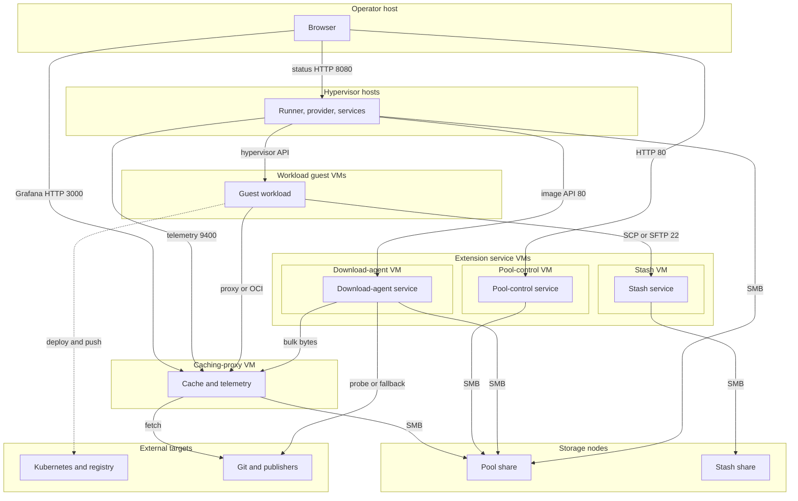
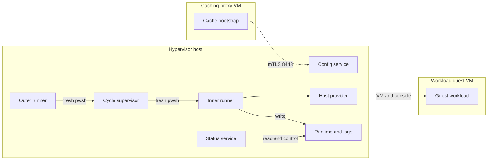
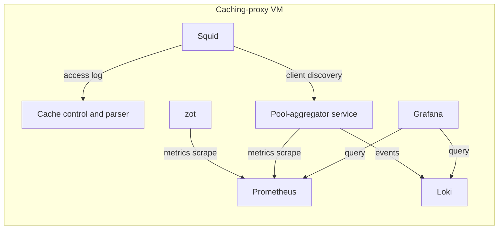

# Deployment topology

These views place the implemented processes, service VMs, storage, and deployment targets on their network nodes.

This is the configured lab topology supported by the source, not a claim that
every standalone installation starts every service. The
[setup entry point](../../install/setup.ps1) chooses the service set, and the
[service extension metadata](../../test/extension) records health ports and
placement. Optional integrations below use dashed edges.

## Network nodes

```mermaid
flowchart TB
    subgraph operator["Operator host"]
        test-status["Browser"]
    end
    subgraph host["Hypervisor hosts"]
        start-test-runner["Runner, provider, services"]
    end
    subgraph guest["Workload guest VMs"]
        guest-workload["Guest workload"]
    end
    subgraph caching-proxy-service-vm["Caching-proxy VM"]
        caching-proxy-service["Cache and telemetry"]
    end
    subgraph test-extension["Extension service VMs"]
        subgraph stash-service-vm["Stash VM"]
            stash-service["Stash service"]
        end
        subgraph pool-control-service-vm["Pool-control VM"]
            pool-control-service["Pool-control service"]
        end
        subgraph download-agent-service-vm["Download-agent VM"]
            download-agent-service["Download-agent service"]
        end
    end
    subgraph network-storage["Storage nodes"]
        pool-storage["Pool share"]
        stash-storage["Stash share"]
    end
    subgraph global-resources["External targets"]
        kubernetes["Kubernetes and registry"]
        origin["Git and publishers"]
    end
    test-status -->|status HTTP 8080| start-test-runner
    test-status -->|Grafana HTTP 3000| caching-proxy-service
    test-status -->|HTTP 80| pool-control-service
    start-test-runner -->|hypervisor API| guest-workload
    start-test-runner -->|telemetry 9400| caching-proxy-service
    guest-workload -->|proxy or OCI| caching-proxy-service
    start-test-runner -->|image API 80| download-agent-service
    guest-workload -->|SCP or SFTP 22| stash-service
    caching-proxy-service -->|SMB| pool-storage
    pool-control-service -->|SMB| pool-storage
    download-agent-service -->|SMB| pool-storage
    stash-service -->|SMB| stash-storage
    start-test-runner -->|SMB| pool-storage
    caching-proxy-service -->|fetch| origin
    download-agent-service -->|bulk bytes| caching-proxy-service
    download-agent-service -->|probe or fallback| origin
    %% optional: project configuration selects the deployment target
    guest-workload -.->|deploy and push| kubernetes
```

There are seven top-level groups. The extension aggregate contains three
separate network nodes, not three daemons required to share one VM. The storage
group represents two independently configured shares, which may be hosted on
the same NAS or on a local lab machine. Kubernetes and its registry are grouped
as deployment destinations; they can run inside the workload guest for
`localhost` or in AWS/Azure. The operator and hypervisor roles can also share a
physical machine.

Sources: the [host contract](../../host/Yuruna.Host.Contract.psm1), the
[guest workload wrapper](https://github.com/alissonsol/yuruna-project/blob/main/example/website/test/ubuntu.server.26/ubuntu.server.26.workload.k8s.website.sh),
[Start-CachingProxyServiceVM.ps1](../../test/service/Start-CachingProxyServiceVM.ps1),
[Start-StashServiceVM.ps1](../../test/service/Start-StashServiceVM.ps1),
[Start-PoolControlServiceVM.ps1](../../test/service/Start-PoolControlServiceVM.ps1),
[Start-DownloadAgentServiceVM.ps1](../../test/service/Start-DownloadAgentServiceVM.ps1),
[Test.PoolStorage.psm1](../../test/modules/Test.PoolStorage.psm1), and
[global/resources](../../global/resources). Host image consumption is implemented
in [Yuruna.DownloadAgent.psm1](../../host/modules/Yuruna.DownloadAgent.psm1);
[pool storage data flows](03-data-flows.md) expand what persists on each share.

## Host processes and bootstrap

```mermaid
flowchart LR
    subgraph host["Hypervisor host"]
        start-test-runner["Outer runner"]
        invoke-test-cycle-runner["Cycle supervisor"]
        invoke-test-runner-inner-loop["Inner runner"]
        yuruna-host["Host provider"]
        start-status-service["Status service"]
        start-config-service["Config service"]
        test-yuruna-dir["Runtime and logs"]
    end
    subgraph guest["Workload guest VM"]
        guest-workload["Guest workload"]
    end
    subgraph caching-proxy-service-vm["Caching-proxy VM"]
        caching-proxy-bootstrap["Cache bootstrap"]
    end
    start-test-runner -->|fresh pwsh| invoke-test-cycle-runner
    invoke-test-cycle-runner -->|fresh pwsh| invoke-test-runner-inner-loop
    invoke-test-runner-inner-loop --> yuruna-host
    yuruna-host -->|VM and console| guest-workload
    invoke-test-runner-inner-loop -->|write| test-yuruna-dir
    start-status-service -->|read and control| test-yuruna-dir
    %% optional: config service is started by the caching-proxy VM launcher
    caching-proxy-bootstrap -.->|mTLS 8443| start-config-service
```

This view has seven host children and one child per guest node. The provider is one of
[Hyper-V](../../host/windows.hyper-v/modules/Yuruna.Host.psm1),
[UTM](../../host/macos.utm/modules/Yuruna.Host.psm1), or
[KVM](../../host/ubuntu.kvm/modules/Yuruna.Host.psm1).
[Start-TestRunner.ps1](../../test/Start-TestRunner.ps1),
[Invoke-TestCycleRunner.ps1](../../test/modules/Invoke-TestCycleRunner.ps1), and
[Invoke-TestRunnerInnerLoop.ps1](../../test/modules/Invoke-TestRunnerInnerLoop.ps1)
are separate processes: the resident launcher starts a fresh cycle supervisor,
which reloads cycle logic and starts the inner runner.
[Start-StatusService.ps1](../../test/service/Start-StatusService.ps1) serves host
pages, live state, artifacts and control routes; it is not in the caching-proxy
VM. [Start-ConfigService.ps1](../../test/service/Start-ConfigService.ps1) supplies
bootstrap credentials over mTLS when started by the caching-proxy VM launcher.
It is not started on every runner host: the client shown is the
[caching-proxy seed](../../host/vmconfig/caching-proxy-service.base.user-data),
which fetches NAS credentials, not a generic workload guest.
[Test.YurunaDir.psm1](../../test/modules/Test.YurunaDir.psm1) resolves runtime and
log paths. [Test.ConfigServiceCA.psm1](../../test/modules/Test.ConfigServiceCA.psm1)
and [Test.ConfigServiceSync.psm1](../../test/modules/Test.ConfigServiceSync.psm1)
implement certificate and configuration handling.

Console control is host-provider I/O; it should not be mistaken for a guest
HTTP API. [Test.Transport.psm1](../../test/modules/Test.Transport.psm1) also
supports an SSH lane where the sequence selects it.

## Processes in the caching-proxy VM

```mermaid
flowchart LR
    subgraph caching-proxy-service-vm["Caching-proxy VM"]
        squid["Squid"]
        zot["zot"]
        caching-proxy-service["Cache control and parser"]
        pool-aggregator-service["Pool-aggregator service"]
        prometheus["Prometheus"]
        loki["Loki"]
        grafana["Grafana"]
    end
    squid -->|access log| caching-proxy-service
    squid -->|client discovery| pool-aggregator-service
    zot -->|metrics scrape| prometheus
    pool-aggregator-service -->|metrics scrape| prometheus
    pool-aggregator-service -->|events| loki
    grafana -->|query| prometheus
    grafana -->|query| loki
```

The seven children are defined by
[caching-proxy-service.base.user-data](../../host/vmconfig/caching-proxy-service.base.user-data),
the [cache control source](../../test/extension/caching-proxy-service/main.go),
the [parser source](../../test/extension/caching-proxy-parser-service), and
[pool-aggregator-service/main.go](../../test/extension/pool-aggregator-service/main.go).
Cache control and parser aggregate two cooperating processes: the caching-proxy
service on `9310` queries the parser's recent-request endpoint on `9302`.
Grafana's request panel reads Loki, not that parser endpoint.
The `metrics scrape` arrows show data direction; Prometheus initiates those
scrapes. The aggregator discovers/polls hosts, accepts telemetry pushes, tracks
extension announcements and serves pool APIs; it does not own the pool intent
Git repository. Apache landing pages, Git-over-HTTP serving, promtail and
exporters are supporting processes in the same seed, omitted to retain seven
children.

Prometheus (`127.0.0.1:9090`) and Loki (`127.0.0.1:3100`) are loopback services;
operators reach their data through Grafana. The aggregator's `9400` listener
can serve TLS and plain HTTP when provisioned with a certificate; its sensitive
routes apply their own gates. This does not make every service endpoint TLS.

## Endpoints and storage boundaries

| Network endpoint | Implemented purpose and source |
| --- | --- |
| Host `8080` | Host pages, status, logs and controls; configurable in [Start-StatusService.ps1](../../test/service/Start-StatusService.ps1). |
| Host `8443` | mTLS bootstrap configuration; configurable in [Start-ConfigService.ps1](../../test/service/Start-ConfigService.ps1). |
| Cache VM `3128 / 3129` | Squid HTTP/CONNECT and CA-trusted HTTPS interception, respectively; [seed](../../host/vmconfig/caching-proxy-service.base.user-data). |
| Cache VM `80 / 3000 / 5000 / 9400` | Landing/Git HTTP, Grafana, zot OCI pull-through, and pool aggregation; [seed](../../host/vmconfig/caching-proxy-service.base.user-data) and [aggregator](../../test/extension/pool-aggregator-service/main.go). |
| Stash VM `22 / 80` | SCP/SFTP ingest and HTTP UI/API; [stash configuration](../../test/extension/stash-service/server/internal/config/config.go). |
| Pool-control and download-agent VMs `80` | Each VM has its own UI/API; [pool-control configuration](../../test/extension/pool-control-service/server/internal/config/config.go), [download-agent configuration](../../test/extension/download-agent-service/server/internal/config/config.go). |
| Storage `SMB/CIFS` | Pool metadata, images and archived cycles are separate from stash artifacts; [Test.PoolStorage.psm1](../../test/modules/Test.PoolStorage.psm1). |

For shared-NAT service VMs, the launchers map host `8081 → 80` for pool control,
`8082 → 80` for downloads and `2222 → 22` for stash ingest. These are host
forwarders, not the daemons' listen ports; use the discovered/advertised URL,
not an assumed guest IP. Bridged guests can be addressed directly. The
launchers cited above own forwarding and refresh it when guest addresses change.

Storage placement is not interchangeable: the download agent writes pool image
generations; pool control commits intent; the stash keeps artifacts and sidecars
on the stash share but its SQLite index/offline buffer on the VM's local disk.
The [stash store](../../test/extension/stash-service/server/internal/store/store.go)
and [download image store](../../test/extension/download-agent-service/server/internal/imagestore/store.go)
implement these distinctions. Local telemetry disks are not made durable merely
by configuring a pool share; the seed and individual service settings determine
what survives a VM rebuild.

---

Back to [Architecture](../architecture.md) · [Design overview](README.md)
