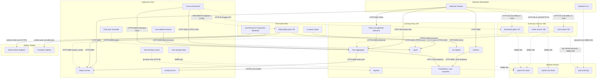

# Deployment topology

> One sentence: where every Yuruna process runs once a lab is fully deployed,
> and the real network links between those nodes.

See [Design overview](00-index.md) - [Configuration data model](05-data-model.md) -
[Yuruna Architecture](../architecture.md).

Derived from the service start scripts under `test/service/`, the cloud-init
seeds under `host/vmconfig/`, the Go daemons under `test/extension/`, the pool
tier in `test/modules/Test.PoolStorage.psm1` and `test/modules/Test.PoolSync.psm1`,
the provider drivers under `host/<platform>/modules/Yuruna.Host.psm1`, and the
deploy entry points `automation/Set-Resource.ps1`, `automation/Set-Component.ps1`
and `automation/Set-Workload.ps1`. Every port below was re-read from the source
that opens or dials it.

## The deployed lab

```mermaid
flowchart TB
  subgraph operator["Operator Workstation"]
    operator-browser["Operator browser"]
    pool-cli["test/pool CLIs"]
  end

  subgraph host["Hypervisor Host"]
    host-driver["Yuruna.Host.psm1"]
    status-service["Status service"]
    config-service["Config service"]
    host-beacon["Host address beacon"]
    pool-sync["Test.PoolSync.psm1"]
    pool-drain["Pool storage drain"]
    pool-push["Pool push forwarder"]
  end

  subgraph guests["Test Guest VMs"]
    test-guest["Disposable guest VM"]
    guest-k8s["In-guest cluster"]
    guest-deploy-scripts["Set-Resource Component Workload"]
  end

  subgraph proxy["Caching Proxy VM"]
    squid["squid"]
    apache["Apache"]
    grafana["Grafana"]
    zot["zot registry"]
    proxy-daemons["Proxy management daemons"]
    aggregator["Pool aggregator"]
    loopback["Prometheus, Loki, exporters"]
  end

  subgraph services["Extension Service VMs"]
    stash-vm["Stash service VM"]
    pool-control-vm["Pool control VM"]
    download-agent-vm["Download agent VM"]
  end

  subgraph shares["Network Shares"]
    pool-nas["ypool-nas share"]
    stash-nas["ystash-nas share"]
    intent-git["pool-intent.git"]
  end

  subgraph targets["Deploy Targets"]
    kube-context["Kube context endpoint"]
    registry["Container registry"]
  end

  operator-browser -->|"HTTP 8080"| status-service
  operator-browser -->|"HTTP 3000"| grafana
  operator-browser -->|"HTTP 9302, 9310"| proxy-daemons
  operator-browser -->|"HTTP 9400 deep-links"| aggregator
  %% optional -- stash service VM only exists with the stash storage triple set
  operator-browser -.->|"HTTP 80 UI, SCP/SFTP 22"| stash-vm
  %% optional -- pool control VM is built in lab mode only
  operator-browser -.->|"HTTP 80, host 8081 on UTM"| pool-control-vm
  %% optional -- download agent is mode-derived, off on a standalone host
  operator-browser -.->|"HTTP 80, host 8082 on UTM"| download-agent-vm
  %% optional -- gated on pool.enabled and a mounted pool share
  pool-cli -.->|"git push over SMB3 445"| intent-git

  host-driver -->|"HTTP 3128, HTTPS 3129"| squid
  %% optional -- loopback RFB exists on host.macos.utm only
  host-driver -.->|"RFB 5900+N loopback (UTM)"| test-guest
  %% optional -- download agent is mode-derived, off on a standalone host
  host-driver -.->|"HTTP 80 images API"| download-agent-vm
  host-beacon -->|"HTTP 9400 host-announce"| aggregator
  host-driver -->|"HTTPS 9400 extension-hosts"| aggregator
  %% optional -- runs only when a proxy address and a lab token are both known
  pool-push -.->|"HTTPS 9400 ingest"| aggregator
  %% optional -- gated on pool.enabled plus pool.intentGitUrl
  pool-sync -.->|"git clone over HTTP 80"| apache
  %% optional -- gated on the networkStorage pool triple
  pool-drain -.->|"SMB3 445"| pool-nas

  proxy -->|"HTTPS mTLS 8443"| config-service
  %% optional -- the proxy mounts the POOL share only, and only when its triple is set
  proxy -.->|"SMB3 445"| pool-nas
  proxy-daemons -.->|"HTTPS 9400 announce"| aggregator
  aggregator -->|"HTTP 8080 status poll"| status-service
  grafana -->|"HTTP 9090, 3100 loopback"| loopback
  aggregator -->|"HTTP 3100 loopback"| loopback

  test-guest -->|"HTTP 8080"| status-service
  test-guest -->|"HTTP 3128, HTTPS 3129"| squid
  guest-k8s -->|"HTTP 5000 mirror"| zot
  guest-deploy-scripts -->|"kubectl, helm over HTTPS"| kube-context
  guest-deploy-scripts -->|"docker push, provider port"| registry

  %% optional -- each service VM beacons only while it is running
  services -.->|"HTTPS 9400 announce"| aggregator
  stash-vm -.->|"SMB3 445"| stash-nas
  pool-control-vm -.->|"SMB3 445"| pool-nas
  pool-control-vm -.->|"HTTP 8080 sweep, control"| status-service
  pool-control-vm -.->|"git commit and push, SMB3 445"| intent-git
  download-agent-vm -.->|"SMB3 445"| pool-nas
  download-agent-vm -.->|"HTTP 3128, HTTPS 3129"| squid
```

**What is folded.** `loopback` stands for the five telemetry processes inside the
caching-proxy VM that bind `127.0.0.1` only and therefore have no LAN link of
their own -- Prometheus (`9090`), Loki (`3100`, plus gRPC `9096`),
prometheus-node-exporter (`9100`), squid-exporter (`9301`, scraping squid at
`3128`) and promtail (`9080`, tailing the squid and zot logs into Loki). All five
are configured in `host/vmconfig/caching-proxy-service.base.user-data`. Grafana is
not their only reader: Prometheus scrapes the two exporters, and promtail pushes
into Loki, which the aggregator also writes to and rehydrates from.

`Proxy management daemons` is the second of the diagram's three folds and the only
one the seven-child cap forces: it is `caching-proxy-parser-service` on `9302` (the
squid access-log view) and `caching-proxy-service` on `9310` (the management API,
the read-only status page, and the two lab-token-gated squid switches -- the only
daemon that writes its own box's squid configuration, as a `conf.d` drop-in plus
`squid -k reconfigure`, and only in local mode).

`Disposable guest VM` likewise stands for whatever guest the cycle plan names
(`guest.ubuntu.server.24`, `.26`, `guest.amazon.linux.2023`, `guest.windows.11`),
all built by the same `host/<platform>/guest.<key>/New-VM.ps1` pair of scripts. A
fifth key, `guest.macos.26`, is buildable on `host.macos.utm` only (Apple Silicon
M4+, UTM 4.6+) and carries no `test/sequences/start.guest.*` entry, so no cycle
plan can name it yet.

**Two ports Yuruna does not pin.** The `Deploy Targets` edges are the only links
whose port is not fixed by this repo. The kube endpoint comes from whatever
`kubectl config use-context` selects in `automation/Yuruna.Workload.psm1` -- the
engine sets the context, never the address. The registry address is the
`<registryName>.registryLocation` output of the resource template; for
`global/resources/localhost/registry` that is literally `localhost:5000`
(`localhost-registry-check.sh`), while the Azure template emits a bare
login-server hostname (`azurerm_container_registry.login_server`) and the AWS
template emits a repository URL that already carries a path
(`aws_ecr_repository.repository_url`). In both cases the push uses the registry's
default HTTPS port, because the address is expanded verbatim into the project's
own `pushCommand` and this repository never composes it.

**Squid's client ports are resolved, not hard-coded.** `3128` / `3129` are the
defaults returned by `Get-CachingProxyServicePort` in `automation/Yuruna.Common.psm1`;
`YURUNA_CACHING_PROXY_SERVICE_HTTP_PORT` / `..._HTTPS_PORT` override them. On a
macOS host the status service additionally maps `3128->3138` and `3129->3139` and
marks both as PROXY-protocol senders -- the `require-proxy-header` variants squid
opens so the userspace forwarder can hand it the real LAN client IP. The gate is
the platform (`$IsMacOS` at `test/service/Start-StatusService.ps1:584-588`, and
the same block at `test/modules/Invoke-TestRunnerInnerLoop.ps1:876-880`), not the
uplink; whether the proxy VM is bridged or on UTM Shared NAT is decided
earlier, in `host/macos.utm/guest.caching-proxy-service/New-VM.ps1`, and only the
Shared-NAT case needs the forwarder at all.

**MCP adds a protocol, not a port.** Five of the six Go daemons mount
`POST /mcp` on the listener they already had -- `9400` on the aggregator, `9310`
on the caching-proxy daemon, `80` on stash, pool-control and download-agent --
over the shared stdlib implementation in `test/extension/extension-sdk/mcp/`. A
tool wraps a route the daemon already serves and a mutating tool passes that
route's own gate, so nothing here adds a link to the diagram: it is a second way
in over the links already drawn. `caching-proxy-parser-service` mounts none, and
the core framework's own MCP surface (`test/service/Start-McpServer.ps1`) has no
listener at all -- it speaks over stdio, so it appears on no node in this
topology.

**On a UTM Shared-NAT host the per-service forwards are fixed.** The caching proxy
owns a whole set -- `80`, `3000`, `3128`/`3129`, `9302`, `9400`, and host `8022`
onto guest `22` -- while stash (`2222`), pool-control (`8081`) and download agent
(`8082`) own exactly one host port each, which is why those three numbers were
chosen: the obvious ones were already taken.

## Nodes

| Node | Runs what | Listens on | Talks to |
| --- | --- | --- | --- |
| Operator workstation | A browser against the served UIs (`test/status/index.html`, the Grafana dashboard `test/extension/pool-aggregator-service/grafana-pool-dashboard.json`, `test/extension/pool-control-service/server/internal/httpsrv/web/board.html`, `test/extension/stash-service/server/internal/httpsrv/web/index.html`, `test/extension/download-agent-service/server/internal/httpsrv/web/index.html`); the pool-admin CLIs `test/pool/*.ps1` (13 scripts) and the lab-admin CLIs `test/lab/*.ps1` (10, including `Set-LabToken.ps1` and the read-only `Lab-Diag.ps1`, which walk the aggregator's lab-token exchange) | nothing | status service `8080`, Grafana `3000`, parser `9302`, caching-proxy daemon `9310`, aggregator `9400` (`/go/*` deep-links and the lab-token exchange), stash `80` + SCP `22`, pool-control `80`, download agent `80`, intent store over SMB3 `445` |
| Hypervisor host | The provider driver `host/<platform>/modules/Yuruna.Host.psm1`; the status service (`test/service/Start-StatusService.ps1`); the config service (`test/service/Start-ConfigService.ps1`); the beacon `test/modules/Invoke-HostAddressBeacon.ps1`; `Test.PoolSync.psm1`, `Test.PoolStorage.psm1` and the detached `Invoke-PoolPushForwarder.ps1` | `8080/tcp` status (`http://*:<port>/`), `8443/tcp` config service (`TcpListener` + `SslStream`), the `Add-PortMap` forwards | squid `3128`/`3129`, download agent `80` (or whatever the aggregator advertises -- a UTM Shared-NAT peer publishes `:8082`), aggregator `9400` (host announce, `/ingest` push, extension-hosts lookup), Apache `80`, pool share `445`, guest console RFB `5900+display` on `127.0.0.1` on `host.macos.utm` only -- Hyper-V drives vmconnect and KVM drives virt-viewer, neither over a socket |
| Test guest VM | `guest/<family>/<family>.<workload>.sh` fetched through `automation/fetch-and-execute.sh`; the in-guest kubeadm cluster from `guest/ubuntu.server.{24,26}/ubuntu.server.{24,26}.k8s.sh`; `automation/Set-{Resource,Component,Workload}.ps1` | SSH `22` (harness key), the in-guest cluster and local registry `5000` | host status service `8080`, squid `3128`/`3129`, zot `5000`, kube endpoint, container registry |
| Caching proxy VM | squid, Apache, Grafana, zot, `caching-proxy-parser-service`, `caching-proxy-service`, `pool-aggregator-service`, Prometheus/Loki/exporters/promtail | `80` Apache, `3000` Grafana, `3128`/`3129` squid (`3138`/`3139` PROXY-protocol, `3130` only during a cache handover), `5000` zot, `9302` parser, `9310` caching-proxy daemon (management API, read-only page, `POST /mcp`), `9400` aggregator (`POST /mcp`); `9090`/`3100`/`9096`/`9100`/`9301`/`9080` on `127.0.0.1` | host status service `8080`, host config service `8443` (mutual TLS), pool share `445`. It does not mount the stash share: extension-host discovery is registration-driven through `activeExtensions` in `runtime/host.registration.json` |
| Stash service VM | `test/extension/stash-service/server` -- one binary, two listeners | `22/tcp` SCP/SFTP sink (`config.ListenAddress`, host `2222` on UTM), `80/tcp` UI and JSON API (`config.DefaultHTTPAddress`) + `POST /mcp` | stash share `445`, aggregator `9400` |
| Pool control VM | `test/extension/pool-control-service/server`, shelling out to `test/pool/*.ps1` | `80/tcp` (`config.DefaultHTTPAddress`, host `8081` on UTM) + `POST /mcp` | intent store on the pool share `445`, every host's status service `8080` -- the discovery sweep reads, and `internal/hostctl` also POSTs `/control/*` to arm or clear another host's pause flags, carrying an HMAC control proof over the lab token -- aggregator `9400` |
| Download agent VM | `test/extension/download-agent-service/server`, serving an operator UI and a diagnostics page beside the images API | `80/tcp` (`config.DefaultHTTPAddress`, host `8082` on UTM) + `POST /mcp` | pool share `445`, squid `3128`/`3129` (`--proxy-http` / `--proxy-https`), aggregator `9400` |
| Pool share `ypool-nas` | SMB3 file service; holds `hosts/`, `images/`, `pool-intent.git`, the two service state dirs | `445/tcp` | nothing -- every link is inbound |
| Stash share `ystash-nas` | SMB3 file service; holds `stash/<hostId>/{hostkey,files}` | `445/tcp` | nothing -- every link is inbound |
| Deploy targets | The kube context named in `workloads.yml` and the registry named by `<registryName>.registryLocation` | provider-defined | nothing back into the lab |

## Optional and config-gated nodes

Dashed edges above mark links that exist only when something turns them on. Most
of those switches are settings in `test/test.config.yml`; two are not -- the
pool-control VM is built on lab mode alone, with no key to set, and the stash VM
turns on the `storage` setup fact that the `networkStorage.stashStorage*` triple
produces. Each is read where named.

| Node or link | Gate | Default | Where the gate is read |
| --- | --- | --- | --- |
| Pool share, and every SMB3 edge into it | all three of `networkStorage.poolStorageLocalPath`, `..NetworkPath`, `..NetworkUser` | all `""` -- off | `test/modules/Test.PoolStorage.psm1` |
| Stash share and the stash service VM | the `storage` setup answer (`storage.kind`), which becomes the `storage` fact | no storage -- off | `install/setup.ps1` passes `-Requires 'storage'` to the stash bring-up; the `networkStorage.stashStorage*` triple is a RESULT that step writes, read later by `test/service/Start-StashServiceVM.ps1` and `test/Test-Config.ps1` |
| Pool intent pull (`Test.PoolSync.psm1` -> Apache) | `pool.enabled` **and** a non-empty `pool.intentGitUrl` | `enabled: false` | `test/modules/Test.PoolSync.psm1`, checked again in `test/Test-Config.ps1` |
| Download agent VM | `downloadAgentService.enabled`, deliberately unstated in the template so it resolves by mode, **and** the `storage` fact -- the agent has nowhere to put images without the pool share | lab with storage yes, otherwise no | `install/setup.ps1:3331` |
| Pool control VM | lab mode only | not built on a standalone host | `install/setup.ps1` |
| Cycle-result archiving to the pool share | `networkStorage.moveLogsToPoolStorage` selects move vs copy once the triple is set | `false` (copy) | `test/modules/Test.PoolStorage.psm1` |
| Lab-health hold, and the per-step probe of every declared health surface | `testCycle.labHealth.enabled` (plus `require` to add areas this host has never reached) | `true` | `test/modules/Test.LabHealth.psm1` |

The lab-health probe set is derived rather than listed: it comes from every
extension area's declared health surface, so it is exactly the service areas above
and grows the day a sixth ships -- no port for it appears in `test.config.yml`.

Two things are **not** gated and are worth naming for contrast. The caching-proxy
VM is built in both modes and its bring-up is marked critical, because the
aggregator that locates every other service rides inside it (`hostedIn:
caching-proxy-service` in `test/extension/pool-aggregator-service/pool-aggregator-service.config.yml`).
The config service is `configService.enabled: true` in the template, and its only
consumer today is that same proxy VM's `yuruna-config-fetch.sh`. The link carries
more than its port suggests: over mutual TLS against a per-host Config CA whose
client leaf is baked into the VM at build time, it serves the share connection
details *and* the share credential itself, resolved live from the host vault on
each request -- the one place the `Vault` entity in
[Configuration data model](05-data-model.md) is read from off the host.

## Standalone host versus pooled lab

The two topologies are the same diagram with different halves lit.

A **standalone host** keeps the whole left column and the proxy VM: the host
services on `8080` and `8443`, the provider driver, the guest VMs, and the
caching-proxy VM with squid, Apache, Grafana, zot, the parser and the aggregator.
The aggregator still runs and still polls this one host, so the dashboard shows a
single row. Cycle results stay in `test/status/log/` on the host.

A standalone setup -- no lab mode, no storage answer, `pool.enabled` off, which is
the shipped default -- removes each of these, and each has its own gate rather
than one shared switch:

- both **network shares** (the storage answer), and with them the pool-storage
  drain, the `images/` pool the download agent serves from, and the
  `pool-intent.git` store;
- the **pool-control VM** entirely (lab mode alone decides this one: setup builds
  it inside its `if ($isLab)` block and reads neither `pool.enabled` nor the
  triples), and with it the discovery sweep and the proof-gated `/control/*` calls
  against other hosts' `8080`;
- the **download-agent VM** (mode default *and* the `storage` fact), so every
  `Get-Image` falls straight through to origin-through-squid -- which is exactly
  the behavior the agent optimizes, not a degraded one
  (`host/modules/Yuruna.DownloadAgent.psm1` throws nothing and collapses a missing
  endpoint to an empty string);
- the **stash VM**, since its `-Requires 'storage'` gate has nothing to mount;
- the **intent pull** edge from `Test.PoolSync.psm1` to Apache's read-only
  `/pool-intent.git` alias (`pool.enabled` plus a non-empty `pool.intentGitUrl`),
  so the host cycles on its own `test.config.yml` rather than a pool's `testSet`
  and `config.testCycle` overrides.

What survives untouched is every link the harness needs to run one cycle: the
guest to the status service on `8080`, the guest and the host to squid on
`3128`/`3129`, the guest cluster to zot on `5000`, the proxy VM to the config
service on `8443`, and the driver to the guest console -- over loopback RFB on
`host.macos.utm`, over the local console window on the other two. The pool
tier is additive throughout -- it changes where results and images live, never
how a cycle runs.
