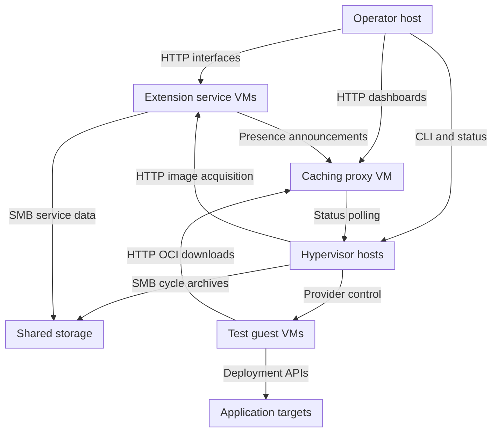
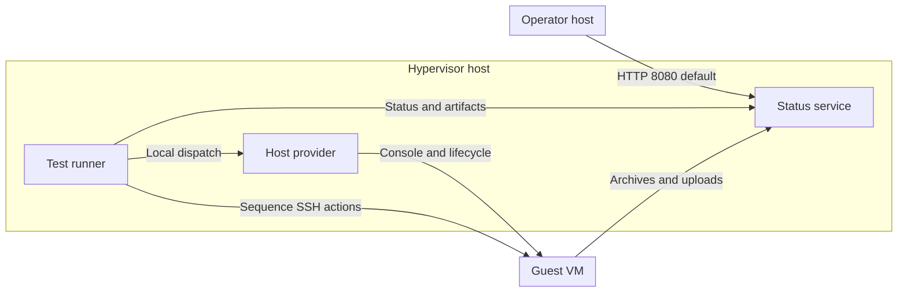
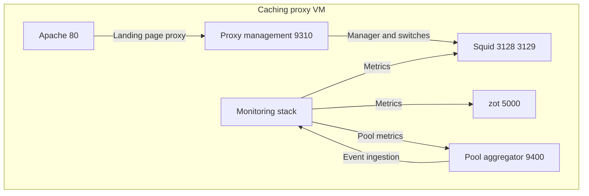
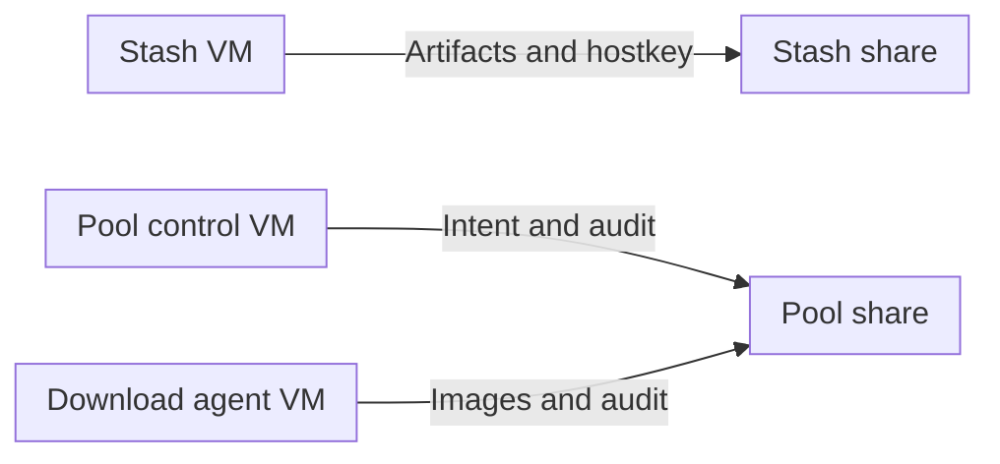
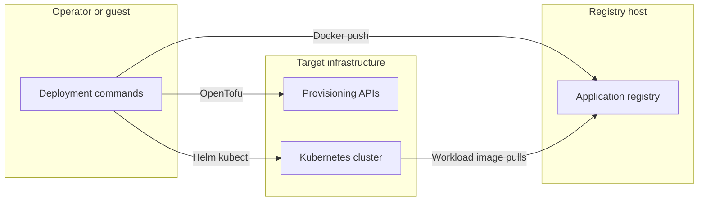

# Deployment topology

These network views show where runners, guests, services, shared storage, and application targets execute when their supported integrations are configured.

The [canonical architecture](../architecture.md) defines the capabilities; this topology separates network placement from the [component breakdown](02-component-breakdown.md). It is a code-derived supported layout, not a live inventory of a particular lab.

## Network overview

```mermaid
flowchart TB
    subgraph operator-host["Operator host"]
    end
    subgraph runner-host["Hypervisor hosts"]
    end
    subgraph guest["Test guest VMs"]
    end
    subgraph caching-proxy-service["Caching proxy VM"]
    end
    subgraph service-vms["Extension service VMs"]
    end
    subgraph yuruna-pool["Shared storage"]
    end
    subgraph deployment-targets["Application targets"]
    end
    operator-host -->|CLI and status| runner-host
    runner-host -->|Provider control| guest
    operator-host -->|HTTP dashboards| caching-proxy-service
    operator-host -->|HTTP interfaces| service-vms
    runner-host -->|HTTP image acquisition| service-vms
    caching-proxy-service -->|Status polling| runner-host
    guest -->|HTTP OCI downloads| caching-proxy-service
    guest -->|Deployment APIs| deployment-targets
    runner-host -->|SMB cycle archives| yuruna-pool
    service-vms -->|SMB service data| yuruna-pool
    service-vms -->|Presence announcements| caching-proxy-service
```

Seven empty subgraphs are intentionally aggregate network boxes. `Extension service VMs` comprises the pool-control, download-agent, and stash VMs; `Shared storage` comprises independently configured pool and stash shares. `Application targets` comprises Kubernetes, its supporting cloud resources, and registries. The following views expand these aggregates without exceeding seven visible boxes, including group boundaries.

The [runner](../../test/Start-TestRunner.ps1), [caching service launcher](../../test/service/Start-CachingProxyServiceVM.ps1), [pool-control launcher](../../test/service/Start-PoolControlServiceVM.ps1), [download-agent launcher](../../test/service/Start-DownloadAgentServiceVM.ps1), and [stash launcher](../../test/service/Start-StashServiceVM.ps1) establish these roles. Service VMs are long-lived auxiliaries, not the short-lived guests created and deleted by a test cycle. An operator can run the CLI on the hypervisor itself; a separate operator box does not imply a mandatory remote-execution service.

## Hypervisor and guest boundary

```mermaid
flowchart LR
    subgraph operator-host["Operator host"]
    end
    subgraph runner-host["Hypervisor host"]
        start-test-runner["Test runner"]
        yuruna-host["Host provider"]
        start-status-service["Status service"]
    end
    subgraph guest["Guest VM"]
    end
    operator-host -->|HTTP 8080 default| start-status-service
    start-test-runner -->|Local dispatch| yuruna-host
    start-test-runner -->|Status and artifacts| start-status-service
    yuruna-host -->|Console and lifecycle| guest
    start-test-runner -->|Sequence SSH actions| guest
    guest -->|Archives and uploads| start-status-service
```

Six visible boxes represent three network groupings and three host processes/modules. The status server reads local status/artifact files and serves committed repository archives to guests; the runner is a file producer, not an HTTP client for each status update. Console capture/OCR runs on the host. Sequence SSH actions use [Test.Ssh.psm1](../../test/modules/Test.Ssh.psm1) directly, with provider discovery available for the guest address. See [Start-StatusService.ps1](../../test/service/Start-StatusService.ps1), [Test.Status.psm1](../../test/modules/Test.Status.psm1), and [Test.SequenceEngine.psm1](../../test/modules/Test.SequenceEngine.psm1).

The real providers are [windows.hyper-v](../../host/windows.hyper-v/), [ubuntu.kvm](../../host/ubuntu.kvm/), and [macos.utm](../../host/macos.utm/). Their supported guest/provider combinations differ; this box does not assert a complete cross-product. Hyper-V/KVM networking and UTM bridged/shared networking select guest-reachable addresses. Shared/NAT paths can require host forwarding; [Start-CachingProxyServiceForwarder.ps1](../../host/macos.utm/Start-CachingProxyServiceForwarder.ps1) is the UTM implementation, and the status launcher reconciles platform-specific forwarding. Fixed example IP addresses are not part of this topology.

## Caching VM services

```mermaid
flowchart TB
    subgraph caching-proxy-service-vm["Caching proxy VM"]
        squid["Squid 3128 3129"]
        zot["zot 5000"]
        apache["Apache 80"]
        caching-proxy-service["Proxy management 9310"]
        pool-aggregator-service["Pool aggregator 9400"]
        monitoring["Monitoring stack"]
        apache -->|Landing page proxy| caching-proxy-service
        caching-proxy-service -->|Manager and switches| squid
        monitoring -->|Metrics| squid
        monitoring -->|Metrics| zot
        monitoring -->|Pool metrics| pool-aggregator-service
        pool-aggregator-service -->|Event ingestion| monitoring
    end
```

The group plus six children is seven visible boxes. `Monitoring stack` aggregates Grafana, Prometheus, Loki, log shipping, and exporters configured in the [caching VM seed](../../host/vmconfig/caching-proxy-service.base.user-data). Grafana defaults to port 3000; Prometheus and Loki are configured as local backends. Apache serves bootstrap material, the service landing route, and the configured pool-intent Git read path. These are distinct from Squid HTTP caching and zot OCI caching.

The [proxy daemon](../../test/extension/caching-proxy-service/main.go) supplies management and landing behavior. The [pool aggregator](../../test/extension/pool-aggregator-service/main.go) discovers/polls host status services, receives extension announcements, publishes pool metrics, and forwards events to Loki. Its port can accept configured TLS alongside plain HTTP; do not infer universal TLS from the presence of a proxy CA. Management mutations have their own token/proof gates; a trusted-LAN read route does not authorize a write.

Squid and zot byte caches remain on the caching VM. Optional monitoring replication uses `hosts/<hostId>/services/caching-proxy-service/` on pool storage; configuring a share does not automatically make every service's local database or cache durable.

## Extension VMs and storage boundaries

```mermaid
flowchart LR
    subgraph pool-control-service["Pool control VM"]
    end
    subgraph download-agent-service["Download agent VM"]
    end
    subgraph stash-service["Stash VM"]
    end
    subgraph yuruna-pool["Pool share"]
    end
    subgraph stash-share["Stash share"]
    end
    pool-control-service -->|Intent and audit| yuruna-pool
    download-agent-service -->|Images and audit| yuruna-pool
    stash-service -->|Artifacts and hostkey| stash-share
```

Five network boxes preserve the separate storage contracts. The shares can be co-located, but their configuration is independent. Each service VM exposes its UI/API on port 80 by default and announces its extension area to the pool aggregator. Stash additionally accepts SCP/SFTP on port 22. The service VM operating system is provisioned through the Ubuntu service-guest definitions, rather than being hosted inside the operator's browser or the pool aggregator.

The [pool-control guest setup](../../guest/ubuntu.server.26/ubuntu.server.26.pool-control-service.sh) mounts the pool, selects `pool-control-service/` for audit/status, and uses `pool-intent.git` unless another intent URL is configured. Its [intent adapter](../../test/extension/pool-control-service/server/internal/intent/intent.go) invokes the existing PowerShell pool-admin commands.

The [download-agent guest setup](../../guest/ubuntu.server.26/ubuntu.server.26.download-agent-service.sh) mounts the pool and separates image generations under `images/` from operational state under `download-agent-service/`. Hosts fetch bytes over the agent's HTTP routes; they do not have to mount the image pool themselves. A missing pool mount yields unavailable image service behavior, not successful writes into a shadow local mount directory.

The [stash guest setup](../../guest/ubuntu.server.26/ubuntu.server.26.stash-service.sh) places host keys and artifacts on its stash share. The [stash store](../../test/extension/stash-service/server/internal/store/store.go) and [constants](../../test/extension/stash-service/server/internal/config/config.go) keep SQLite metadata and the outage buffer on VM-local disk. A configured share outage triggers bounded buffering; an unconfigured stash share can use the explicit local-share fallback. Neither case routes uploads through Squid. File-level layouts and retention handoffs appear in [Pool storage contents](03-data-flows.md#e-pool-storage-contents).

## Application deployment targets

```mermaid
flowchart LR
    subgraph automation-host["Operator or guest"]
        automation["Deployment commands"]
    end
    subgraph kubernetes-target["Target infrastructure"]
        cloud-api["Provisioning APIs"]
        kubernetes["Kubernetes cluster"]
    end
    subgraph registry-host["Registry host"]
        registry["Application registry"]
    end
    automation -->|OpenTofu| cloud-api
    automation -->|Docker push| registry
    automation -->|Helm kubectl| kubernetes
    kubernetes -->|Workload image pulls| registry
```

Three groups plus four nodes are seven visible boxes. The commands can run on the operator's machine or inside a test guest. The diagram distinguishes the application image registry from zot's upstream pull-through cache; a localhost deployment can place its cluster and registry inside the same guest.

Sources: [Yuruna.Resource.psm1](../../automation/Yuruna.Resource.psm1), [Yuruna.Component.psm1](../../automation/Yuruna.Component.psm1), [Yuruna.Workload.psm1](../../automation/Yuruna.Workload.psm1), [global resources](../../global/resources/), and the project's [website configurations](https://github.com/alissonsol/yuruna-project/tree/main/example/website/config). Localhost, AWS, and Azure have implemented resource paths. GCP remains planned and is intentionally not depicted as a deployed target. Cloud endpoints and external registries are external dependencies; drawing their API boundary does not imply that Yuruna implements those services.

---

Back to [Architecture](../architecture.md) · [Design overview](README.md)
