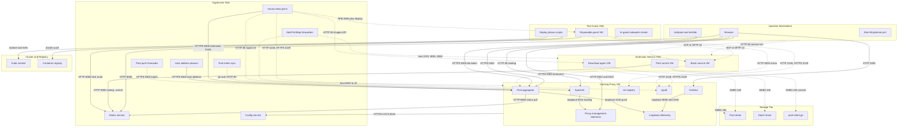

# Deployment topology

> One sentence: where every Yuruna process runs once a lab is fully deployed,
> and the real network links between those nodes.

See [Design overview](00-index.md) - [Context and components](01-context-and-components.md) -
[Component breakdown](02-component-breakdown.md) - [Data flows](03-data-flows.md) -
[Lifecycle state](04-lifecycle-state.md) - [Configuration data model](05-data-model.md) -
[Naming conventions](naming.md) - [Yuruna Architecture](../architecture.md).

Derived from the service start scripts under `test/service/`, the cloud-init
seeds under `host/vmconfig/`, the Go daemons and area manifests under
`test/extension/`, the provider drivers `host/<platform>/modules/Yuruna.Host.psm1`
and the shared `host/modules/Yuruna.HostDownload.psm1`, the guest bring-up
scripts under `guest/`, the mode split in `install/setup.ps1`, and the resource
templates under `global/resources/`. Every port below was re-read from the line
that opens or dials it.

## The deployed lab

```mermaid
flowchart TB
  subgraph operator-workstation["Operator Workstation"]
    operator-browser["Browser"]
    pool-lab-clis["test/pool and test/lab"]
    start-mcp-server["Start-McpServer.ps1"]
  end

  subgraph hypervisor-host["Hypervisor Host"]
    yuruna-host["Yuruna.Host.psm1"]
    status-service["Status service"]
    config-service["Config service"]
    host-address-beacon["Host address beacon"]
    pool-push-forwarder["Pool push forwarder"]
    pool-sync["Pool intent sync"]
    port-forwarders["Add-PortMap forwarders"]
  end

  subgraph caching-proxy-vm["Caching Proxy VM"]
    squid["squid"]
    apache2["Apache2"]
    grafana["Grafana"]
    zot["zot registry"]
    caching-proxy-daemons["Proxy management daemons"]
    pool-aggregator-service["Pool aggregator"]
    loopback-telemetry["Loopback telemetry"]
  end

  subgraph extension-service-vms["Extension Service VMs"]
    stash-service-vm["Stash service VM"]
    pool-control-service-vm["Pool control VM"]
    download-agent-service-vm["Download agent VM"]
  end

  subgraph test-guest-vms["Test Guest VMs"]
    test-guest["Disposable guest VM"]
    guest-kubeadm-cluster["In-guest kubeadm cluster"]
    guest-deploy-scripts["Deploy phase scripts"]
  end

  subgraph storage-tier["Storage Tier"]
    pool-share["Pool share"]
    stash-share["Stash share"]
    pool-intent-git["pool-intent.git"]
  end

  subgraph deploy-targets["Cluster and Registry"]
    kube-context["Kube context"]
    container-registry["Container registry"]
  end

  operator-browser -->|"HTTP 8080"| status-service
  operator-browser -->|"HTTP 80 landing"| apache2
  operator-browser -->|"HTTP 3000"| grafana
  operator-browser -->|"HTTP 9302 and 9310"| caching-proxy-daemons
  operator-browser -->|"HTTPS 9400"| pool-aggregator-service
  pool-lab-clis -->|"HTTPS 9400 lab-token"| pool-aggregator-service
  %% optional -- each service VM is separately gated
  operator-workstation -.->|"HTTP 80 service UIs"| extension-service-vms
  %% optional -- stash VM needs the storage answer
  operator-workstation -.->|"SCP or SFTP 22"| stash-service-vm

  %% optional -- gated on the squid :3128 probe
  yuruna-host -.->|"HTTP 3128, HTTPS 3129"| squid
  %% optional -- HTTPS also needs :80 for the CA
  yuruna-host -.->|"HTTP 80 squid CA"| apache2
  %% optional -- download-agent VM is mode-derived
  yuruna-host -.->|"HTTP 80 images API"| download-agent-service-vm
  yuruna-host -->|"HTTPS 9400 extension-hosts"| pool-aggregator-service
  %% optional -- RFB console on host.macos.utm only
  yuruna-host -.->|"RFB 5900 plus display"| test-guest
  host-address-beacon -->|"HTTPS 9400 host-address"| pool-aggregator-service
  %% optional -- needs a proxy address and the internal authentication key
  pool-push-forwarder -.->|"HTTPS 9400 ingest"| pool-aggregator-service
  %% optional -- pool.enabled plus pool.intentGitUrl
  pool-sync -.->|"git over HTTP 80"| apache2
  %% optional -- only where the VM is NAT-networked
  port-forwarders -.->|"host 8022 to 22"| caching-proxy-vm
  %% optional -- UTM Shared NAT only
  port-forwarders -.->|"host 2222, 8081, 8082"| extension-service-vms

  caching-proxy-vm -->|"HTTPS mTLS 8443"| config-service
  %% optional -- networkStorage pool triple
  caching-proxy-vm -.->|"SMB3 445"| pool-share
  apache2 -->|"loopback 9310 landing"| caching-proxy-daemons
  grafana -->|"loopback 9090 and 3100"| loopback-telemetry
  pool-aggregator-service -->|"loopback 3100 push"| loopback-telemetry
  pool-aggregator-service -->|"HTTP 8080 status poll"| status-service

  %% optional -- needs aggregator-url and host-id
  extension-service-vms -.->|"HTTPS 9400 announce"| pool-aggregator-service
  %% optional -- networkStorage stash triple
  stash-service-vm -.->|"SMB3 445"| stash-share
  %% optional -- networkStorage pool triple
  pool-control-service-vm -.->|"SMB3 445 commit"| pool-intent-git
  pool-control-service-vm -->|"HTTP 8080 sweep, control"| status-service
  %% optional -- networkStorage pool triple
  download-agent-service-vm -.->|"SMB3 445"| pool-share
  %% optional -- CACHE_PROXY_IP non-empty
  download-agent-service-vm -.->|"HTTP 3128, HTTPS 3129"| squid

  test-guest -->|"HTTP 8080 host route"| status-service
  %% optional -- CACHE_HOST resolved by probe
  test-guest -.->|"HTTP 3128, HTTPS 3129"| squid
  %% optional -- stash VM is separately gated
  test-guest -.->|"SCP or SFTP 22"| stash-service-vm
  %% optional -- CACHE_HOST resolved by probe
  guest-kubeadm-cluster -.->|"HTTP 5000 mirror"| zot
  guest-deploy-scripts -->|"kubectl and helm"| kube-context
  guest-deploy-scripts -->|"docker push"| container-registry
```

## What each box is on disk

**Operator Workstation.** No Yuruna process listens here. `Browser` is the five
served UIs plus Grafana: `test/status/index.html` on the status service,
`test/extension/caching-proxy-service/` and its landing page, and the web roots
under `test/extension/pool-control-service/server/internal/httpsrv/web/`,
`.../stash-service/server/internal/httpsrv/web/` and
`.../download-agent-service/server/internal/httpsrv/web/`.
`test/pool and test/lab` is the operator CLI surface. `Start-McpServer.ps1`
(`test/service/Start-McpServer.ps1`) is drawn with no edge on purpose: it is a
foreground stdio server with no listener and no token, and it shells its tool
table out as child `pwsh` processes.

**Hypervisor Host.** `Yuruna.Host.psm1` is whichever of the three drivers the
host type selects -- `host/windows.hyper-v/`, `host/ubuntu.kvm/` or
`host/macos.utm/` -- imported `-Global` into the runner runspace, together with
the shared `host/modules/Yuruna.HostDownload.psm1`,
`host/modules/Yuruna.DownloadAgent.psm1` and
`host/modules/Yuruna.HostProvision.psm1`. `Status service` is the detached
`HttpListener` from `test/service/Start-StatusService.ps1`, bound to
`http://*:<port>/` with the port read from `statusService.port` and defaulting
to `8080`. `Config service` is `test/service/Start-ConfigService.ps1`, a
`TcpListener` plus `SslStream` on `[IPAddress]::Any` at `configService.port`,
default `8443`, mutual TLS on every route. `Host address beacon` is
`test/modules/Invoke-HostAddressBeacon.ps1`, spawned by the status service under
a `hostaddress.beacon.lock`; `Pool push forwarder` is the detached
`test/modules/Invoke-PoolPushForwarder.ps1`; `Pool intent sync` is
`test/modules/Test.PoolSync.psm1`, which runs in the cycle process rather than as
a daemon. All three are outbound only. `Add-PortMap forwarders` is the driver's
own `Add-PortMap` implementation -- see the fold note below.

**Caching Proxy VM** is `yuruna-caching-proxy-service`, built by
`test/service/Start-CachingProxyServiceVM.ps1` through the per-driver
`guest.caching-proxy-service/New-VM.ps1` and seeded from
`host/vmconfig/caching-proxy-service.base.user-data`. It is the pool-services
host: squid, Apache2, Grafana, zot, both proxy daemons, the aggregator and the
loopback telemetry stack all come out of that one seed.

**Extension Service VMs** are `yuruna-stash-service`,
`yuruna-pool-control-service` and `yuruna-download-agent-service`, each started
by its `test/service/Start-*ServiceVM.ps1`, seeded from its
`host/vmconfig/*-service.base.user-data`, and built inside the guest by
`guest/ubuntu.server.26/ubuntu.server.26.<area>-service.sh`. One of the three has
a no-VM shape the diagram does not draw: `Start-PoolControlServiceVM.ps1
-HostSideProof` runs the daemon on the hypervisor host itself, on `-Port` default
`8090`, kept clear of the status service's `8080`. It is a fallback for a host
that cannot spare a VM, and it is the only service that can run this way.

**Test Guest VMs** are the per-cycle guests. `Deploy phase scripts` is
`automation/Set-Resource.ps1`, `automation/Set-Component.ps1` and
`automation/Set-Workload.ps1`, which run *inside* the guest -- the project's own
workload script calls them, the harness never does.

**Storage Tier** is two SMB3 shares plus one directory. `pool-intent.git` is a
bare git repository on the pool share, not a service of its own; it is drawn
separately because two different transports reach it.

**Cluster and Registry** is the workload destination named by the project's
`workloads.yml` context and by a resource template's `registryLocation` output.

## The folds, with exact members and real counts

**Ten node classes folded to seven subgraphs.** The classes are: operator
workstation, hypervisor host, caching-proxy VM, stash VM, pool-control VM,
download-agent VM, pool-aggregator service, test guests, storage tier, and the
target cluster plus registry -- **10**. Two folds bring that to 7. First, the
three single-purpose service VMs become one `Extension Service VMs` subgraph;
its members are exactly `yuruna-stash-service`, `yuruna-pool-control-service` and
`yuruna-download-agent-service` -- **3**, and each is drawn as its own child so
no link is lost. Second, `pool-aggregator-service` is drawn as a child of the
caching-proxy VM rather than a class of its own, because its area manifest
`test/extension/pool-aggregator-service/pool-aggregator-service.config.yml`
declares no `vmName` and instead states `hostedIn: caching-proxy-service`. It is
the one extension service a host does not create a VM for.

**`Proxy management daemons` is 2 processes.** They are
`caching-proxy-parser-service` on `:9302`
(`test/extension/caching-proxy-parser-service/parse.go`, `defaultListenAddr`)
and `caching-proxy-service` on `0.0.0.0:9310`
(`test/extension/caching-proxy-service/main.go`, the `-http-addr` default). Real
count **2**. The parser tails squid's access log; the daemon serves the
management API, the landing page and the two lab-token-gated squid switches, and
dials the parser on `127.0.0.1:9302`, squid on `127.0.0.1:3128`, zot on
`http://127.0.0.1:5000` and Grafana on `http://127.0.0.1:3000` -- four loopback
edges the diagram does not draw because they never leave the VM.

**`Loopback telemetry` is 5 processes across 6 listeners.** Prometheus
`127.0.0.1:9090`, prometheus-node-exporter `127.0.0.1:9100`, Loki
`127.0.0.1:3100` HTTP with `127.0.0.1:9096` gRPC, promtail `127.0.0.1:9080`, and
squid-exporter `127.0.0.1:9301` scraping squid at `3128`. Real count **5**
processes, **6** listeners, all configured in
`host/vmconfig/caching-proxy-service.base.user-data`. None has a LAN link of its
own, which is exactly why they are one box.

**`squid` is 5 listeners.** `3128` plain HTTP, `3129` ssl-bump, `3138` and `3139`
the `require-proxy-header` PROXY-protocol twins of the first two, and `3130` the
TLS `cache_peer` port that exists only inside a cache handover window
(`$script:TlsPeerPort` in `test/service/Move-CachingProxyService.ps1`, with a
plain `3128` fallback). Real count **5**. Only `3128` is absent from the seed:
`host/vmconfig/caching-proxy-service.base.user-data` says in so many words not to
declare `http_port 3128` there, because the bind comes from the distribution's
own `/etc/squid/squid.conf`.

**`Add-PortMap forwarders` is 3 mechanisms, one per driver.** Hyper-V drives
`netsh portproxy v4tov4` plus firewall rules, requires Administrator and rejects
non-IPv4; ubuntu.kvm writes socket-activated
`yuruna-cacheproxy-p<hostport>.socket` / `.service` unit pairs running
`systemd-socket-proxyd`, and ignores `-ProxyProtocolPort` outright; macos.utm
runs per-port `pwsh` `TcpListener` forwarders. Real count **3**. The LAN set they
install is resolved in one place, `Get-CachingProxyServiceExposedPort` in
`test/modules/Test.VMUtility.psm1`, which returns `80, 3000, 9302, 9400` plus the
client-facing squid HTTP and HTTPS ports -- **6** ports. A macOS host re-maps only
`80, 3000` and adds the PROXY-protocol remaps instead.

**`Disposable guest VM` is 5 guest keys.** `guest.amazon.linux.2023`,
`guest.ubuntu.server.24`, `guest.ubuntu.server.26` and `guest.windows.11` exist
under all three drivers; `guest.macos.26` exists under `host/macos.utm/` alone.
Real count **5**. They are 5 of the **9** distinct `guest.*` builder keys in
`host/` -- the other 4 build the service VMs (`guest.caching-proxy-service`,
`guest.download-agent-service`, `guest.pool-control-service`,
`guest.stash-service`) and are drawn as their own subgraphs above. Counting per
driver gives **25** builder directories in total: 9 under macos.utm, 8 each under
ubuntu.kvm and windows.hyper-v, every one holding `Get-Image.ps1` and
`New-VM.ps1`. The per-cycle name prefix is `vmStart.testVmNamePrefix`, `test-` in
the shipped configuration.

**`Browser` is 5 served UIs plus Grafana.** The five roots are
`test/status/index.html` on the status service,
`test/extension/caching-proxy-service/` and its landing page (`landing.go` and
`ui.go`), and the web roots under
`test/extension/pool-control-service/server/internal/httpsrv/web/`,
`test/extension/stash-service/server/internal/httpsrv/web/` and
`test/extension/download-agent-service/server/internal/httpsrv/web/`. Real count
**5**, plus Grafana on `:3000`. None of the six runs on the workstation, which is
why they are one box.

**`test/pool and test/lab` is 23 scripts.** 13 `.ps1` under `test/pool/` and 10
under `test/lab/`, counted in the working tree.

## Edges that are easy to misread

**`yuruna-host -.-> squid` is not a proxy setting, it is a probe result.** The
host download path composes `http://<cache>:3128` only after
`Get-CacheProxyForHostDownload` in `host/modules/Yuruna.HostDownload.psm1` gets a
non-empty answer from the driver's `Resolve-CacheHostIp`, which itself ends in
`Test-CachingProxyServicePort -Port 3128`. HTTPS is stricter: it probes `3129`
*and* `80` before committing, then fetches `http://<cache>/yuruna-squid-ca.crt`
so the bumped chain can be validated per process. Any of those failing means a
plain `Invoke-WebRequest` with no proxy at all.

**`pool-sync -.-> apache2` and `pool-control-service-vm -.-> pool-intent-git` are
the same store over two different transports.** Apache aliases
`/pool-intent.git` to `/mnt/ypool-nas/pool-intent.git` on `:80`, and that route is
dumb-HTTP -- an alias with no `git-http-backend`, so it is pull-only. Writes go
the other way: `guest/ubuntu.server.26/ubuntu.server.26.pool-control-service.sh`
points the pool-control daemon at `/mnt/yuruna-pool/pool-intent.git` on the CIFS
mount, because the pool share is the one location both VMs mount read-write.
`test/lab/Set-LabToken.ps1` is what hands a joining host the
`http://<proxy>/pool-intent.git` form.

**`caching-proxy-vm --> config-service` carries a credential, not just a
config.** `host/vmconfig/caching-proxy-service.base.user-data` writes
`/usr/local/bin/yuruna-config-fetch.sh`, which calls
`https://<san>:8443/v1/nas/<name>` with `--cacert`, `--cert`, `--key` and
`--connect-to`, five attempts ten seconds apart, and on total failure probes
`http://<host>:8080/livecheck` to tell "host unreachable at the baked address"
apart from "host up, config service down". A templated
`yuruna-config-fetch@.service` / `.timer` pair runs it at boot and hourly.

**The caching-proxy VM mounts the pool share only.** The seed invokes
`yuruna-config-fetch.sh pool` and enables no `@stash` instance, so `/mnt/ypool-nas`
is mounted and `/mnt/ystash-nas` never is, even though the script's `case`
statement still knows the `stash` name.

**The pool share has two mount points, not one.** The caching-proxy VM mounts it
at `/mnt/ypool-nas`; the pool-control and download-agent VMs mount it at
`/mnt/yuruna-pool` (`DefaultPoolDir` in
`test/extension/download-agent-service/server/internal/config/config.go`, and
`MOUNT=/mnt/yuruna-pool` in the pool-control bring-up script). Same bytes, two
names.

**The stash service replaces sshd on `:22`.** Its `ListenAddress` is
`0.0.0.0:22` and its UI is `0.0.0.0:80`
(`test/extension/stash-service/server/internal/config/config.go`), both on one
binary holding `CAP_NET_BIND_SERVICE`. The `:22` listener speaks the stash's own
SFTP server, not OpenSSH, which is why the bring-up sequence runs the deploy step
last. On a UTM Shared-NAT host the forward is `2222 -> 22`, because the Mac's own
sshd already owns `22`.

**`test-guest -.-> stash-service-vm` is resolved, never literal.** A sequence
variable expands `${ext:stash-service.ResolveHost(<vm>)}` through `Resolve-Host`
in `test/extension/stash-service/default.psm1`, which tries the driver's
`Get-VMIp`, then this cycle's published address re-probed before use, then the
pool lookup -- and returns an empty string with a warning if all three come back
empty.

**`pool-control-service-vm --> status-service` is two calls, not one.** The LAN
sweep in `.../pool-control-service/server/internal/discovery/scan.go` probes
`DefaultPort = 8080` on each candidate address, and
`.../internal/hostctl/hostctl.go` then POSTs `/control/<route>` to a discovered
host's base URL carrying a control proof. Both land on the status service's port.

**`operator-browser --> pool-aggregator-service` on `9400` is one port serving two
protocols.** `test/extension/pool-aggregator-service/main.go` wraps the listener
in a dual-protocol listener that sniffs the first byte (`0x16` for a TLS record)
and hands `http.Server` either a `*tls.Conn` or the raw connection, so TLS and
plain HTTP share the port and the mux.

**Forwarding `9400` does not make the pool view populate.** The comment on
`Get-CachingProxyServiceExposedPort` records why: a userspace forwarder
re-originates every connection from the host, so the aggregator -- which
discovers hosts by their real client IP -- sees one client for the whole LAN. The
pool view needs a bridged cache VM.

**MCP adds a protocol, not a link.** `POST /mcp` is mounted on the listener each
daemon already had: `9400` on the aggregator, `9310` on the caching-proxy daemon,
`80` on stash, pool-control and download-agent. `caching-proxy-parser-service`
mounts none.

## Conditional links and their gates

| Link in the diagram | Gate | Where the gate is read |
| --- | --- | --- |
| `yuruna-host` and `test-guest` to `squid`, `yuruna-host` to `apache2` | a cache answers on `:3128`; HTTPS additionally needs `:3129` and `:80` | `Invoke-CachingProxyServiceAvailableProbe` in `host/modules/Yuruna.HostProvision.psm1`; `Get-CacheProxyForHostDownload` in `host/modules/Yuruna.HostDownload.psm1`; config anchor `vmStart.cachingProxyIp`; env override `YURUNA_CACHING_PROXY_SERVICE_IP` |
| `guest-kubeadm-cluster` to `zot` | `CACHE_HOST` non-empty after its probe | `guest/ubuntu.server.26/ubuntu.server.26.k8s.sh`, `guest/ubuntu.server.24/ubuntu.server.24.k8s.sh` |
| `download-agent-service-vm` to `squid` | `CACHE_PROXY_IP` set; HTTPS additionally needs `/etc/yuruna/yuruna-squid-ca.crt` non-empty | `guest/ubuntu.server.26/ubuntu.server.26.download-agent-service.sh`, daemon flags `--proxy-http`, `--proxy-https`, `--proxy-ca` |
| `yuruna-host` to `download-agent-service-vm` | `downloadAgentService.enabled`, deliberately unstated so it resolves by mode, plus the `storage` fact | `test/test.config.yml.template`; `install/setup.ps1` (`$downloadAgentEnabled = $isLab`, then `-Requires 'storage'`) |
| `yuruna-host` to `test-guest` over RFB | host type is `host.macos.utm` | `Get-VncPortForVm` in `host/macos.utm/modules/Yuruna.Host.psm1`, base `vmCommunication.vncPort` |
| `pool-push-forwarder` to `pool-aggregator-service` | a proxy address and a pinned pool CA are both resolvable | `Invoke-PoolEventPush` in `test/modules/Test.PoolPush.psm1` -- no CA means the token is not sent at all |
| `pool-sync` to `apache2` | `pool.enabled` **and** a non-empty `pool.intentGitUrl` | `test/modules/Test.PoolSync.psm1`, re-checked in `test/Test-Config.ps1` |
| `port-forwarders` to either VM subgraph | the VM is NAT-networked rather than bridged | per-driver `Add-PortMap`; `Test-CacheVMOnExternalNetwork` decides for the cache VM |
| `caching-proxy-vm`, `download-agent-service-vm`, `pool-control-service-vm` to `pool-share` | all three of `networkStorage.poolStorageLocalPath`, `..NetworkPath`, `..NetworkUser` | `test/modules/Test.PoolStorage.psm1`; the CIFS mount is `nofail` in every seed |
| `stash-service-vm` to `stash-share` | the `networkStorage.stashStorage*` triple, produced by the `storage` setup answer | `host/vmconfig/stash-service.base.user-data`; `install/setup.ps1` passes `-Requires 'storage'` |
| `operator-workstation` and `test-guest` to `stash-service-vm` | the stash VM exists at all, which is the same `storage` gate | `test/service/Start-StashServiceVM.ps1` |
| `extension-service-vms` to `pool-aggregator-service` | `--aggregator-url` and `--host-id` both non-empty and the interval non-zero | `Beacon.Enabled` in `test/extension/extension-sdk/beacon/beacon.go` |
| `operator-workstation` to the service UIs | each VM's own gate above; the download-agent base URL is whatever the pool advertises | `Resolve-DownloadAgentEndpoint` in `host/modules/Yuruna.DownloadAgent.psm1` |

Two links in the diagram are deliberately **not** gated. The caching-proxy VM's
bring-up is marked critical in both setup modes, because the aggregator that
locates every other service rides inside it. And the config service is
`configService.enabled: true` in the shipped template, with the proxy VM's
`yuruna-config-fetch.sh` as its only consumer today.

## Endpoints this repository does not pin

Four addresses on the diagram are provider-defined, and the source says so rather
than inventing a number.

- **`squid :3128`.** The seed refuses to declare `http_port 3128`; the bind is
  the Debian and Ubuntu `squid` package's own. Only the client-side default is
  in-repo, in `Get-CachingProxyServicePort`
  (`automation/Yuruna.Common.psm1`), overridable per scheme through
  `YURUNA_CACHING_PROXY_SERVICE_HTTP_PORT` and its HTTPS twin.
- **`Grafana :3000`.** No `grafana.ini` `[server] http_port` exists anywhere in
  the seed. The in-repo evidence is a readiness probe, the operator line the seed
  prints, and the seed's own closing port summary
  (`for hp in 3128 3129 80 3000 9090 3100 5000`).
- **The download-agent base URL.** Whatever the pool advertises.
  `host/modules/Yuruna.DownloadAgent.psm1` normalizes three candidate shapes,
  prefers a pool entry's `target` over its `host` because only the target carries
  a published port, and proves each candidate with `GET <base>/healthz` on a
  two-second budget before accepting it. A UTM Shared-NAT peer publishes `:8082`.
- **`Kube context` and `Container registry`.** The engine sets the kube context
  with `kubectl config use-context` in `automation/Yuruna.Workload.psm1` and never
  composes an address. The registry address is a template's `registryLocation`
  output: `global/resources/localhost/registry/localhost-registry-check.sh` emits
  `{"registryLocation":"localhost:5000"}`,
  `global/resources/azure/registry/registry.tf` emits the ACR `login_server`, and
  `global/resources/aws/registry/registry.tf` emits the ECR `repository_url`,
  which already carries a path. The push uses the registry's default port,
  because the address is expanded verbatim into the project's own push command.

Guest addresses are not pinned either. Every consumer resolves through the
driver's `Get-VMIp` or the aggregator's `/api/v1/extension-hosts`;
`vmStart.cachingProxyIp` is the one address literal in the shipped configuration,
and `install/setup.ps1` rewrites it from the proxy VM's reported address at setup
time.

## Standalone host with the pool tier off

`install/setup.ps1` has exactly two modes, `standalone` and `lab`, decided once
into `$isLab`. The two topologies are the same diagram with different halves lit.

### What a standalone host keeps

The whole left column and the whole caching-proxy VM. That is: the provider
driver with all 38 contract verbs, the status service on `8080`, the config
service on `8443`, the guest VMs with their host route and their in-guest
cluster, and the proxy VM with squid, Apache, Grafana, zot, both proxy daemons,
the aggregator and the loopback telemetry stack. The proxy VM is built in both
modes -- only its size profile differs, since `-Lab` is passed to
`Start-CachingProxyServiceVM.ps1` on a lab beacon alone -- and everything in it
comes up regardless, because it is all one seed. The stash service VM is started
unconditionally, subject only to its `-Requires 'storage'` gate, and
`test/lab/New-LocalLabStorage.ps1` can stand up local SMB shares to satisfy that
gate without a NAS. One thing only a standalone host gets: the dashboard
hosts-file alias, written from the freshly-read proxy address beside
`vmStart.cachingProxyIp`. A lab beacon deliberately skips it, because its proxy is
shared and every other machine reaches it through that config key instead.

The aggregator still runs and still serves. Its discovery just never finds a
second member, so the pool dashboard shows one row.

### What it loses

- **The download-agent VM.** `$downloadAgentEnabled = $isLab`, so a standalone
  host skips it unless `downloadAgentService.enabled` is stated true. Every
  `Get-Image` then takes the origin path -- through the cache when one answers --
  which is the behavior the agent optimizes, not a degraded one.
- **The pool-control VM.** Built inside setup's `if ($isLab)` block with no key
  of its own, so a standalone host loses the LAN sweep and the proof-gated
  `/control/*` calls against other hosts' `8080`.
- **Lab enrollment and the default pool.** `test/lab/Set-LabToken.ps1` and
  `test/pool/New-Pool.ps1` are inside the same lab-only block.
- **Pool intent sync.** The shipped configuration is `pool.enabled: false` with
  an empty `pool.intentGitUrl`, so `Test.PoolSync.psm1` returns `$null` and the
  runner no-ops. The host cycles on its own `test.config.yml`.
- **Both shares, if no storage answer was given**, and with them the pool-storage
  drain, the `images/` tree the download agent serves from, and the
  `pool-intent.git` store.

### The cache is optional by design, and the gate is a probe

Nothing in the pool tier decides whether the cache is used. The gate is a live
port probe on every path:

- **Host side.** `Get-CacheProxyForHostDownload` returns `$null` when
  `Resolve-CacheHostIp` comes back empty, and `Save-CachedHttpUri` then does a
  plain `Invoke-WebRequest` with no proxy. The same happens for a non-`http(s)`
  scheme, for a `3129` probe that fails, for an `:80` probe that fails, and for a
  CA fetch that fails after retries. `YURUNA_CACHING_PROXY_SERVICE_IP`
  short-circuits the search on ubuntu.kvm and macos.utm; on ubuntu.kvm a pinned
  address that does not answer returns `$null` and never falls back to a search.
- **Guest side.** `CACHE_HOST` is derived, then probed, then committed to.
  Ubuntu **templates** the address into the seed as
  `CACHING_PROXY_URL_PLACEHOLDER` and wraps the whole apt block in
  `if [ -n "CACHING_PROXY_URL_PLACEHOLDER" ]`. Amazon Linux 2023 **derives** it at
  run time -- `$http_proxy` first, then `YURUNA_CACHING_PROXY_SERVICE_IP` out of
  `/etc/yuruna/host.env`, then the bare name `yuruna-caching-proxy-service` -- and
  probes `:3128` before adopting it, clearing `CACHE_HOST` when nothing answers.
  That probe is deliberately non-fatal there, because nothing has yet been
  configured to route exclusively through the cache. The k8s guests say it
  outright: an empty `CACHE_HOST` is a supported topology, not a fault, and every
  mirror-shaped step below is gated on that one variable.

So a host with no cache at all keeps every link the harness needs to run a cycle:
the guest to the status service on `8080`, the proxy VM to the config service on
`8443` where one exists, and the driver to the guest console -- loopback RFB at
`5900 + display` on macos.utm, a `vmconnect` window on Hyper-V, a `virt-viewer`
window on ubuntu.kvm, neither of the last two over a socket. What it gives up is
bytes saved, not a working cycle. The pool tier is additive throughout: it changes
where results and images live, never how a cycle runs.
