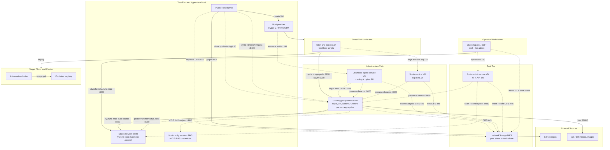

# Deployment topology

> One sentence: how the parts run and talk over the network when fully deployed,
> grouped into seven network nodes.

See [Design overview](00-index.md) · [Component breakdown](02-component-breakdown.md) ·
[Yuruna Architecture](../architecture.md).

Derived from `test/Invoke-TestRunner.ps1`, `test/Start-StatusService.ps1`,
`test/service/Start-ConfigService.ps1`, the
`test/service/Start-{CachingProxyServiceVM,StashServiceVM,PoolControlServiceVM,DownloadAgentServiceVM}.ps1`
launchers,
`host/vmconfig/{caching-proxy-service,stash-service,pool-control-service,download-agent-service}.base.user-data`,
`guest/ubuntu.server.26/ubuntu.server.26.{stash,pool-control,download-agent}-service.sh`,
`test/extension/{pool-aggregator-service,pool-control-service,stash-service,download-agent-service}`,
`host/modules/Yuruna.DownloadAgent.psm1`,
`test/modules/{Test.PoolSync,Test.PoolStorage,Test.PoolPush,Test.PoolNotifier,Test.ExtensionService,Test.VMUtility}.psm1`,
`test/pool/*.ps1`, and `test/test.config.yml.template`. Mermaid has no
deployment-diagram type, so each network node is a `subgraph`.

```mermaid
flowchart TD
    subgraph operator[Operator Workstation]
        cli[CLI: setup.ps1, Set-*<br/>pool + lab admin]
    end
    subgraph runnerhost[Test-Runner / Hypervisor Host]
        runner[Invoke-TestRunner]
        statussrv[Status service :8080<br/>/yuruna-repo /livecheck /control]
        hostcfg[Host config service :8443<br/>mTLS NAS credentials]
        provider[Host provider<br/>Hyper-V / KVM / UTM]
    end
    subgraph infravm[Infrastructure VMs]
        squid[Caching-proxy service VM<br/>squid, zot, Apache, Grafana<br/>parser, aggregator]
        stash[Stash service VM<br/>scp sink, UI]
        agent[Download-agent service VM<br/>catalog + bytes :80]
    end
    subgraph guestvm[Guest VMs under test]
        guest[fetch-and-execute.sh<br/>workload scripts]
    end
    subgraph pooltier[Pool Tier]
        poolctl[Pool-control service VM<br/>UI + API :80]
        nas[networkStorage NAS<br/>pool share + stash share]
    end
    subgraph cloud[Target Cloud and Cluster]
        k8s[Kubernetes cluster]
        registry[Container registry]
    end
    subgraph external[External Sources]
        github[GitHub repos]
        mirrors[apt / dnf mirrors, images]
    end

    cli -->|deploy| cloud
    runner -->|create VM| provider
    provider --> guestvm
    guest -->|/livecheck /yuruna-repo :8080| statussrv
    guest -->|apt + image pulls :3128 :3129 :5000| squid
    squid -->|miss 80/443| mirrors
    squid -->|/yuruna-repo build source :8080| statussrv
    runner -->|git pull 443| github
    k8s -->|image pull| registry

    %% planned - every dashed edge below is config-gated and carries its own
    %% gate comment; the "What gates each dashed edge" table names each gate.
    %% The three identical presence beacons share one row, every other edge
    %% has its own.
    %% gate: configService.enabled
    squid -.->|mTLS /v1/nas/pool :8443| hostcfg
    %% gate: pool.networkReplicate baked as YPOOL_NAS_REPLICATE
    squid -.->|CIFS 445| nas
    %% gate: aggregator -status-port and -interval flags
    squid -.->|probe /runtime/status.json :8080| statussrv
    %% gate: pool.enabled + pool.intentGitUrl
    runner -.->|clone pool-intent.git :80| squid
    %% gate: stored lab-auth-token
    runner -.->|cycle NDJSON /ingest :9400| squid
    %% gate: pool.networkReplicate + networkStorage.poolStorage keys
    runner -.->|replicate CIFS 445| nas
    %% gate: downloadAgentService.enabled, then the discovery ladder
    provider -.->|ensure + artifact :80| agent
    %% gate: --pool-dir on a mounted share
    agent -.->|Download pool CIFS 445| nas
    %% gate: YURUNA_CACHE_PROXY_IP plus --proxy-ca for HTTPS
    agent -.->|origin fetch :3128 :3129| squid
    %% gate: --aggregator-url + --host-id on each service
    agent -.->|presence beacon :9400| squid
    %% gate: none for create or read; DELETE needs a lab token
    guest -.->|large artifacts scp :22| stash
    %% gate: networkStorage.stashStorage keys
    stash -.->|files CIFS 445| nas
    %% gate: --aggregator-url + --host-id on each service
    stash -.->|presence beacon :9400| squid
    %% gate: --state-dir on a mounted share
    poolctl -.->|intent + state CIFS 445| nas
    %% gate: --aggregator-url + --host-id on each service
    poolctl -.->|presence beacon :9400| squid
    %% gate: --scan-interval sweep, then an X-Yuruna-Control proof
    poolctl -.->|scan + control proof :8080| statussrv
    %% gate: lab-token session for writes
    cli -.->|operator UI :80| poolctl
    %% gate: pool.intentGitUrl or -IntentGitUrl
    cli -.->|admin CLIs write intent| nas
```

**What runs where.** Co-resident processes are folded into the VM box that runs
them — the caching-proxy VM alone hides eleven long-lived listeners and seven
timers, and drawing them would blow the seven-child budget on its own.

| Box | What runs on it | Brought up by |
|-----|-----------------|---------------|
| `cli` | `install/setup.ps1`, the 13 pool-intent CLIs, `test/lab/Set-LabToken.ps1`, a browser on the dashboards | `install/setup.ps1` after the per-host bootstrapper in `install/` |
| `runner` | outer loop, one cycle-child and one inner process per cycle, plus the detached `Invoke-PoolStorageDrain.ps1`, `Invoke-PoolPushForwarder.ps1` and `Invoke-HostAddressBeacon.ps1` sidecars | `test/Invoke-TestRunner.ps1` |
| `statussrv` | detached `HttpListener` on `statusService.port` (8080); PID in `runtime/server.pid` | `test/Start-StatusService.ps1` |
| `hostcfg` | `TcpListener` + `SslStream` on `configService.port` (8443), client certificate required on every route; PID in `runtime/config-server.pid` | `test/service/Start-ConfigService.ps1 -Serve` |
| `provider` | Hyper-V, libvirt-KVM or UTM plus `host/<type>/modules/Yuruna.Host.psm1`; on macOS also `Start-CachingProxyServiceForwarder.ps1` | `host/<type>/Enable-TestAutomation.ps1` |
| `squid` | squid, Apache, Grafana, zot, the log parser and the pool-aggregator, over loopback-only Prometheus, Loki, promtail and two exporters | `test/service/Start-CachingProxyServiceVM.ps1` |
| `stash` | one `stash-service` process holding **both** :22 and :80, with the OS sshd masked to free :22; `yuruna-host-locate.timer` | `test/service/Start-StashServiceVM.ps1` |
| `agent` | `download-agent-service` on :80; `yuruna-host-locate.timer`; a build-time-only pwsh + pinned Fido for Windows 11 URLs | `test/service/Start-DownloadAgentServiceVM.ps1` |
| `guest` | `automation/fetch-and-execute.sh` plus the family workload script from `guest/<family>/` | `host/<type>/guest.<key>/New-VM.ps1`, called through the `New-VM` contract verb |
| `poolctl` | `pool-control-service` on :80, a full pwsh, the framework checkout it shells out to, and git | `test/service/Start-PoolControlServiceVM.ps1` |
| `nas` | no Yuruna process — the pool share and the separate stash share | mounted, never started: `Connect-YurunaPoolStorage` on hosts, an `/etc/yuruna/*.cifs.cred` fstab line in the service guests |
| `k8s`, `registry` | the workloads and images the project deploys | `automation/Set-Resource.ps1`, `Set-Component.ps1`, `Set-Workload.ps1` |
| `github`, `mirrors` | third-party | not brought up by Yuruna |

**What gates each dashed edge.** There is no single pool switch; every optional
link has its own flag, and two of them live outside `test.config.yml` entirely.

| Dashed edge | Exact gate |
|-------------|------------|
| `squid → hostcfg` | `configService.enabled` (default `true`) and `configService.port`. `Start-CachingProxyServiceVM.ps1` refuses to build the VM when the service is enabled but :8443 is not accepting. |
| `squid → nas` | `pool.networkReplicate`, baked into the seed as the line `YPOOL_NAS_REPLICATE='true'` in `/etc/yuruna/ypool-nas.env`; `ypool-nas-replicate.timer` is enabled only when that exact line is present. |
| `squid → statussrv` | Aggregator flags only — `-status-port` (8080), `-interval` (30s), `-host-ttl` (24h). No `test.config.yml` key. |
| `runner → squid` (intent) | `pool.enabled` (default `false`) **and** a non-empty `pool.intentGitUrl`; bounded by `pool.pullTimeoutSeconds`. |
| `runner → squid` (`/ingest`) | A stored vault `lab-auth-token` (legacy name `pool-auth-token`) **and** a reachable proxy. The aggregator self-gates on `-auth-token-file` and answers 503 without one. |
| `runner → nas` | `pool.networkReplicate` (default `false`) **and** all three of `networkStorage.poolStorage{LocalPath,NetworkPath,NetworkUser}`. |
| `provider → agent` | `downloadAgentService.enabled` decides only whether `install/setup.ps1` brings the VM up. The call itself is gated by the discovery ladder in `Yuruna.DownloadAgent.psm1`: `$env:YURUNA_EXTENSION_HOST_DOWNLOAD_AGENT_SERVICE`, then a local `yuruna-download-agent-service` VM, then the pool's `/api/v1/extension-hosts` — every rung proved with a 2-second `/healthz`. |
| `agent → nas` | `--pool-dir` (default `/mnt/yuruna-pool`) over a mounted share. |
| `agent → squid` | `YURUNA_CACHE_PROXY_IP` in `/etc/yuruna/download-agent.env` becomes `--proxy-http` / `--proxy-https`; HTTPS proxying is dropped when the `--proxy-ca` PEM is absent, and freshness probes always go direct. |
| `agent/stash/poolctl → squid` (beacon) | A non-empty `--aggregator-url` **and** `--host-id`, with the presence interval above zero. |
| `guest → stash` | Ungated for create and read. `DELETE` needs `--aggregator-url` — without it the daemon disables deletion — plus a lab-token session or a control proof. |
| `stash → nas` | All three `networkStorage.stashStorage{LocalPath,NetworkPath,NetworkUser}` non-empty; they are empty by default, and `--share-folder` then falls back to VM-local `/var/lib/stash-service/share-local`. |
| `poolctl → nas` | `--state-dir` on the mount. The intent store resolves to `$MOUNT/pool-intent.git`, and the daemon refuses to create it on local disk under an unmounted mountpoint. |
| `poolctl → statussrv` | The sweep is gated by `--scan-interval` (default 15m; `0` disables the timer while the Scan page still scans on demand) over `--scan-cidr` on `--scan-port` (default 8080). The `/control/*` calls additionally need an `X-Yuruna-Control` HMAC proof minted from a shared `lab-auth-token`. |
| `cli → poolctl` | Reads are open on the trusted LAN; writes need a lab-token session backed by `--auth-token-file`. |
| `cli → nas` | `pool.intentGitUrl`, or `-IntentGitUrl` on the CLI, resolved by `Resolve-YurunaPoolAdminTarget`. |

**The caching-proxy-service VM is the busiest box.** It co-locates squid (HTTP
proxy :3128, ssl-bump :3129, plus PROXY-protocol variants :3138/:3139 that macOS
maps host→VM), the zot OCI pull-through cache (:5000), Apache (:80), Grafana
(:3000), the Go access-log parser (:9302), the **pool-aggregator-service**
(:9400) and loopback-only Loki (127.0.0.1:3100), Prometheus (127.0.0.1:9090),
the node exporter (127.0.0.1:9100) and the squid exporter (127.0.0.1:9301),
reachable only through Grafana. Only :3128 is a hard runner dependency. Apache
:80 serves the CA certificates, `/squid-meta`, `/ypool-nas-status`, and the
read-only `/pool-intent.git` alias.

**Two edges run opposite to the obvious direction.** The cache VM is the *client*
of the config service: its cloud-init curls `https://<san>:8443/v1/nas/pool` with
`--cacert/--cert/--key` and writes the CIFS credential at runtime, so a rotated
NAS password propagates without a rebuild.
`Start-CachingProxyServiceVM.ps1` refuses to build the VM when `configService`
is enabled but not accepting on :8443. The stash, pool-control-service and
download-agent-service VMs do **not** use this path — their CIFS credentials are
baked into their cloud-init seeds, and `/v1/nas/stash` is served but never
called. Likewise, the pool-aggregator-service's primary data path is a **pull**:
it harvests IPs from the squid access log and probes each one's status service on
:8080 for `/runtime/status.json`, then fetches `host.registration.json`,
`cycle.events.ndjson` and `/yuruna-repo/VERSION`. The `/ingest` push is a
supplement.

**The pool-intent store lives on the NAS**, not on the pool-control-service VM:
`pool-intent.git` sits under the pool share, the cache VM's Apache serves it
read-only over :80, and each runner clones from there every cycle. The
pool-control service writes to the same bytes through its own CIFS mount. The
operator's admin CLIs also write the intent directly — the pool-control-service
daemon shelling out to those same CLIs server-side is an internal detail, not an
operator-to-daemon call. The pool share carries more than the intent store: the
per-host cycle folders and their `.yuruna-complete` sentinels, `hosts/info.<id>.yml`,
the download-agent `images/` tree, the two service state directories, the
`notifications/{outgoing,sending,delivered,failed}` alert spool, and the proxy
guest's hourly `services/caching-proxy-service/` replica of Loki, Prometheus and
Grafana. What each holds is in
[03-data-flows.md](03-data-flows.md#f-what-lives-on-the-shared-storage).

**All four infra VMs bootstrap from the deploying host's status service**: each
seed reads `/etc/yuruna/host.env` and probes `/livecheck` first. They differ in
what they pull — the cache VM fetches per-file Go source from `/yuruna-repo`,
while the stash, pool-control-service and download-agent-service VMs pull the
whole framework as `/yuruna-archive.tar.gz`. That is why the launchers must start
the status service before creating the VM. Only one edge is drawn to keep the
diagram readable.

**The download-agent tier is an optimization with no authority.** The VM is
disposable — stopping the service destroys it and starting it rebuilds from the
base image — because the durable part is the Download pool on the NAS, which the
rebuilt agent adopts again. Its Go daemon is compiled *inside* the guest, so no
host needs a `go` toolchain. The `provider -.-> agent` edge is the whole point of
the tier: `host/*/guest.*/Get-Image.ps1` asks the agent before any publisher, so
one lab-wide download replaces one per host. A host that already holds the
current artifact is told `skipped` and stops immediately; a host that needs bytes
takes them off the LAN with `Range` resume; anything else falls back to the
publisher path with the same output and exit codes as a lab running no agent.
Reads (UI, catalog, metadata, bytes, `/healthz`) are open to the trusted LAN;
refresh, delete and prune need the rotating Lab token or the lab-auth token,
which is the `writeGate: lab-token` its manifest declares. Nothing structurally
stops two machines on one NAS from each running an agent, so the agents hold a
lease at `images/.agent-lease.json` and a losing agent goes read-only —
correctness never depends on it, since content-addressed generations make
concurrent writers safe on their own; the lease only makes duplicate work rare.

**Presence beacons are how the topology discovers itself**, and the deployed
period is not the declared one. Each service VM POSTs `/announce` to the
aggregator with its area and target port; `Get-ExtensionServiceVmRoster` keys the
roster off the areas that declare a `vmName`, which is why `pool-aggregator-service`
is absent from it — it declares `hostedIn: caching-proxy-service` instead and
runs on the cache VM. The three service manifests and the Go
`DefaultPresenceInterval` all say **2m**, but every guest bring-up script passes
`--presence-interval 15m`. The aggregator keeps a quiet target published for
`extensionHealthGrace` (5m) and then suppresses its address, while the announce
row itself survives until `-announce-ttl` (45m) reaps it.

**Ports and remaps.** The 8022→22 remap belongs to the **caching-proxy-service**
VM (its SSH jump-host access). Three more exist and fire only on
`host.macos.utm` when the VM's bundle is in **Shared NAT** mode, where the guest
has no LAN-reachable address of its own: `Start-StashServiceVM.ps1` maps
2222→22, `Start-PoolControlServiceVM.ps1` maps 8081→80, and
`Start-DownloadAgentServiceVM.ps1` maps 8082→80. The three ports are
deliberately distinct because the proxy already forwards host :80 and :2222 is
taken by the stash sink. On bridged, Hyper-V and KVM paths those three VMs are
reached directly on :22 and :80, with the stash guest masking the OS sshd to free
port 22. On Windows the cache VM is exposed through kernel `netsh interface
portproxy` plus firewall rules with no host process; on macOS
`host/macos.utm/Start-CachingProxyServiceForwarder.ps1` is a real long-lived host
process, and it prepends a HAProxy PROXY v1 header (host :3128/:3129 → VM
:3138/:3139, the `require-proxy-header` listeners) so squid still logs the real
client IP rather than the host's NAT-side one.

The client-IP limitation belongs to the **Linux KVM NAT fallback**: there
`systemd-socket-proxyd` re-originates every connection from the host, so squid
records one client IP for the whole LAN, the pool-aggregator-service discovers no
hosts, and the pool dashboard shows "No data". Caching still works on that path;
the multi-host pool view needs the cache VM **bridged**, which is why the UTM and
Hyper-V dashboards populate.

`Start-PoolControlServiceVM.ps1 -HostSideProof` adds a third listener on the
runner host (:8090, deliberately clear of :8080) and needs a local `go` toolchain.

A dashboard correction does **not** require rebuilding the cache VM:
`test/pool/Sync-PoolDashboardOnProxy.ps1` pushes the canonical
`grafana-pool-dashboard.json` onto a running proxy from the host that holds the
harness SSH key, rewriting the `AGGREGATOR_BASE_PLACEHOLDER` from the guest's own
address and letting Grafana's 30-second file provider pick it up without a
restart. A warm squid cache likewise survives a VM replacement:
`test/service/Move-CachingProxyService.ps1` hands it to the successor through a
temporary parent-child cache hierarchy rather than refetching it.

**A failed NAS mount now reports its own cause.** The three service-VM launchers
used to assert that the `networkUser` credential had failed; they now read the
verbatim reason through `Get-PoolStorageLastMountError` and pick the remedy from
it, so a `sudo -n` refusal — matched by `Test-PoolStorageSudoRefusal`, which
knows both the classic sudo and the sudo-rs wordings — is reported as a sudo
problem with the credential explicitly cleared, and the `Set-Password` instruction
appears only when the credential is actually implicated. This matters at deploy
time because a refused `sudo -n` under sudo-rs leaves no log entry behind, so the
moment has to be explained while it is happening. The download-agent gate stays
two-layered: a NAS user with **no stored password** is a hard stop before
anything is built, while a stored credential that does not authenticate right now
is a warning only — the daemon runs fine against an offline share and reports
`poolAvailable:false`. Neither `Start-PoolControlServiceVM.ps1` nor
`Start-CachingProxyServiceVM.ps1` consults `pool.enabled`; those VMs are brought
up by their own launchers regardless.

A single machine commonly hosts both **Operator Workstation** and **Test-Runner /
Hypervisor Host**.

---

LICENSEURI https://yuruna.link/license

Copyright (c) 2019-2026 by Alisson Sol et al.

Last review: 2026.08.14
