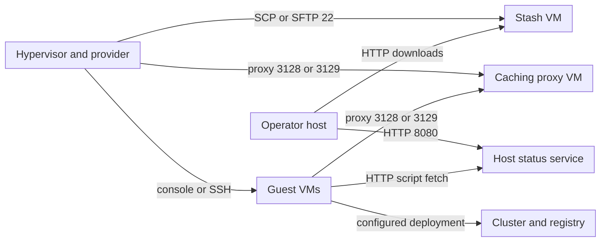
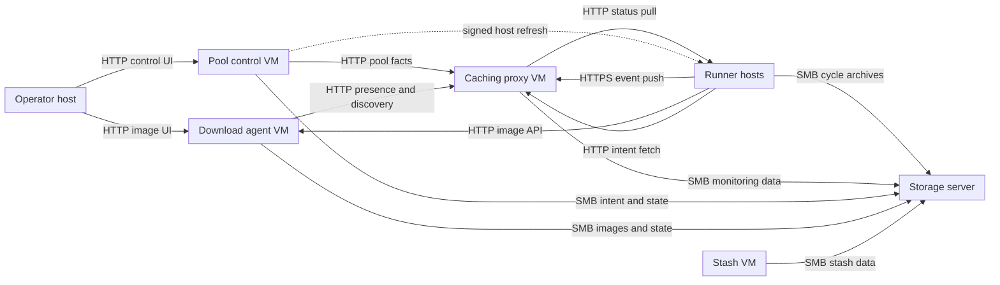
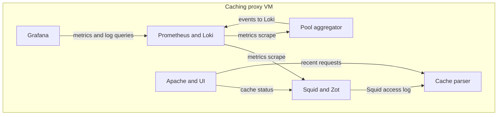
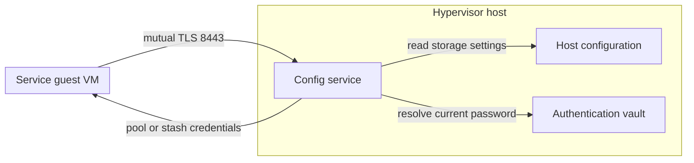
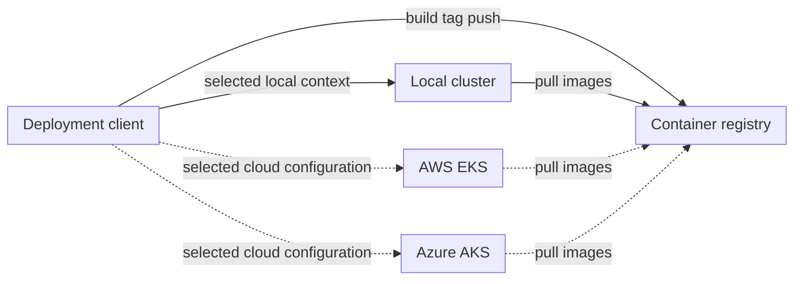

# Deployment topology

These network views place runners, providers, guests, services, storage, and deployment targets in the implemented lab topology.

The views describe a lab with its service VMs enabled. Each view contains at
most seven boxes, counting subgraph frames. Empty subgraphs represent network
nodes or named aggregates; expansions identify processes sharing a machine.
Ports are implementation defaults and may be forwarded or configured differently.
See [Architecture](../architecture.md) for the system's capability boundaries.

## Runner and guest endpoints

```mermaid
flowchart LR
    subgraph test-status["Operator host"]
    end
    subgraph host["Hypervisor and provider"]
    end
    subgraph guest["Guest VMs"]
    end
    subgraph caching-proxy-service["Caching proxy VM"]
    end
    subgraph stash-service["Stash VM"]
    end
    subgraph start-statusservice-ps1["Host status service"]
    end
    subgraph global-resources["Cluster and registry"]
    end
    test-status -->|HTTP 8080| start-statusservice-ps1
    host -->|console or SSH| guest
    guest -->|HTTP script fetch| start-statusservice-ps1
    host -->|proxy 3128 or 3129| caching-proxy-service
    guest -->|proxy 3128 or 3129| caching-proxy-service
    host -->|SCP or SFTP 22| stash-service
    test-status -->|HTTP downloads| stash-service
    guest -->|configured deployment| global-resources
```

Sources: the [host providers](../../host/),
[host contract](../../host/Yuruna.Host.Contract.psm1),
[runner entry point](../../test/Start-TestRunner.ps1),
[status service](../../test/service/Start-StatusService.ps1),
[guest fetch script](../../automation/fetch-and-execute.sh),
[cache discovery and probes](../../test/modules/Test.CachingProxyService.psm1),
[stash server](../../test/extension/stash-service/server/main.go),
[stash guest setup](../../guest/ubuntu.server.26/ubuntu.server.26.stash-service.sh),
and the companion [website guest deployment](https://github.com/alissonsol/yuruna-project/blob/main/example/website/test/ubuntu.server.26/ubuntu.server.26.workload.k8s.website.sh).

The hypervisor box groups the selected `Yuruna.Host.psm1` driver with its
outer/cycle/inner runner processes. Implemented host families are
`windows.hyper-v`, `ubuntu.kvm`, and `macos.utm`; provider console operations are
local hypervisor calls, while SSH is a guest network connection. The status
service is another process on the hypervisor host, separated here to show the
HTTP boundary. It serves operator pages, control routes, artifacts, and scripts
fetched by guests. An operator may use the same physical host.

The seven-box overview groups deployment targets into one endpoint. The website
Ubuntu guest runs the three deployment scripts itself and can host its local
registry and Kubernetes target. Other selected configurations target cloud
infrastructure, expanded below. Stash uploads use the stash daemon's SSH
listener; this listener replaces the service VM's ordinary SSH daemon.

## Pool services and storage

```mermaid
flowchart LR
    subgraph test-status["Operator host"]
    end
    subgraph host["Runner hosts"]
    end
    subgraph caching-proxy-service["Caching proxy VM"]
    end
    subgraph pool-control-service["Pool control VM"]
    end
    subgraph download-agent-service["Download agent VM"]
    end
    subgraph stash-service["Stash VM"]
    end
    subgraph network-storage["Storage server"]
    end
    test-status -->|HTTP control UI| pool-control-service
    test-status -->|HTTP image UI| download-agent-service
    host -->|HTTPS event push| caching-proxy-service
    caching-proxy-service -->|HTTP status pull| host
    host -->|HTTP image API| download-agent-service
    host -->|SMB cycle archives| network-storage
    caching-proxy-service -->|SMB monitoring data| network-storage
    pool-control-service -->|SMB intent and state| network-storage
    download-agent-service -->|SMB images and state| network-storage
    stash-service -->|SMB stash data| network-storage
    pool-control-service -->|HTTP pool facts| caching-proxy-service
    download-agent-service -->|HTTP presence and discovery| caching-proxy-service
    host -->|HTTP intent fetch| caching-proxy-service
    %% optional: remote refresh requires configured authority and credentials.
    pool-control-service -.->|signed host refresh| host
```

Sources: [pool event push](../../test/modules/Test.PoolPush.psm1),
[pool storage](../../test/modules/Test.PoolStorage.psm1),
[pool worker conversion](../../test/modules/Test.PoolWorker.psm1),
[aggregator](../../test/extension/pool-aggregator-service/main.go),
[pool control](../../test/extension/pool-control-service/server/main.go),
[download agent](../../test/extension/download-agent-service/server/main.go),
[host image client](../../host/modules/Yuruna.DownloadAgent.psm1),
[stash server](../../test/extension/stash-service/server/main.go), and the
[shared proxy provisioning assets](../../host/vmconfig/caching-proxy-service.base.user-data).

The caching-proxy VM also hosts the pool aggregator and the HTTP Git endpoint
for `pool-intent.git`. The aggregator defaults to port 9400, supports TLS when
its certificate/key are installed, and serves plain HTTP for discovery and
browser requests. The runner's event push requires pinned HTTPS. Pool-control,
download-agent, and stash HTTP listeners default to port 80 in their own VMs.
The pool-control service makes remote host refresh available only when its
signing authority and operator credential are configured.

This seven-box view groups the two independently configured storage shares on
one storage server; deployments may put them on different servers. Pool data
and stash data have separate paths and accounts in `networkStorage`. A NAS or
a runner host can export the shares. The pool contains host archives,
monitoring data, download images/state, and control intent/state, expanded in
[Data flows](03-data-flows.md). Service enablement and ownership are
configuration choices: a worker can use existing lab services without
provisioning its own service VMs.

## Caching-proxy VM processes

```mermaid
flowchart TB
    subgraph caching-proxy-service["Caching proxy VM"]
        squid-zot["Squid and Zot"]
        caching-proxy-parser-service["Cache parser"]
        pool-aggregator-service["Pool aggregator"]
        prometheus-loki["Prometheus and Loki"]
        grafana["Grafana"]
        apache2["Apache and UI"]
    end
    squid-zot -->|Squid access log| caching-proxy-parser-service
    prometheus-loki -->|metrics scrape| squid-zot
    prometheus-loki -->|metrics scrape| pool-aggregator-service
    pool-aggregator-service -->|events to Loki| prometheus-loki
    grafana -->|metrics and log queries| prometheus-loki
    apache2 -->|cache status| squid-zot
    apache2 -->|recent requests| caching-proxy-parser-service
```

Sources: the [shared proxy seed](../../host/vmconfig/caching-proxy-service.base.user-data),
[cache management daemon](../../test/extension/caching-proxy-service/main.go),
[cache parser](../../test/extension/caching-proxy-parser-service/), and
[pool aggregator](../../test/extension/pool-aggregator-service/main.go).

One VM frame plus six children gives seven boxes. Squid and Zot form the
HTTP/package and OCI-image cache aggregate; exporters are grouped with the
services they observe. Prometheus and Loki share a monitoring-storage box.
Apache and the Go management UI share the web box: Apache exposes the landing
page on port 80 and proxies it to the management daemon on port 9310. Apache
also serves certificates and pool intent. Zot serves the registry API on 5000;
Grafana serves dashboards on 3000. The aggregator, web UI, and Grafana are
separate services, so a working dashboard does not establish collector health.

## Guest configuration channel

```mermaid
flowchart LR
    subgraph guest["Service guest VM"]
    end
    subgraph host["Hypervisor host"]
        start-configservice-ps1["Config service"]
        test-config-yml["Host configuration"]
        authentication["Authentication vault"]
    end
    guest -->|mutual TLS 8443| start-configservice-ps1
    start-configservice-ps1 -->|read storage settings| test-config-yml
    start-configservice-ps1 -->|resolve current password| authentication
    start-configservice-ps1 -->|pool or stash credentials| guest
```

Sources: [Start-ConfigService](../../test/service/Start-ConfigService.ps1),
[certificate authority helpers](../../test/modules/Test.ConfigServiceCA.psm1),
[authentication extension](../../test/extension/authentication/default.psm1),
[configuration template](../../test/test.config.yml.template), and the
[service guest client](../../host/vmconfig/caching-proxy-service.base.user-data).

This five-box view makes host co-location explicit. The endpoint defaults to
8443 and serves `/v1/nas/pool` and `/v1/nas/stash` to authenticated service guests.
It reads configuration and vault data for each request, allowing credential
rotation to reach running service VMs. Its local reads are distinct from the
network request. The browser-facing status service uses a separate listener.

## Deployment targets

```mermaid
flowchart LR
    subgraph set-resource-ps1["Deployment client"]
    end
    subgraph localhost["Local cluster"]
    end
    subgraph aws["AWS EKS"]
    end
    subgraph azure["Azure AKS"]
    end
    subgraph registry["Container registry"]
    end
    set-resource-ps1 -->|selected local context| localhost
    %% optional: AWS and Azure are selected configuration alternatives.
    set-resource-ps1 -.->|selected cloud configuration| aws
    set-resource-ps1 -.->|selected cloud configuration| azure
    set-resource-ps1 -->|build tag push| registry
    localhost -->|pull images| registry
    aws -.->|pull images| registry
    azure -.->|pull images| registry
```

Sources: [local resource templates](../../global/resources/localhost/),
[AWS resource templates](../../global/resources/aws/),
[Azure resource templates](../../global/resources/azure/),
[component publisher](../../automation/Yuruna.Component.psm1),
[workload publisher](../../automation/Yuruna.Workload.psm1),
[credential providers](../../automation/Yuruna.CredentialProvider.psm1), and
[website target configurations](https://github.com/alissonsol/yuruna-project/tree/main/example/website/config).

This five-node view expands the overview's target aggregate. The deployment
client groups the three phase scripts and can run on the operator host or in
a workload guest. The registry box groups the selected local registry, AWS ECR,
Azure ACR, or another configured registry. Cloud boxes describe checked-in
provisioning/configuration paths, not evidence of a live deployment. GCP
resource deployment is planned and has no template or project configuration
in the current tree; Google Artifact Registry login is already implemented.

For AWS, `clusterEndpoint` addresses the Kubernetes control plane, while
`hostname` and `frontendIp` outputs describe application ingress. The
[ingress resources](../../global/resources/aws/eks-cluster/endpoints.tf) route
load-balancer ports 80/443 to ingress NodePorts 30080/30443; the
[AWS workload configuration](https://github.com/alissonsol/yuruna-project/blob/main/example/website/config/aws/workloads.yml)
consumes the application outputs separately from the cluster context.

---

[Architecture](../architecture.md) | [Design overview](README.md)
