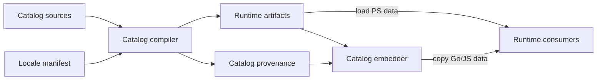
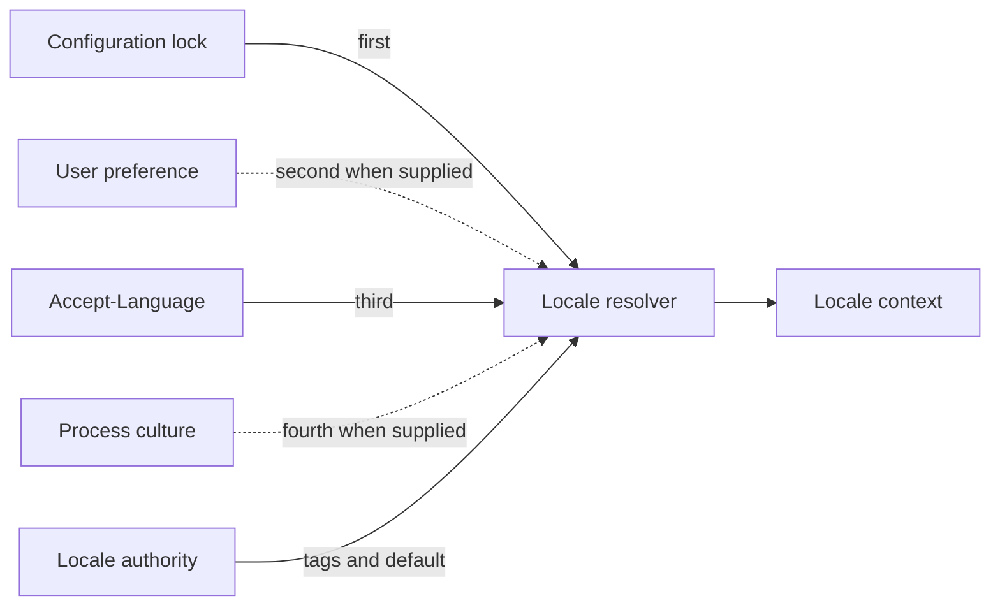
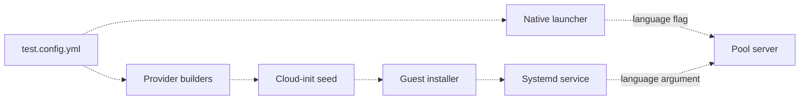
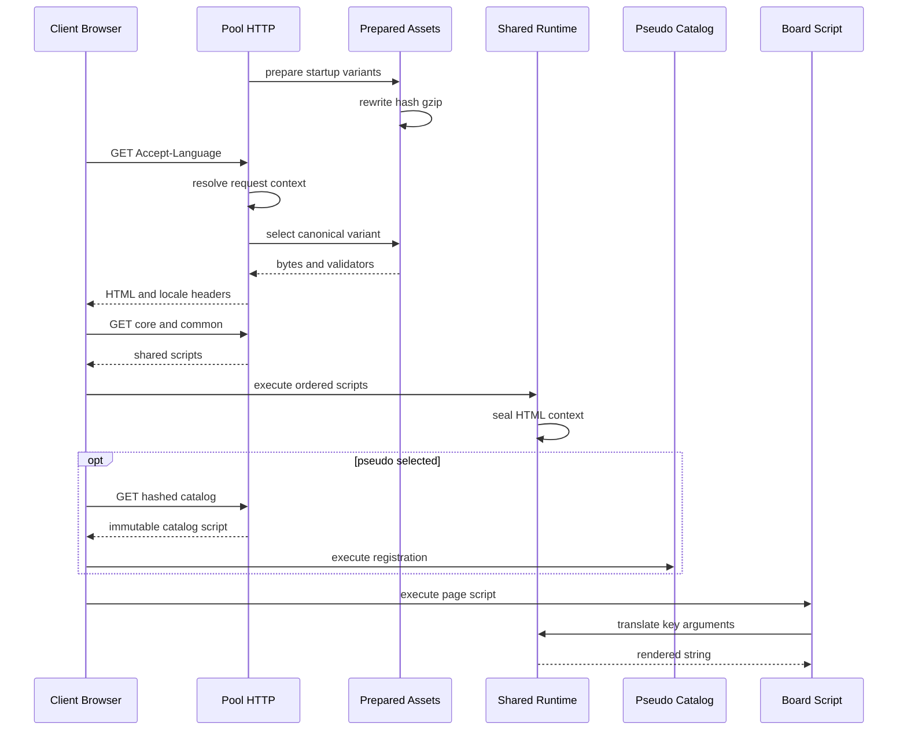
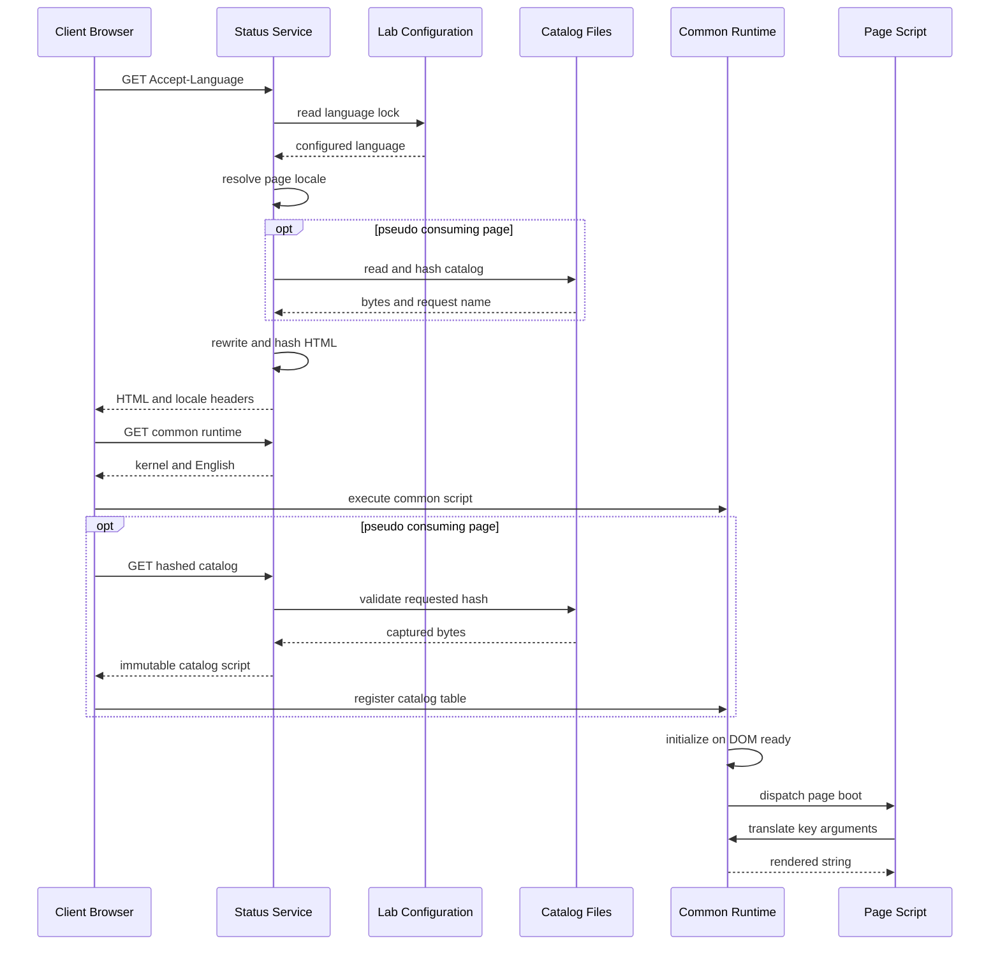
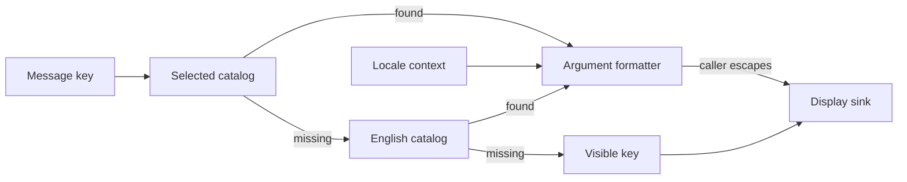
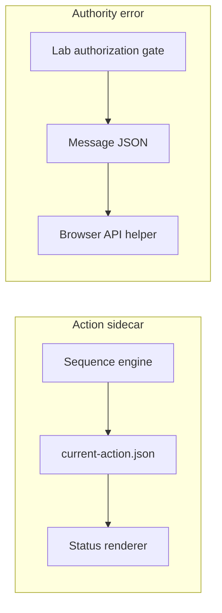
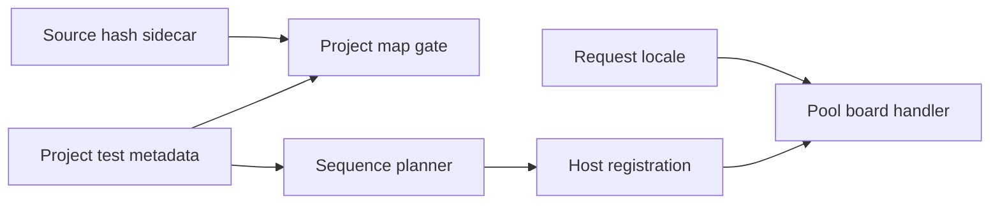
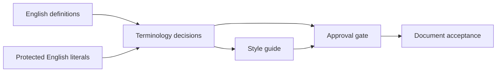

# Globalization and future localization

This page explains the implemented globalization mechanisms, their current localization coverage, and the remaining work needed to enable additional runtime languages.

## 1. What exists now

Globalization keeps machine behavior independent of a reader's language and gives
human-facing code explicit locale, catalog, formatting, and review boundaries.
Localization supplies reviewed wording through those boundaries. In the current
tree, the infrastructure is broader than the translated runtime surface.

| Locale | Manifest status | Runtime selection | Authored content |
|---|---|---|---|
| `en-US` | `supported` | Default and only release-supported locale | English `pool` and `status` catalogs |
| `pt-BR` | `planned` | Not enabled; plural rule is `null` | Approved terminology/style and 13 document translations recorded as reviewed; no runtime source catalog |
| `qps-Ploc` | `pseudo` | Explicit test opt-in | Generated expanded-Latin messages, LTR |
| `qps-Plocm` | `pseudo` | Explicit test opt-in | Generated mirrored messages, RTL |

The authority is [locale-manifest.json](../../globalization/locale-manifest.json).
The current catalogs contain 7 active `pool` keys and 19 active `status` keys, not
every user-visible string in the product. Status and pool-control provide reference
conversion slices; English dialogs, errors, and static page text still exist.
Loading the shared browser runtime into stash/download-agent pages does not make
their text localized. Caching-proxy manager/parser pages use compatibility helpers
but still contain English HTML.

There are four independent readiness questions:

- Can the service select the locale and actually deliver its catalogs?
- Does each human-facing call site use a key or a project locale map?
- Are the locale's formatting and plural rules implemented consistently?
- Has the relevant translation received the required human review?

Passing one does not imply the others. Reviewed Portuguese documents do not enable
Portuguese UI, and complete coverage of 26 catalog keys does not mean complete UI
conversion. The 13 document records cover eight framework documents and five
project documents; they record repository review state, not proof of a public
release. The two Portuguese project-label sidecar entries remain `unreviewed`.

Sources: `globalization/manifests/{inventory,doc-translations,browser-sources}.json`,
`globalization/terminology/pt-BR.{terms,style-guide}.json`,
`test/extension/pool-control-service/server/internal/httpsrv/web/assets/{board,common}.js`,
`test/status/yuruna.common.js`, and
`yuruna-project/globalization/project-locale-source-hashes.json`.

## 2. Catalog contracts, compilation, and distribution

Sources: `globalization/catalogs/en-US/{pool,status}.json`,
`globalization/schema/catalog.schema.json`, `tools/Invoke-CatalogCompile.ps1`,
`globalization/generated/`, `globalization/manifests/catalog-set.json`, and
`tools/Invoke-CatalogEmbed.ps1`. Runtime Consumers groups
`test/modules/Test.Catalog.psm1`, `test/extension/extension-sdk/i18n/`, and
`globalization/kernel/yuruna.i18n.js`; compilation and distribution are separate
steps because the services do not all import one shared runtime artifact.

### English owns the message contract

A catalog key is a stable, namespaced identifier such as `status.cycle_paused`.
Its English record owns context, lifecycle, placeholder types and trust metadata,
and scalar versus plural/select structure. Placeholders include representative
examples. Lifecycle distinguishes active, deprecated, and tombstoned keys.

A translation supplies wording or variants and the English message's `sourceHash`.
It cannot redefine argument types, selector, lifecycle, or context. The compiler
rejects unknown/tombstoned keys, stale source hashes, incompatible message forms,
and mismatched variant names. It merges translated wording with English-owned
metadata before compiling. Currently translated plural/select branch names must
exactly match the English branch set; extra categories require a contract/compiler
change, not just another translated branch.

Every locale marked `supported` must pin a plural rule and cover every
non-tombstone English key. Planned Portuguese is not a complete runtime catalog
merely because its manifest already declares direction and separators.

### Runtimes consume prepared data

The compiler emits deterministic PowerShell data, Go data, and classic ES5 browser
JavaScript. It generates pseudo locales from English and tokenizes messages into
literals, argument segments, and selector variants. Runtime rendering walks these
pieces; it does not parse source message syntax on every label.

PowerShell lazily caches locale/domain tables loaded with
`Import-PowerShellDataFile`. Go decodes registered tables once; pool-control uses
`sync.Once`. Browser payloads register tables by locale and domain.
`Invoke-CatalogCompile.ps1 -Check` verifies output freshness, including orphan
outputs; `-Update` regenerates them. Sorted keys, fixed layout, LF, and no generated
timestamps keep the output reproducible.

The embedder's distribution lists are explicit:

| Consumer | Resident content | Additional content now |
|---|---|---|
| `test/status/yuruna.common.js` | Kernel and English `status` | Separate pseudo `status` scripts |
| SDK `webui/assets/yuruna.core.js` | Kernel and English `status` | Page/service-specific assets |
| Pool `web/assets/common.js` | English `pool` | Separate pseudo `pool` scripts |
| Pool Go `internal/catalog/` | English and both pseudos, `pool` and `status` | No Portuguese tables |

`Invoke-CatalogEmbed.ps1 -Check` detects drift between generated authority and
copies. Adding a locale to the manifest alone does not add it to these copies or
to the service-specific selection paths.

`catalog-set.json` records input and artifact hashes, sizes/counts, and per-message
provenance. Its complete-file hash becomes catalog-set identity carried by runtime
contexts. That identity is distinct from the hash of one served script or HTML
representation used in a URL or ETag.

## 3. Locale authority and deterministic matching

This is the implemented generic API, not a diagram of an implemented language
selector. Sources: `New-LocaleContext` in `test/modules/Test.Locale.psm1`,
`NewContextWithUser` in `test/extension/extension-sdk/i18n/locale.go`, and
`globalization/fixtures/locale-matching.json`.

The live status and pool HTTP adapters supply only configuration and
`Accept-Language`, with process culture explicitly empty and no user preference.
Their effective precedence is configuration lock, then header, then default.
There is no current language-selector UI, locale cookie/localStorage preference,
or live page-language switch.

The resolver uses bounded supported-tag matching:

1. Trim input, turn underscores into hyphens, normalize tag casing, and validate
   shape. Tags are limited to 35 characters and headers to 512. Invalid path-like
   input is rejected, not repaired into an asset name.
2. Match an enabled tag exactly, then a declared alias. There is no arbitrary
   parent-language or neighboring-region fallback. `en` can resolve to `en-US`;
   `pt` and `pt-PT` cannot enable their currently planned `pt-BR` target.
3. For headers, reject candidates with malformed or repeated quality parameters,
   skip `q=0` candidates and wildcards, and prefer the highest valid quality.
   Equal quality uses ordinal resolved-tag then requested-tag ordering, not the
   client's list order; aliases of the same supported tag are deduplicated.
4. If nothing usable remains, use the default. Thus `q=0` is a candidate exclusion,
   not a promise of HTTP 406 or a prohibition on the final application default.

A non-`auto` configured lock is authoritative even when unsupported: it produces
the English fallback with decision source `config`; the header cannot override it.
For example, configuring `pt-BR` today does not unlock a Portuguese catalog or let
an enabled pseudo header bypass the configuration lock.

The normal PowerShell/Go context carries requested and resolved tags, direction,
source, UTC time-zone policy, and catalog version/hash. PowerShell returns a
read-only dictionary; Go carries a value on the request. The status adapter projects
tag/requested tag/direction/source into its HTML renderer. Go `FromRequest` has a
minimal default fallback if middleware was omitted; that fallback does not carry
all the normal provenance fields.

### How configuration reaches the pool service

Sources: `test/test.config.yml`, `test/service/Start-PoolControlServiceVM.ps1`,
the three `host/<platform>/guest.pool-control-service/New-VM.ps1` builders,
`host/vmconfig/pool-control-service.base.user-data`,
`guest/ubuntu.server.26/ubuntu.server.26.pool-control-service.sh`, and
`test/extension/pool-control-service/server/{main.go,internal/httpsrv/httpsrv.go}`.
The builders are one aggregate, and native versus VM launch are optional
alternatives, not two required launches.

Pool-control captures its language at startup. A launcher/config change requires
service restart to replace that value and its prepared page variants. Its
`i18nwire.go` builds the effective locale list from explicit embedded tags, removing
pseudos unless `--allow-pseudo-locale` was passed. The generic SDK also offers
manifest/available-catalog intersection, but this service prebuilds its own
authority once rather than narrowing it afresh per request.

Status behaves differently: `Resolve-PageLocale` in
`test/service/Start-StatusService.ps1` rereads the lab's `language` at each page/error
request. It explicitly enables `en-US`, adding pseudos only when
`YURUNA_ALLOW_PSEUDO_LOCALE` is `1` or `true`. This list must also change before a
real additional locale becomes selectable.

## 4. Server decision and browser execution

### Pool-control: prepare once, select per request

Sources: pool-control `internal/httpsrv/{httpsrv.go,assets.go,handlers.go}`,
`internal/httpsrv/web/{board.html,assets/board.js,assets/common.js}`, SDK
`webui/assets/yuruna.core.js`, and `globalization/kernel/yuruna.i18n.js`.
Pool HTTP folds the real locale middleware and page handler; Shared Runtime folds
the core and common scripts to keep this sequence to six participants.

Middleware resolves once and attaches the decision; it does not write language
headers. The representation handler decides whether its response varies by locale.
Middleware wraps the mux outside per-route mutation authorization, so negotiation
happens before those authorization checks. A language header is not a credential
and grants no mutation authority.

The server writes `lang`, `dir`, `data-yuruna-requested-language`, and
`data-yuruna-locale-source` into HTML. The kernel initializes from this server-owned
decision, not `navigator.language`, and seals the page context. A non-default table
may register after initialization: selection follows generated locale authority,
while a later translation call reads whichever registered table now exists.

English is resident. For an enabled pseudo locale the page inserts
`/assets/<locale>.<SHA256>.pool.js` immediately after `/assets/common.js`, before the
page's own script. These are ordered classic script tags without `defer`: the
current implementation is parser-blocking, not an asynchronous catalog fetch or
rehydration broker. There is no separate request for the kernel itself.

### Status: materialize at the request boundary

Sources: `Resolve-PageLocale`, `Add-PageLocaleCatalog`,
`ConvertTo-LocalizedPageHtml`, and `Get-StatusLocaleCatalogAsset` in
`test/service/Start-StatusService.ps1`, plus `test/status/yuruna.common.js`.
Catalog Files aggregates generated files served from `test/status/`. Page Script
represents `bootIndex`, `bootPerf`, and other page-specific boot/render functions
inside the same `yuruna.common.js` asset, not an extra downloaded script.

Unlike pool-control, status reads/hashes the selected catalog and transforms/hashes
HTML at request time. It inserts `/<locale>.<SHA256>.status.js` only when the page
contains the common-runtime script marker. A transcript or nested report using the
generic file route may get language metadata without receiving a catalog script.

For both services, early metadata establishes language/direction and script order;
it does not translate every static sentence at first paint. Real server-rendered
catalog text includes status directory headings/captions and missing-file/too-large
errors. Pool `/api/board` selects project-authored labels per request. Remaining
static English and legacy errors are still conversion work.

### Cache identity follows the actual representation

| Representation | Identity and behavior |
|---|---|
| Pool HTML | Startup-prepared variants keyed by page, canonical requested tag, resolved tag, and decision source; raw header text is not a cache key |
| Pool encoding | Identity and gzip bytes have separate ETags; `Vary: Accept-Encoding` prevents mixing them |
| Status HTML | ETag hashes the transformed bytes, including locale metadata and any selected catalog URL |
| Negotiated HTML | `Content-Language` and `Vary: Accept-Language` are set before conditional handling and repeated on `304` |
| Pseudo catalog | Full content SHA-256 in URL; `public,max-age=31536000,immutable` |
| Shared JS/CSS | Locale-invariant bytes; no language variation solely because middleware ran |
| Board JSON | Request-selected project labels get locale headers; response remains `no-store` |
| Status 404/413 | Localized error text and diagnostic ETag, but always the actual error status, never a conditional `304` |

Sources: pool `internal/httpsrv/{assets.go,handlers.go,board.go}`, SDK
`i18n/http.go`, and status `Set-LocalizedRepresentationValidator`,
`Set-ImmutableAssetValidator`, and `Set-StatusErrorRepresentation`.
Pool's finite variant set includes default, enabled tags, and usable aliases, or
one locked context. It does not allocate a new cached page for every spelling or
weighted header. Current responses do not vary on a locale cookie because there
is no such request input yet.

## 5. Lookup, formatting, and safe display

Sources: `test/modules/Test.Catalog.psm1`, SDK
`i18n/{catalog.go,format.go}`, `globalization/kernel/yuruna.i18n.js`, and SDK
`webui/assets/yuruna.core.js`. Display Sink groups PowerShell/HTTP text writers and
browser DOM call sites; the catalog returns a string, not universally safe HTML.
The formatter also walks literals and selects compiled plural/select variants.

The key prefix selects the domain. A missing selected-locale key tries English;
if no table defines it, the visible key identifies the missing message instead of
silently producing an empty control. Fallback diagnostics differ: browser warnings
are deduplicated per key/locale/page, Go records missing lookups, and PowerShell
emits a verbose diagnostic once for a final missing key. These are not a universal
production logging pipeline.

Formatting comes from manifest-derived data, not host ICU or browser `Intl`:

| Value | Implemented display contract |
|---|---|
| Integer/decimal | Pinned grouping/separators; current decimal formatter uses two fractional digits |
| Duration argument | Native numeric seconds, floored into fixed `h`/`m`/`s` tokens |
| Datetime argument | Fixed-shape UTC display |
| Browser `fmtLocal` / `fmtLocalTime` | Fixed-shape wall clock in the reader's local zone |
| Plural/select | Compiled branch lookup with `other`; only plural rule `one-if-1` is implemented today |
| External label/path | External text, never parsed back into machine state |

The browser context declares `timeZone: local` for wall clocks; this does not turn
the separate typed datetime formatter into local-time display. Locale selection,
time zone, and wire timestamp encoding are distinct decisions.

An unpinned plural rule blocks supported-catalog compilation. Defensive runtime
behavior is not identical: PowerShell's plural helper throws, Go's standalone
helper returns an error while catalog rendering records it and uses `other`, and
the browser warns and tries the default rule when the rule is absent. An unknown
browser rule uses `other`. This is failure containment, not reviewed semantics for
Portuguese or another future language.

Callers must escape at their output boundary or use text nodes such as `Y.el`.
Pool board call sites use `Y.bidiIsolate` for external labels: it removes untrusted
directional controls and adds isolate boundaries while preserving legitimate RTL
letters. Setting `dir=rtl` alone is not an escaping policy or proof of complete RTL
layout coverage. Sources: SDK `webui/assets/yuruna.core.js` and pool
`internal/httpsrv/web/assets/board.js`.

## 6. Machine identity and the message migration boundary

These are two implemented examples, not a completed end-to-end migration.
Sources: `test/modules/Test.SequenceEngine.psm1`,
`test/status/yuruna.common.js`, SDK `labgate/labgate.go`,
`i18n/message.go`, and `webui/assets/yuruna.core.js`.

The action sidecar separates machine `code`, external `label`, and compatibility
`line`. Status maps `sequence_paused_waiting_resume` to `status.cycle_paused`; its
English-text matching is a fallback for older records without a code. Other
machine channels include `step.start`/`step.end` NDJSON in
`Test.Orchestrator.psm1` and runner `failureClass` values. These codes are not
localized just because their human labels may be.

`globalization/manifests/code-registry.json` records owners, wire codes,
producers/consumers, lifecycle, and `rendersAs` keys. Tests check those declarations
against source. The registry is not a runtime translator that automatically
converts arbitrary messages.

### The envelope is implemented, but adoption is narrow

`globalization/schema/message.schema.json`, `test/modules/Test.Message.psm1`, and
SDK `i18n/message.go` define `yuruna.message/v1`: a bounded namespaced code, at most
32 typed arguments, optional sourced/redacted external detail, and optional
non-authoritative rendered text with locale/key/catalog provenance.

| Wire argument | Encoding |
|---|---|
| Safe integer | Plain integer within JavaScript's exact range |
| Large integer / decimal / bytes | Typed wrapper with invariant decimal-string value |
| Duration | Typed wrapper with decimal-string integer `milliseconds` |
| Datetime | Typed UTC timestamp with fixed seven-digit fractional seconds |

Credential-looking argument names are rejected. Detail is bounded to 4,096 Unicode
scalar values, stripped of controls, and redacted using known secrets and common
credential patterns. Third-party prose stays non-authoritative: it is not a
translation key and must not decide runner state.

The live envelope producer found in the current tree is the Go lab authorization
gate's authority-unavailable/unconfigured refusal path. It sends canonical
`message` beside compatibility `reason`/`error`. The browser API helper preserves
the code but still derives `Error.message` from detail or legacy prose. Ordinary
pool errors still use legacy writers; no live PowerShell producer currently calls
the envelope helpers.

There is also no general typed-envelope-to-catalog adapter. The wire duration uses
milliseconds, whereas the catalog formatter takes native numeric seconds; wrapper
objects for large values are not automatically unpacked by current formatters.
Connecting those APIs without explicit conversion would be incorrect. Broad
producer migration, code-to-key dispatch, and typed-argument decoding remain future
integration work, rather than solid edges in the diagram.

The compatibility fixture records migration window `2027.02` / `2027-02-28` in
`globalization/fixtures/message-envelope.json`; converters do not automatically
disable themselves when that date arrives.

### Invariant behavior already exists outside message catalogs

Hyper-V network health reads `ifOperStatus`/`InterfaceOperationalStatus`, not the
localized word `Up`. The KVM `virsh` wrapper temporarily clears `LC_ALL`, pins
`LC_MESSAGES=C`, and restores both afterward, retaining the other locale
categories. Status normalizes wire timestamps for invariant lexical sorting.
These are globalization mechanisms even when no sentence is translated.
Sources: `host/{windows.hyper-v,ubuntu.kvm}/modules/Yuruna.Host.psm1` and
`test/service/Start-StatusService.ps1`.

## 7. Project-owned labels are a separate translation channel

Sources: `yuruna-project/test/test.runner.yml`,
`yuruna-project/globalization/project-locale-source-hashes.json`,
`tools/Invoke-ProjectLocaleMap.ps1`, `test/modules/Test.SequencePlanner.psm1`,
`test/modules/Test.Capability.psm1` and the registration paths under
`test/extension/pool-aggregator-service/`, and pool
`internal/httpsrv/board.go`. Host Registration groups the capability transport; the
sidecar feeds validation, not live label selection.

Required English `displayName` and `description` scalars have optional sibling
`displayNameLocalized` and `descriptionLocalized` maps. Test-set `name` and sequence
IDs remain machine identifiers. A map cannot redefine `en-US`, has 1–16 entries,
and uses bounded canonical tags. The map gate and PowerShell projection normalize
values to NFC and bound them to 160 Unicode scalar values for labels or 2,000 for
descriptions. The Go board reader validates UTF-8 and rune bounds but does not
normalize arbitrary host registrations.

The planner preserves the whole valid map through discovery, avoiding a language
decision frozen to the runner's process culture. The pool handler selects the
already-resolved exact locale for each request. A missing/invalid optional map or
absent translation falls back to the required English scalar; it does not borrow
another locale. The Go reader also validates the English scalar because host
registration is a trust boundary.

The map gate checks path/field/locale identities and rejects stale, orphan,
duplicate, or missing source-hash rows. An explicit
`-AcceptReviewedTranslation` operation records review for exactly one identified
translation after validating the candidate sidecar. Ordinary validation permits
`unreviewed` rows, and runtime readers do not consult sidecar hashes or review
status. The two current Portuguese smoke-test fields therefore demonstrate the
additive schema, not release-ready Portuguese UI.

Compatibility is additive: old frameworks ignore map keys, old projects provide
only scalars, and new/new pairs can use the optional maps. This data model does not
put project-authored text into framework catalogs; see also
[Configuration data model](05-data-model.md#human-text-and-stable-identifiers).

## 8. Documentation, terminology, and human review

Sources: `docs/definition.md`, `tools/githooks/pre-commit`,
`globalization/terminology/pt-BR.{terms,style-guide}.json`,
`tools/Test-Terminology.ps1`, and `tools/Test-DocTranslation.ps1`.
These boxes describe the existing review dependencies, not automatic translation.

Terminology pins definition bytes/headings, protected English literals, and retired
name/source pairs. The style guide pins the terminology file's hash. Approval
requires distinct translator and reviewer records with names, dates, and release
version evidence. The gate checks metadata and structural consistency; it cannot
verify real identity or linguistic quality.

The implemented operator helper `dev-only/Approve-Language.ps1` asks for human
decisions, writes terminology first, updates the style-guide pin next, and records
document review last. `-ListOnly` is read-only. Revising an approved term clears
approval records and returns reviewed documents to draft. This tool does not
generate runtime translations or change the locale manifest to `supported`.

`Test-DocTranslation.ps1` defines a specific 13-document subset, not every Markdown
file; the document manifest records its source hashes and review state. The tool
checks source/translated file presence, source freshness,
and relative links. Explicit `-AcceptReview` records the source hash and review
state; recording `reviewed` requires approved terminology and valid translated
links. Ordinary validation does not require every document to be reviewed.

`tools/Invoke-DocAnchor.ps1` preserves opaque file/heading IDs beside headings.
Translated headings receive the same IDs by heading order; heading-count or ID
mismatches fail. Translated wording does not define the stable target, and the
generated anchor manifest is an index rather than the authority.

### Staleness has three distinct scopes

| Translation channel | English input hashed | What becomes stale |
|---|---|---|
| Catalog `sourceHash` | Canonical semantic `{key, contract}`, recursively sorted | One message translation; JSON whitespace/key order alone does not invalidate it |
| Document `sourceHash` | Exact English file bytes | That document translation |
| Project-map `sourceHash` | UTF-8 NFC English scalar | One path/field/locale entry |

Sources: `Invoke-CatalogCompile.ps1`, `Test-DocTranslation.ps1`, and
`Invoke-ProjectLocaleMap.ps1` under `tools/`. A matching hash proves freshness
against a particular source, not human approval; approval does not enable runtime
negotiation.

## 9. Browser floor and incremental conversion gates

The current floor is Safari 9.0 / iOS 9.0 with ES5 source. The kernel is embedded
into consuming runtimes, and `globalization/kernel/yuruna.fetch-shim.js` supplies
the used XHR-backed fetch subset (`status`, `ok`, `text`, and `json`). Shared
`Y.api` has a default 10-second timeout even without `AbortController`, aborts the
underlying request where possible, and ignores late completion. The raw-page
request helper provides a similar bounded compatibility path. Status calls are
not all routed through `Y.api`; there is no universal request broker.

`tools/Invoke-Es5Check.ps1` checks registered browser sources for newer syntax and
locale-sensitive native calls such as `Intl` and `toLocale*`.
`tools/Invoke-CssVarFallback.ps1` maintains literal CSS fallbacks for the light
palette, and `tools/Invoke-PerfBaseline.ps1` checks tracked byte/request budgets.
Pseudo runs exercise expansion and RTL through real services, but do not certify
linguistic review, every screen, or behavior on a physical floor device.

Conversion is incremental. `Invoke-DomainInventory.ps1` maintains a 16-domain
heuristic census; candidate counts are not translation-completeness percentages.
`Invoke-AffectedSliceMap.ps1` checks owned producer/consumer paths, and
`Test-GlobalizationAuthority.ps1` ratchets already-converted source regions against
unexplained prose and machine boundaries against rendered English. Current
authority covers two bounded converted regions; display-only inventory remains
separate. Sources are the corresponding scripts under `tools/` and
`globalization/manifests/{domain-inventory,affected-slice-authority,conversion-authority}.json`.

| Check | What it establishes |
|---|---|
| Catalog compile/embed `-Check` | Contract validity and generated/copy freshness |
| `Test-Utf8Catalog.ps1` | Encoding and Unicode constraints |
| Locale fixtures and PS/Go/browser tests | Shared matching/formatting behavior on covered cases |
| Code-registry and slice checks | Stable identities and classified conversion boundaries |
| `Test-Terminology.ps1` | Structural/pin consistency; `-RequireApproved` additionally requires approvals |
| `Test-DocTranslation.ps1` | Document freshness/links; `-RequireReviewed` additionally requires review |
| `Invoke-ProjectLocaleMap.ps1` | Additive-map structure and hash integrity, not universal field review |
| `Invoke-CrossRepoGate.ps1` | Paired framework/project checks, expanded by mode |

All cross-repository modes run document validation without `-RequireReviewed`;
`full` and `release` also run terminology validation without `-RequireApproved`.
`changed-domain` covers cross-repository structural/text checks; `full` adds
framework gates and focused runtime matrices; `release` adds expected staged-tree
identities. None imposes universal translation approval.

Separately, the private release-preparation workflow requires approved
terminology/style and review of one selected first document, plus all-document
integrity. It is not an all-document review mandate.
The private release publisher validates private-stripped staged
framework/project trees, binds evidence to both tree hashes, and rechecks them
before publishing. Tree integrity, translation review, and runtime language
readiness remain different contracts.

## 10. Future localization: concrete remaining work

The following is planned work inferred from the implemented boundaries, not a
claim that a locale switch or a complete translated application already exists.

| Area | Existing foundation | Work still needed |
|---|---|---|
| Portuguese runtime catalogs | English contracts, source hashes, compiler, reviewed terminology | Author and review Portuguese wording for every required existing key |
| Portuguese grammar | Manifest rule field and three deterministic formatters | Pin reviewed semantics and implement/test the rule in PS, Go, and JS; only `one-if-1` exists now |
| Runtime enablement | Generated outputs, explicit embed lists, bounded HTTP selection | Coordinate complete catalogs, supported status, embed targets, Go service lists, status allow-list, and real-locale asset selection in one validated change |
| Broader UI coverage | Domain census, stable-code registry, two reference slices | Convert remaining labels/dialogs/errors and machine/prose boundaries without translating identifiers |
| General message rendering | Typed envelope helpers and catalog APIs | Migrate producers/consumers, dispatch codes to keys, decode typed wrappers, preserve redaction and legacy compatibility |
| Project-field review | Exact-locale maps and explicit review operation | Review the two existing Portuguese fields independently of document approval |
| User-selected language | Generic resolver's user input | Add a selector and validated bounded preference input; current live HTTP has none |
| Additional languages | Generic locale/catalog concepts | Generalize Portuguese-specific terminology/style schemas, `ptBRDecision` checks, and document-anchor locale lists |

A language needing more plural categories also needs the compiler's current
English/translation branch-equality contract revisited. There is no automatic CLDR
importer: a rule identifier alone does not supply matching runtime implementations.
Likewise, successful source-catalog compilation does not automatically extend
the pseudo-only browser asset delivery branches.

If a future selector uses a locale cookie, it must feed the existing user input
below the configuration lock, validate against enabled/available catalogs, and
account for cookie-specific representations through bounded cache identity and
appropriate private revalidation/`Vary: Cookie`. Current `Accept-Language` cache
handling is not a ready-made cookie policy. A reload-based selector would also
need to preserve the server-owned whole-page decision: `setLocale` is currently a
pre-initialization fixture hook and refuses changes after initialization. Live
switching and rehydration would require a separate design.

Non-parser-blocking ordered catalog loading and status-side representation
precomputation are also possible future work, not properties of the current
implementation. An offline/static-page language resolver, if added, must be
explicitly separate from the current HTTP-owned decision; the browser does not
currently negotiate from `navigator`.

Readiness for an additional runtime language therefore requires coordinated source
contracts, reviewed wording, formatting parity, distributed assets, enabled service
selection, and tests of converted surfaces. None of those steps is performed by
updating these design documents.

## Diagram grouping

The build, resolver, launch, project-map, and lookup views each contain seven nodes.
Pool and status request sequences are separate six-participant views because their
configuration lifetime, cache preparation, and browser initialization differ. The
machine boundary uses two three-node groups for actual migrated paths; the review
view has six nodes. Optional API inputs and launch alternatives use dashed links
and `%% optional` comments. Future integration remains explicitly labeled prose,
not an invented component graph.

---

[Yuruna Architecture](../architecture.md) | [Design index](00-index.md)
