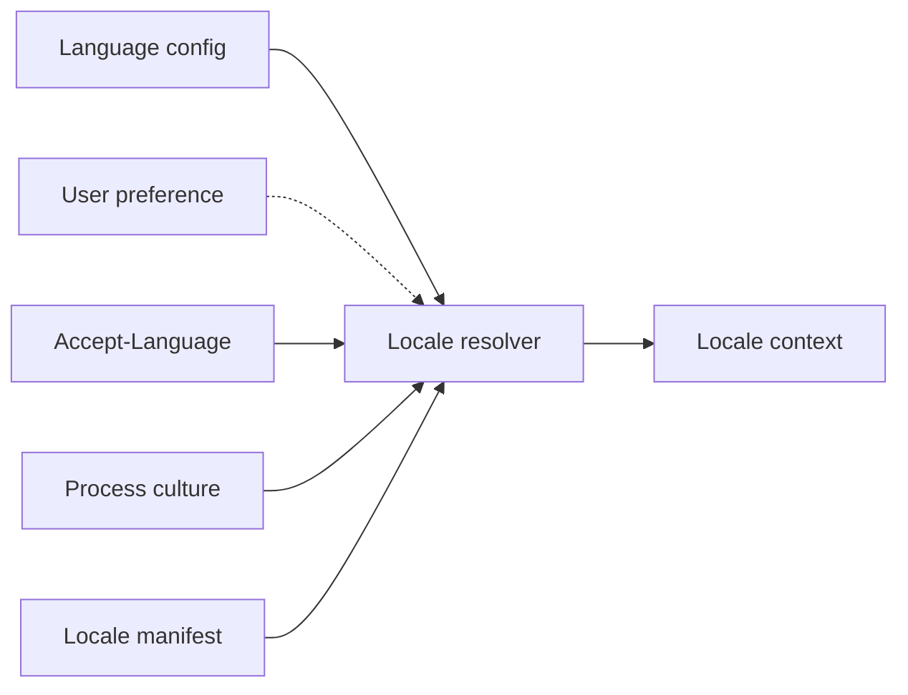
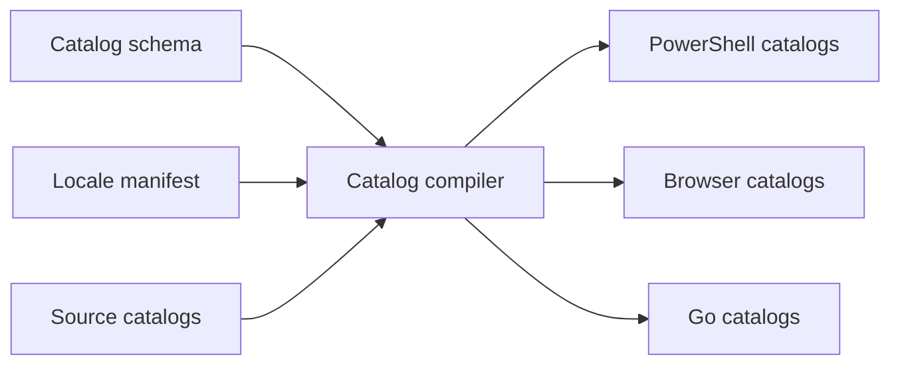
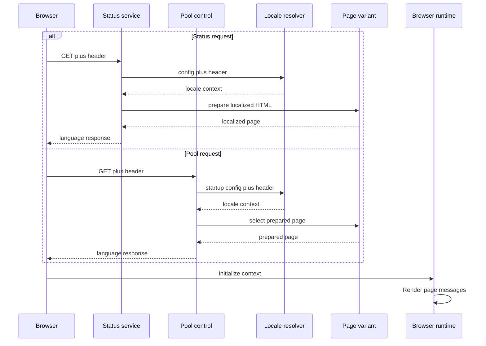
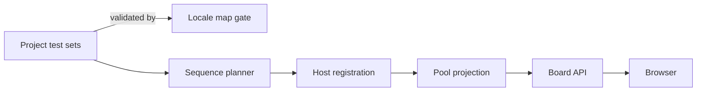

# Globalization

This document maps the globalization behavior implemented in the current Yuruna sources and separates that behavior from localization work that is still planned.

## 1. Current boundary

The globalization foundation is live, but Yuruna is not yet a generally localized product.

| Area | Implemented now | Current boundary |
|---|---|---|
| Locale authority | One generated manifest drives PowerShell, Go, and browser matching. | `en-US` is the only supported release locale; `pt-BR` is planned. |
| Pseudo-locales | `qps-Ploc` and `qps-Plocm` exercise converted slices. | They require an explicit test switch and are not release locales. |
| HTTP negotiation | Status and pool-control select a locale at the request boundary. | Other guest pages still serve their existing English representations. |
| Runtime catalogs | Status and pool catalogs are compiled for three runtimes. | The two source catalogs contain 26 messages; most candidate strings are not catalog calls. |
| Project metadata | Localized maps survive planning, host registration, and pool projection. | Existing `pt-BR` sample values are unreviewed and cannot be selected in a normal release. |
| Documentation | Source hashes, stable anchors, review state, and Portuguese paths are gated. | Documentation uses explicit links, not HTTP language negotiation. |

The release states and aliases come from [`locale-manifest.json`](../../globalization/locale-manifest.json). Converted and deferred surfaces are recorded separately in [`domain-inventory.json`](../../globalization/manifests/domain-inventory.json) and [`affected-slice-authority.json`](../../globalization/manifests/affected-slice-authority.json); those records prevent the existence of infrastructure from being mistaken for complete coverage.

## 2. Locale authority and selection

The generic resolver has one precedence order. A configured locale is a lock: even an unsupported configured value resolves to the default rather than allowing a lower-priority request value to take over.

The resolver evaluates inputs in this order:

1. lab language configuration;
2. persisted user preference;
3. HTTP `Accept-Language`;
4. process UI culture;
5. manifest default.

Persisted preference and process culture are implemented and covered by the shared resolver contract, but the live status and pool HTTP paths currently pass neither. Status reads the language lock for each request; pool-control receives it at service startup. Both then use the request header when the lock is `auto`. See the PowerShell [`Test.Locale` module](../../test/modules/Test.Locale.psm1), Go [`locale.go`](../../test/extension/extension-sdk/i18n/locale.go), browser [`yuruna.i18n.js`](../../globalization/kernel/yuruna.i18n.js), and the cross-runtime [`locale-matching.json`](../../globalization/fixtures/locale-matching.json) fixture.

Matching is bounded and deterministic:

- tags are canonicalized for case and `_` separators, then matched exactly;
- only aliases declared by the manifest are followed (`en`, `pt`, and `pt-PT` today);
- language-prefix guessing is forbidden, so `pt-AO` does not imply `pt-BR`;
- zero-quality, wildcard, malformed, oversized, or unsupported header choices cannot widen the supported set;
- the result carries requested and resolved tags, direction, source, time zone, catalog version, and catalog hash.

The browser takes that context from server-authored `<html>` attributes. It does not parse `Accept-Language` again or switch locale after initialization.

## 3. Catalog generation and loading

English source catalogs are validated and compiled before they reach a runtime. Translation entries own translated words and a source hash; they do not redefine message structure.

[`Invoke-CatalogCompile.ps1`](../../tools/Invoke-CatalogCompile.ps1) validates the [`catalog schema`](../../globalization/schema/catalog.schema.json), completeness, plural rules, and stale source hashes. It generates pseudo-locales, sorts output, fixes UTF-8/LF spelling, omits timestamps, and pretokenizes messages so runtimes do not parse message grammar on a request. [`catalog-set.json`](../../globalization/manifests/catalog-set.json) is the generated inventory and digest boundary.

[`Invoke-CatalogEmbed.ps1`](../../tools/Invoke-CatalogEmbed.ps1) embeds the default browser kernel and English catalogs into the normal assets. Non-default catalogs remain content-addressed assets loaded only when selected. The runtime implementations are:

- PowerShell: [`Test.Catalog.psm1`](../../test/modules/Test.Catalog.psm1), with lazy per-domain loading;
- Go: [`catalog.go`](../../test/extension/extension-sdk/i18n/catalog.go) and [`format.go`](../../test/extension/extension-sdk/i18n/format.go), with decode-once registration;
- browser: [`yuruna.i18n.js`](../../globalization/kernel/yuruna.i18n.js), with resident token tables.

All three resolve a missing locale entry through `en-US`, then expose the message key as the final visible failure marker. Missing-key diagnostics are bounded so a repeated miss does not become an unbounded log path.

## 4. Client/server negotiation

Status and pool-control share the matching contract, but deliberately prepare representations at different times.

The status service localizes HTML, generated directory listings, and generated errors from a request context; see [`Start-StatusService.ps1`](../../test/service/Start-StatusService.ps1). Pool-control enumerates the finite locale page variants at startup and stores body, gzip body, and ETag together; see [`assets.go`](../../test/extension/pool-control-service/server/internal/httpsrv/assets.go) and [`i18nwire.go`](../../test/extension/pool-control-service/server/internal/httpsrv/i18nwire.go).

Localized page and API representations emit `Content-Language` and `Vary: Accept-Language`, including conditional responses. Ordinary static JS and CSS do not vary by language. Hashed non-default catalogs are immutable. Pool's localized board projection is implemented in [`board.go`](../../test/extension/pool-control-service/server/internal/httpsrv/board.go).

## 5. Localized project content

Project metadata keeps required English scalars and adds locale maps. Resolution is deferred until the reader has a request locale.

The additive fields live in the project repository's [`test.runner.yml`](https://github.com/alissonsol/yuruna-project/blob/main/test/test.runner.yml). [`Invoke-ProjectLocaleMap.ps1`](../../tools/Invoke-ProjectLocaleMap.ps1) checks tags, source hashes, and map shape against the project's [`project-locale-source-hashes.json`](https://github.com/alissonsol/yuruna-project/blob/main/globalization/project-locale-source-hashes.json). [`Test.SequencePlanner.psm1`](../../test/modules/Test.SequencePlanner.psm1) and [`Test.Capability.psm1`](../../test/modules/Test.Capability.psm1) preserve the maps through registration; pool-control chooses only an exact resolved tag and otherwise uses the English scalar.

This transport is implemented. The current Portuguese sample records are still marked unreviewed, and `pt-BR` remains planned, so they are not shipping localized UI content.

## 6. Stable messages and fallbacks

Machine boundaries use a namespaced code plus typed, invariant arguments. A rendered sentence is diagnostic convenience, not protocol identity; it is accompanied by locale and catalog hash where the envelope carries a rendering. The schema is [`message.schema.json`](../../globalization/schema/message.schema.json), with PowerShell handling in [`Test.Message.psm1`](../../test/modules/Test.Message.psm1), Go handling in [`message.go`](../../test/extension/extension-sdk/i18n/message.go), and a current producer in [`labgate.go`](../../test/extension/extension-sdk/labgate/labgate.go).

Fallbacks are intentionally narrow:

| Boundary | Fallback |
|---|---|
| Locale request | Exact tag, declared alias, then `en-US` |
| Catalog lookup | Resolved locale, `en-US`, then message key |
| Project field | Exact resolved-tag map entry, then required English scalar |
| External detail | Bounded and redacted; never used as stable identity |

The legacy message transition is dual-read/dual-write rather than a flag-day protocol change. Infrastructure exists beyond its current producer coverage; inventory and authority manifests remain the source of truth for conversion status.

## 7. Browser floor and performance

The required browser floor is Safari on iOS 9.0 and desktop Safari 9.0, as recorded in [`definition.md`](../definition.md). The implementation holds that floor without locale-dependent platform behavior:

- generated and authored browser code is ES5 and avoids `Intl`;
- locale numbers and plural rules are pinned in the locale manifest;
- [`yuruna.fetch-shim.js`](../../globalization/kernel/yuruna.fetch-shim.js) supplies the bounded XHR-backed fetch subset when needed;
- [`yuruna.rawpage.js`](../../globalization/kernel/yuruna.rawpage.js) guarantees bounded completion even without `AbortController`;
- the shared [`yuruna.core.js`](../../test/extension/extension-sdk/webui/assets/yuruna.core.js) feature-detects the small compatibility surface it uses;
- [`Invoke-CssVarFallback.ps1`](../../tools/Invoke-CssVarFallback.ps1) emits literal palette declarations before custom-property declarations.

[`Invoke-Es5Check.ps1`](../../tools/Invoke-Es5Check.ps1) checks the registered browser sources and inline scripts, while [`browser-sources.json`](../../globalization/manifests/browser-sources.json) defines that finite set. Capability-off browser tests exercise the fallbacks. There is not yet a real iOS 9/WebKit integration lane, so the floor is enforced by source gates and compatibility tests rather than device evidence.

The hot path avoids repeated work: English is embedded, messages are pretokenized, runtime catalogs are cached, pool pages are prebuilt and compressed, and raw header values never become cache keys. [`perf-baseline.json`](../../globalization/perf-baseline.json) enforces deterministic page and asset budgets; its executable latency ceilings are still provisional.

## 8. Documentation localization

English documents remain the source. [`doc-translations.json`](../../globalization/manifests/doc-translations.json) maps translated paths and records source hashes and review state; [`doc-anchors.json`](../../globalization/manifests/doc-anchors.json) holds stable cross-language anchors. [`Test-DocTranslation.ps1`](../../tools/Test-DocTranslation.ps1) validates freshness, review state, encoding, and repaired relative links.

Portuguese documentation is selected through explicit links from the documentation index, not through `Accept-Language`. A translated file's presence therefore proves neither freshness nor approval; the manifest state does.

## 9. Localization delivery

### 9.1 Terminology

Locale terminology and style records are versioned under [`globalization/terminology`](../../globalization/terminology/). Approval binds both a native translator and an independent reviewer to the recorded evidence digest.

### 9.2 Export

[`Export-Localization.ps1`](../../tools/Export-Localization.ps1) produces a deterministic request containing glossary, catalogs, documents, project scalars, and reference fixtures. An unchanged prior answer may be carried forward without silently accepting stale source.

### 9.3 Import

[`Import-Localization.ps1`](../../tools/Import-Localization.ps1) checks the request digest, source freshness, and reviewer attestation before placing returned material. The approval digest is recomputed from the bytes that actually land.

### 9.4 Publish

[`Publish-Localization.ps1`](../../tools/Publish-Localization.ps1) regenerates catalogs, embedded assets, and inventories, then runs the cross-repository gates. It does not turn a planned locale into a supported locale; that remains an explicit manifest decision.

### 9.5 Interchange format

The implemented exchange format is the repository's deterministic JSON directory bundle. [`tooling-decision.json`](../../globalization/manifests/tooling-decision.json) currently records XLIFF 2.1 as **required but provisional** because no native translator has yet selected a workflow. The exporter warns and writes JSON because XLIFF serialization and import are not implemented; accepting `Xliff` as an option is not evidence that the path ships.

The booked native translator's answer replaces the provisional record:

- if XLIFF is required, implement XLIFF 2.1 export and import with the same IDs, source hashes, plural data, notes, attestation, and deterministic round-trip gates before using it for a translation round;
- if JSON is accepted, change the recorded decision, keep the existing bundle contract, and remove the unmet-format warning;
- if another format is required, record it first and provide equivalent lossless round-trip and review evidence rather than translating through an ad hoc conversion.

The decision belongs in the manifest so every export, release-preparation run, and operator follows the same answer.

## 10. Work not yet implemented

The current sources still mark these as future work:

- promote `pt-BR` only after complete reviewed catalogs, project content, documentation, and release evidence exist;
- convert deferred UI, CLI, generated-page, and service strings recorded by the authority and inventory manifests;
- wire persisted user preference into live HTTP services if per-user selection is adopted;
- implement the interchange decision in section 9.5 when the provisional answer is replaced;
- add real legacy WebKit evidence and non-provisional executable performance ceilings.

[`Invoke-CrossRepoGate.ps1`](../../tools/Invoke-CrossRepoGate.ps1) is the aggregate verification boundary for the implemented foundation. Passing it proves the recorded slices and invariants, not completion of the planned items above.

---

[Architecture](../architecture.md) | [Design overview](README.md)
