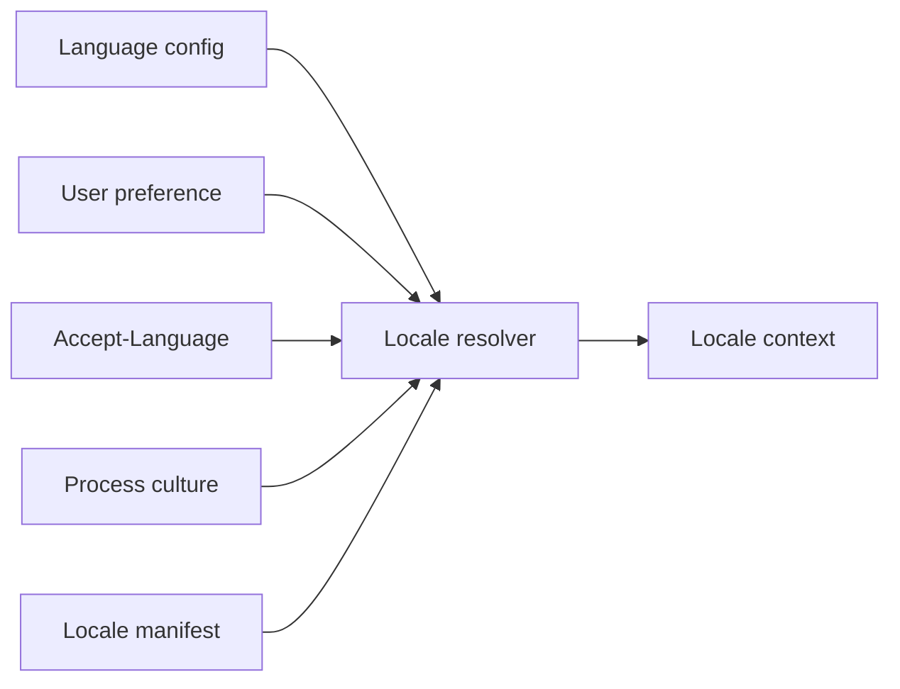
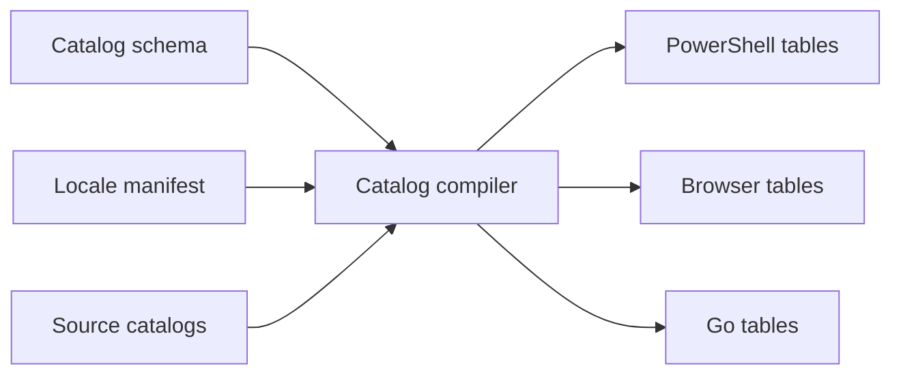
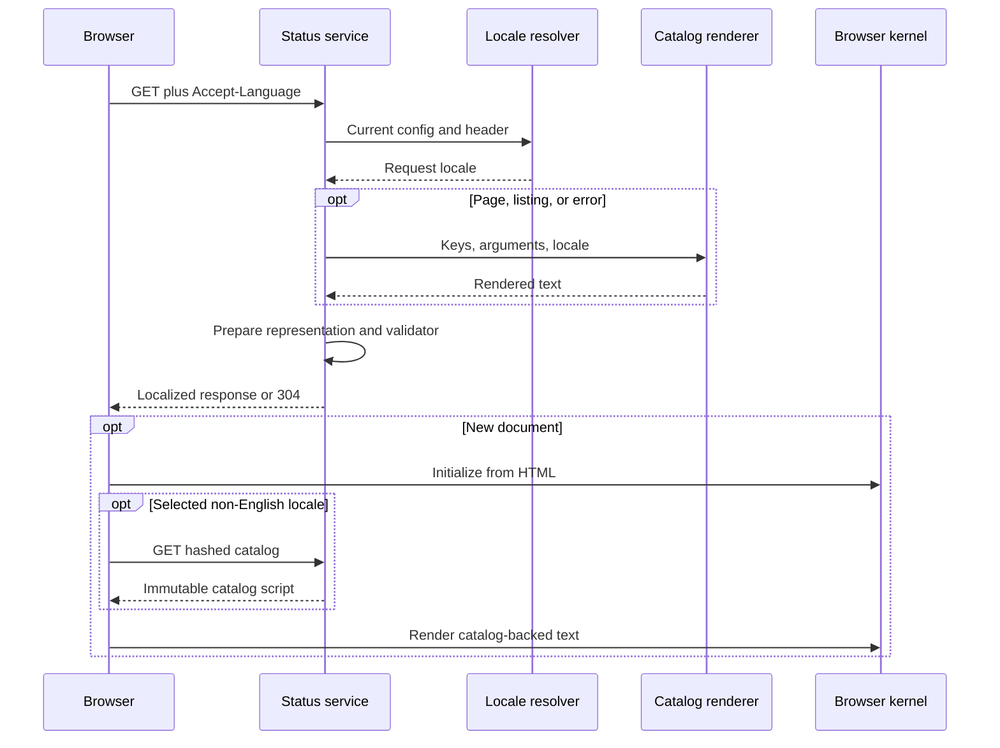
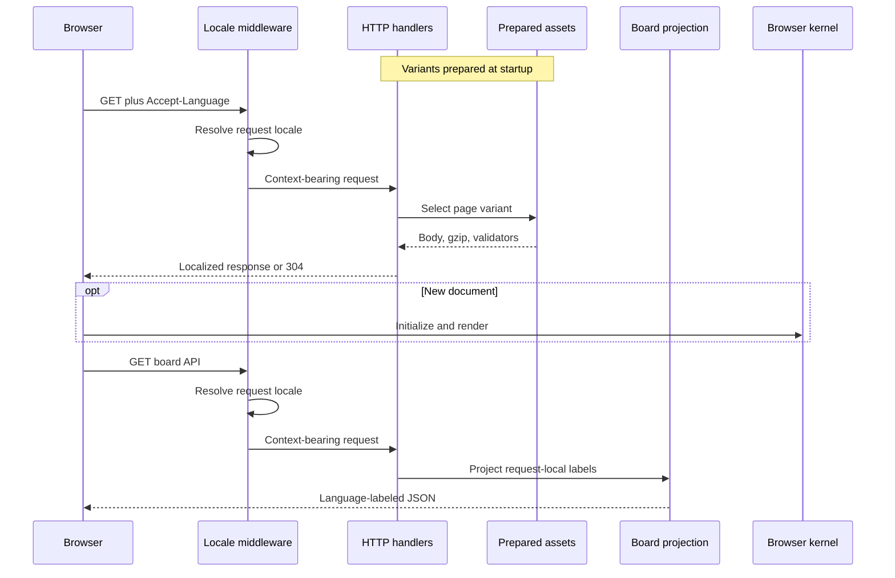
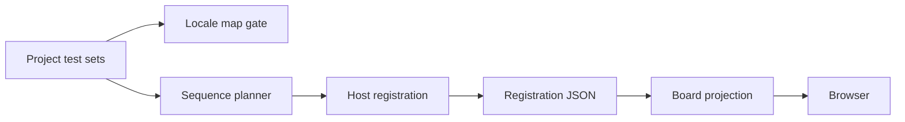

# Globalization

This document maps the locale decisions, catalog delivery, and localized-content boundaries implemented in Yuruna and yuruna-project.

## 1. Implemented scope

Globalization infrastructure exists, but it does not make every product surface localized. The current [`locale-manifest.json`](../../globalization/locale-manifest.json) marks `en-US` and `pt-BR` as `supported`. `pt-BR` renders with the CLDR 46 Portuguese cardinal plural rule (`pt-cardinal-cldr46`) pinned in the manifest, from translated catalogs under [`globalization/catalogs/pt-BR/`](../../globalization/catalogs/pt-BR/) that cover every source message. [`Test-LocaleSupport.ps1`](../../tools/Test-LocaleSupport.ps1) verifies that every locale the manifest declares `supported` has complete compiled PowerShell, browser, and Go artifacts bound to current inputs; a `planned` locale is not held to that bar. `qps-Ploc` and `qps-Plocm` are test-only expanded and mirrored locales, not public release languages.

Source catalogs span 15 English-owned domains under [`globalization/catalogs/en-US/`](../../globalization/catalogs/en-US/): one per Go service (`cache`, `parser`, `download`, `aggregator`, `pool`, `stash`), the shared `status` domain each service also embeds and the SDK's `auth` domain for its lab gate, and the operator/CLI-facing `automation`, `host`, `runner`, `configsync`, `remediation`, `exceptions`, and `notification` domains. The compiled inventory in [`catalog-set.json`](../../globalization/manifests/catalog-set.json) currently totals 6,046 source messages. Their compiled outputs cover three runtimes. [`Invoke-CatalogTriage.ps1`](../../tools/Invoke-CatalogTriage.ps1) gives every domain-inventory candidate literal a disposition -- convert, internal, or unexplained -- so the remaining scan count is actionable rather than a raw guess dominated by runner/host-driver log lines. Actual catalog use spans status, pool, cache, parser, download-agent, stash, and pool-aggregator service surfaces plus operator-facing PowerShell automation; it does not cover every label on those pages. Project test-set labels travel separately in localized metadata maps, as shown below. See the scoped source boundaries in [`conversion-authority.json`](../../globalization/manifests/conversion-authority.json) and the wider candidate census in [`domain-inventory.json`](../../globalization/manifests/domain-inventory.json).

## 2. Locale decisions

This seven-node diagram shows the generic resolver inputs, not five competing live HTTP settings. Sources: PowerShell [`New-LocaleContext`](../../test/modules/Test.Locale.psm1), Go [`NewContextWithUser`](../../test/extension/extension-sdk/i18n/locale.go), and the shared [`locale-matching.json`](../../globalization/fixtures/locale-matching.json) cases.

The precedence is configuration, persisted user preference, `Accept-Language`, process culture, then the manifest default. A nonempty configuration other than `auto` is a lock: an unsupported lock resolves to the default while retaining `config` as its source; lower-priority inputs cannot override it.

Tags are canonicalized, matched exactly, and then matched through declared aliases. There is no prefix-based dialect guess. Header choices are bounded to 512 characters, tags to 35; malformed qualities, zero qualities, wildcards, and unsupported tags do not select a locale. Positive qualities rank descending, with ordinal resolved-tag and requested-tag tie-breaks. The declared `pt` and `pt-PT` aliases select `pt-BR`.

The context carries requested tag, resolved tag, direction, source, time-zone policy, and catalog provenance. PowerShell and Go use UTC policy at these boundaries; browser wall-clock display explicitly uses the reader's local zone. Typed catalog datetime arguments retain a fixed UTC spelling.

The live HTTP paths are narrower:

| Boundary | Configuration read | Other supplied input |
|---|---|---|
| Status service | Read from `test/test.config.yml` for each page request | Request `Accept-Language`; no user preference or process culture |
| Pool-control | Captured through `-language` at service startup | Request `Accept-Language`; no user preference or process culture |
| Browser kernel | Server-authored HTML attributes, once | No second header negotiation or persisted-preference lookup |

Sources: status [`Resolve-PageLocale`](../../test/service/Start-StatusService.ps1), pool [`main.go`](../../test/extension/pool-control-service/server/main.go), SDK [`http.go`](../../test/extension/extension-sdk/i18n/http.go), and browser [`yuruna.i18n.js`](../../globalization/kernel/yuruna.i18n.js). Status enables pseudo negotiation only with `YURUNA_ALLOW_PSEUDO_LOCALE=1` or `true`; pool-control requires `-allow-pseudo-locale`.

## 3. Catalog build and runtime

The seven nodes group all locales and domains by runtime. [`Invoke-CatalogCompile.ps1`](../../tools/Invoke-CatalogCompile.ps1) validates the [`catalog schema`](../../globalization/schema/catalog.schema.json), argument declarations, translated source hashes, variant shape, and supported-locale completeness. It derives pseudo-locales from English and emits deterministic, pretokenized tables plus the catalog-set manifest. Plain messages remain strings; argument-bearing messages and plural/select variants become data that renderers walk without parsing message grammar.

[`Invoke-CatalogEmbed.ps1`](../../tools/Invoke-CatalogEmbed.ps1) then places the kernel, locale authority, provenance, and English status table into [`yuruna.common.js`](../../test/status/yuruna.common.js) and the SDK's [`yuruna.core.js`](../../test/extension/extension-sdk/webui/assets/yuruna.core.js). Pool-control, stash, and download-agent each embed only their own domain's English table into their own `common.js`; caching-proxy and caching-proxy-parser inline the kernel with their own and the `status` English tables into their Go-built pages, and pool-aggregator renders its catalog text server-side only. Generated Go tables live under each service's own `internal/catalog/` package rather than one shared module; non-English browser catalogs remain separate assets, except that the caching-proxy and caching-proxy-parser pages inline the selected one.

| Runtime | Load boundary | Render path |
|---|---|---|
| PowerShell (page/service domains) | Lazy cached locale/domain table through restricted `Import-PowerShellDataFile` | [`Test.Catalog.psm1`](../../test/modules/Test.Catalog.psm1) walks tokens |
| PowerShell (operator/CLI domains) | Same compiled tables, loaded once per runspace on first emission | [`Format-YurunaOperatorMessage`](../../automation/Yuruna.Globalization.psm1) renders `automation`, `host`, `runner`, `configsync`, `remediation`, `exceptions`, and `notification` keys for CLI/automation output |
| Go | JSON decode at catalog registration; each service registers once per process through its own `localization.go` (pool-control: `i18nwire.go`) | [`catalog.go`](../../test/extension/extension-sdk/i18n/catalog.go) walks resident tables |
| Browser | English registered in existing runtime; selected non-English script registered during document parsing | [`yuruna.i18n.js`](../../globalization/kernel/yuruna.i18n.js) walks resident tables |

The lookup fallback is requested catalog, `en-US`, then the key itself. Missing-key diagnostics are deduplicated by locale and key, not repeated for every rendered row. Numeric separators and plural rules for typed catalog arguments come from the repository's manifest rather than each runtime's locale database; operator messages that keep a composite format pre-format those values with .NET culture data.

## 4. Status request

The five participants correspond to the browser and the four linked runtime artifacts. [`Start-StatusService.ps1`](../../test/service/Start-StatusService.ps1) emits the detached HTTP server, resolves locale at the relevant response boundary, writes `lang`, `dir`, requested-language and source attributes, and injects the selected non-English catalog before page-specific scripts. HTML `data-i18n` markers, listings, and localized errors use server-side catalog calls; other page text is localized only where the browser code calls the catalog.

HTML validators hash the representation after locale-dependent rewriting. Negotiated responses set `Content-Language` and `Vary: Accept-Language` before testing `If-None-Match`, preserving them on `304`. Catalog URLs contain their content hash and use immutable caching; ordinary JS/CSS do not acquire language variation merely because the service can negotiate HTML. See the response helpers and [`Test.StatusServiceLocale.Tests.ps1`](../../test/modules/Test.StatusServiceLocale.Tests.ps1).

## 5. Pool request

The six participants separate request negotiation from representation selection. Sources: [`httpsrv.go`](../../test/extension/pool-control-service/server/internal/httpsrv/httpsrv.go), [`handlers.go`](../../test/extension/pool-control-service/server/internal/httpsrv/handlers.go), SDK [`http.go`](../../test/extension/extension-sdk/i18n/http.go), [`assets.go`](../../test/extension/pool-control-service/server/internal/httpsrv/assets.go), [`board.go`](../../test/extension/pool-control-service/server/internal/httpsrv/board.go), and the shared browser kernel. Pool-control is drawn as the representative case; caching-proxy, caching-proxy-parser, download-agent, pool-aggregator, and stash each carry the same `localization.go`/`internal/catalog/registry.go` shape for their own domain rather than a distinct pattern per service.

[`i18nwire.go`](../../test/extension/pool-control-service/server/internal/httpsrv/i18nwire.go) builds the service's finite locale set from its embedded supported and pseudo tables and the startup switch. Page variants are rendered, hashed, and compressed during initialization. Cache keys use finite normalized context fields, not raw header strings. Each API request negotiates separately through the same startup policy; middleware supplies context but leaves language headers to handlers that actually send negotiated content.

Page handlers and the localized board API apply `Content-Language` and `Vary: Accept-Language`. Asset delivery adds `Vary: Accept-Encoding`, chooses identity or gzip validators, and handles conditional requests. Content-addressed catalogs are immutable. Static assets are not split by browser language.

## 6. Project label transport

The seven nodes trace the project-discovery path. The project repository's [`test/test.runner.yml`](https://github.com/alissonsol/yuruna-project/blob/main/test/test.runner.yml) keeps required English `displayName` and `description` scalars beside additive `displayNameLocalized` and `descriptionLocalized` maps. [`Invoke-ProjectLocaleMap.ps1`](../../tools/Invoke-ProjectLocaleMap.ps1) validates shape, tags, and the project's [`source-hash sidecar`](https://github.com/alissonsol/yuruna-project/blob/main/globalization/project-locale-source-hashes.json).

[`Test.SequencePlanner.psm1`](../../test/modules/Test.SequencePlanner.psm1) preserves bounded maps; [`Test.Capability.psm1`](../../test/modules/Test.Capability.psm1) carries them into `runtime/host.registration.json` rather than freezing them to the service account's culture. [`board.go`](../../test/extension/pool-control-service/server/internal/httpsrv/board.go) reads member registrations over each host's status HTTP endpoint and the intent library, selecting only an exact resolved-tag entry. Missing or invalid optional maps fall back to the English scalar. Registration discovery can lag a project refresh by one cycle because registration precedes that refresh.

The current project supplies `pt-BR` values for its test sets and example sequences, with `reviewed` sidecar records. Transport support is implemented.

## 7. Message identity

Machine identity is separate from rendered wording. [`message.schema.json`](../../globalization/schema/message.schema.json), PowerShell [`Test.Message.psm1`](../../test/modules/Test.Message.psm1), and Go [`message.go`](../../test/extension/extension-sdk/i18n/message.go) define namespaced codes, typed invariant arguments, bounded external detail, and optional rendered text with locale/catalog provenance. A current producer is SDK [`labgate.go`](../../test/extension/extension-sdk/labgate/labgate.go).

The status pause and repository-access paths retain explicit legacy phrase readers beside stable codes for compatibility; [`conversion-authority.json`](../../globalization/manifests/conversion-authority.json) identifies those limited exceptions. Their existence does not imply every CLI, notification, or external-tool parser already uses structured messages.

## 8. Browser floor and measurement

The code targets Safari 16 / iOS 16 -- the macOS Ventura contemporaries -- and Chrome and Firefox 105 or later. The authored kernel is ES2022, uses pinned formatting data instead of each runtime's own locale database, and initializes locale once from the server's markup. ICU data differs between engines and moves between releases, so pinning separators and plural rules is what lets PowerShell, Go and the browser render one number identically. The mechanisms below are concrete sources, not a claim of successful native qualification:

- [`yuruna.rawpage.js`](../../globalization/kernel/yuruna.rawpage.js) adds an independent completion timeout for the standalone caching-proxy pages.
- [`browser-sources.json`](../../globalization/manifests/browser-sources.json) is the single registry of shipped browser sources: `roots` and `pages` for the byte budget, `pageRoots` for the accessibility gate, and `provisionedPageProducers` for the page exporter. A directory in one tool's private list and not another's is a file that passes the check nobody pointed at it.

[`yuruna.first-usable.js`](../../globalization/kernel/yuruna.first-usable.js) records when a page renderer has supplied primary data or an accessible empty/error/static state and released its holds. It also requires language and direction before publishing readiness. It records `performance.now`, falls back to navigation-start timing, or explicitly leaves time unavailable; a document-load event alone is not readiness.

English embedding avoids a locale-catalog request on the default path. Pretokenization, process-local catalog caches, and prepared pool page variants remove repeated work from rendering. [`perf-baseline.json`](../../globalization/perf-baseline.json) records deterministic asset/page budgets, while its executable scenario ceilings are explicitly provisional. Source gates and instrumentation do not establish that a device at the floor passed or that controlled performance evidence has been collected.

## 9. Localization delivery

### 9.1 Terminology

[`globalization/terminology/`](../../globalization/terminology/) contains locale terms and style rules. [`Test-Terminology.ps1`](../../tools/Test-Terminology.ps1) checks their shape and approval evidence; the presence of a terminology file is not itself an approval.

### 9.2 Export

[`Export-Localization.ps1`](../../tools/Export-Localization.ps1) builds deterministic request bundles from catalogs, terminology, documentation, and project metadata through [`Test.LocalizationExchange.psm1`](../../test/modules/Test.LocalizationExchange.psm1). Request digests distinguish unchanged source from changed rows.

### 9.3 Import

[`Import-Localization.ps1`](../../tools/Import-Localization.ps1) reads returned requests, answers, and translator/reviewer attestations, checks digests and source drift, then routes accepted material to catalog, document, terminology, and project-review writers. This describes the existing import path, not a guarantee of complete transactional or interchange support.

### 9.4 Publish

[`Publish-Localization.ps1`](../../tools/Publish-Localization.ps1) sequences generation and verification tools, including optional full cross-repository checking. It does not automatically promote a planned locale. Documentation uses explicit translated paths recorded in [`doc-translations.json`](../../globalization/manifests/doc-translations.json) and stable anchors in [`doc-anchors.json`](../../globalization/manifests/doc-anchors.json); Markdown is not negotiated by the HTTP locale middleware.

### 9.5 Interchange format

[`Export-Localization.ps1`](../../tools/Export-Localization.ps1) and [`Import-Localization.ps1`](../../tools/Import-Localization.ps1) implement three deterministic bundle formats -- JSON, CSV, and XLIFF 2 -- preserving IDs, source hashes, variants, notes, and review evidence for round trips in all three. `-Format` picks explicitly; otherwise `Resolve-RequestFormat` reads [`tooling-decision.json`](../../globalization/manifests/tooling-decision.json), which currently records XLIFF 2.1 as `Required` but `provisional` (decided 2026-09-10 by the Yuruna maintainers, as the direction least likely to strand a booked translator's schedule) -- so an unqualified export currently writes XLIFF, announcing the provisional obligation on every run rather than silently substituting JSON.

[`Validate-LocalizationBundle.py`](../../tools/Validate-LocalizationBundle.py) checks an exported bundle -- any of the three formats -- offline, without a PowerShell or Go toolchain and without changing its files, so a translator or reviewer working outside this repository can verify a bundle before returning it.

The manifest explicitly leaves the final format decision to the booked native translator: their own answer replaces this provisional one. Implementing all three formats now, rather than only JSON, is what keeps that later answer from becoming new schedule risk.

## 10. Coverage boundary

Full wording conversion remains outside the current implemented seed. The generic user-preference resolver input is not a live account-preference feature. Compatibility source checks and timing markers do not substitute for native-device observations or controlled measurements.

[`Invoke-CrossRepoGate.ps1`](../../tools/Invoke-CrossRepoGate.ps1) checks the recorded cross-repository contracts. A passing gate proves those contracts and declared source slices, not localization of every remaining source string.

---

[Architecture](../architecture.md) | [Design overview](README.md)
