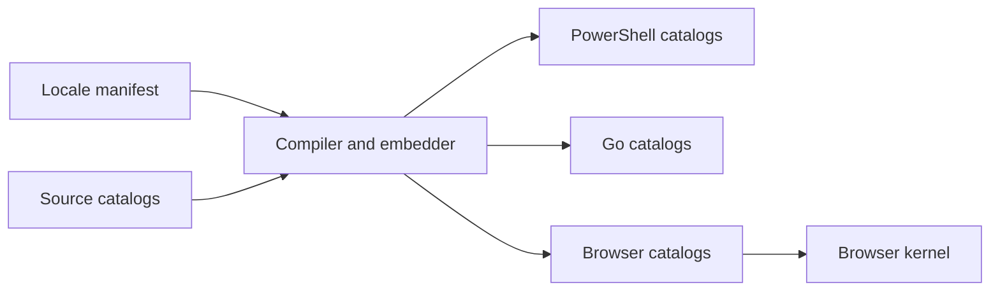
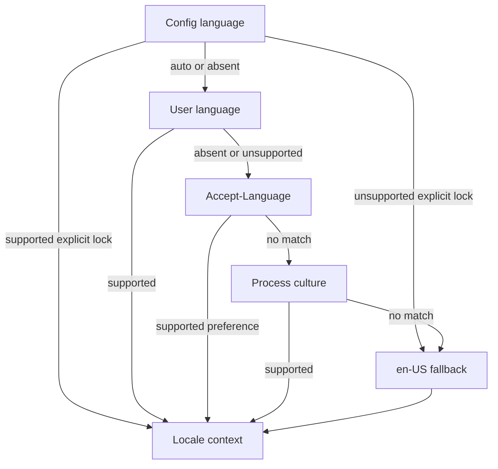
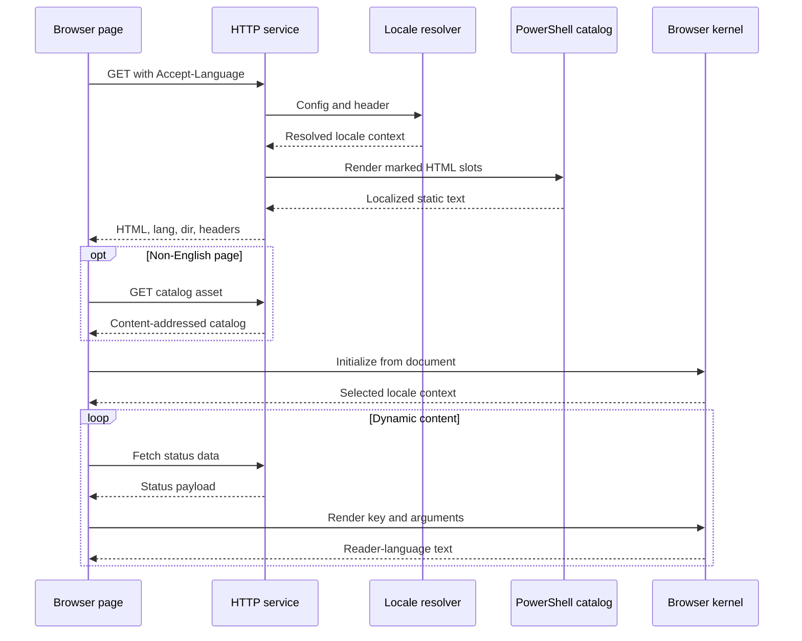

# Globalization

These views trace the shared locale authority, request negotiation, and rendering of localized content.

## Catalog and locale authority

```mermaid
flowchart LR
    locale-manifest-json["Locale manifest"]
    globalization-catalogs["Source catalogs"]
    invoke-catalogcompile-ps1["Compiler and embedder"]
    globalization-generated-powershell["PowerShell catalogs"]
    internal-catalog["Go catalogs"]
    globalization-generated-browser["Browser catalogs"]
    yuruna-i18n-js["Browser kernel"]
    locale-manifest-json --> invoke-catalogcompile-ps1
    globalization-catalogs --> invoke-catalogcompile-ps1
    invoke-catalogcompile-ps1 --> globalization-generated-powershell
    invoke-catalogcompile-ps1 --> internal-catalog
    invoke-catalogcompile-ps1 --> globalization-generated-browser
    globalization-generated-browser --> yuruna-i18n-js
```

Sources: [locale-manifest.json](../../globalization/locale-manifest.json),
[source catalogs](../../globalization/catalogs/),
[Invoke-CatalogCompile.ps1](../../tools/Invoke-CatalogCompile.ps1),
[Invoke-CatalogEmbed.ps1](../../tools/Invoke-CatalogEmbed.ps1),
[generated PowerShell catalogs](../../globalization/generated/powershell/),
[generated browser catalogs](../../globalization/generated/browser/),
[extension SDK catalogs](../../test/extension/extension-sdk/internal/catalog/),
and [yuruna.i18n.js](../../globalization/kernel/yuruna.i18n.js).
The compiler box groups compilation and embedding into each consuming service
or browser bundle, keeping the diagram to seven boxes. Go catalogs also exist
in the individual service packages; each consumer receives only its domains.

The manifest is the shared authority for aliases, text direction, supported
locales, plural rules, and numeric separators. Supported locales are
`en-US`, `pt-BR`, `zh-CN`, and `he-IL`; `qps-Ploc` and `qps-Plocm`
are diagnostic pseudo-locales. Pseudo-locales are opt-in on served surfaces.
Hebrew and the mirrored pseudo-locale use right-to-left direction.
The repository's [globalization guide](../globalization.md) describes
translation operations.

Runtime support, installed catalog availability, and translation acceptance are
separate decisions. `status: supported` in the locale manifest permits
negotiation; a catalog entry with `origin: machine` is still an automated
draft. The
[catalog schema](../../globalization/schema/catalog.schema.json) distinguishes
that provenance from an accepted entry, which has no `origin` field. The
compiler validates `sourceHash`, placeholders, and forms before producing
runtime catalogs; a stale source hash is not silently shipped as current text.
Machine and accepted entries use the same rendering path, with provenance
recorded in the compiled set manifest.

## Locale selection

```mermaid
flowchart TD
    language["Config language"]
    user-language["User language"]
    accept-language["Accept-Language"]
    process-culture["Process culture"]
    en-us["en-US fallback"]
    new-localecontext["Locale context"]
    language -->|supported explicit lock| new-localecontext
    language -->|unsupported explicit lock| en-us
    language -->|auto or absent| user-language
    user-language -->|supported| new-localecontext
    user-language -->|absent or unsupported| accept-language
    accept-language -->|supported preference| new-localecontext
    accept-language -->|no match| process-culture
    process-culture -->|supported| new-localecontext
    process-culture -->|no match| en-us
    en-us --> new-localecontext
```

Sources: [Test.Locale](../../test/modules/Test.Locale.psm1),
[Go locale matching](../../test/extension/extension-sdk/i18n/locale.go),
[Go HTTP negotiation](../../test/extension/extension-sdk/i18n/http.go),
[status request resolver](../../test/service/Start-StatusService.ps1), and
[locale fixtures](../../globalization/fixtures/locale-matching.json).

This six-box view shows the common resolver's precedence. A configured language
other than `auto` locks the decision, including fallback when that lock is
unsupported. User-language and process-culture inputs are available to the
shared resolver, but the HTTP adapters currently pass no user preference and
an empty process culture. Served pages therefore use configuration, then
`Accept-Language`, then the default; they do not infer a visitor's locale
from the server operating system.

Header matching canonicalizes bounded tags, uses the manifest's aliases and
supported set, rejects malformed or zero-quality candidates, and resolves
quality ties deterministically. Undeclared regional variants do not borrow
a catalog through prefix matching. Go services restrict candidates to the
catalogs they actually embed. The status service refuses to serve a page
when its selected non-English catalog asset is missing. The locale context
carries requested/resolved tags, source, direction, UTC time policy, and
catalog provenance. PowerShell returns a
read-only context rather than mutating a process-wide current locale.

## Client and server exchange

```mermaid
sequenceDiagram
    participant index-html as Browser page
    participant start-statusservice-ps1 as HTTP service
    participant test-locale-psm1 as Locale resolver
    participant test-catalog-psm1 as PowerShell catalog
    participant yuruna-i18n-js as Browser kernel
    index-html->>start-statusservice-ps1: GET with Accept-Language
    start-statusservice-ps1->>test-locale-psm1: Config and header
    test-locale-psm1-->>start-statusservice-ps1: Resolved locale context
    start-statusservice-ps1->>test-catalog-psm1: Render marked HTML slots
    test-catalog-psm1-->>start-statusservice-ps1: Localized static text
    start-statusservice-ps1-->>index-html: HTML, lang, dir, headers
    opt Non-English page
        index-html->>start-statusservice-ps1: GET catalog asset
        start-statusservice-ps1-->>index-html: Content-addressed catalog
    end
    index-html->>yuruna-i18n-js: Initialize from document
    yuruna-i18n-js-->>index-html: Selected locale context
    loop Dynamic content
        index-html->>start-statusservice-ps1: Fetch status data
        start-statusservice-ps1-->>index-html: Status payload
        index-html->>yuruna-i18n-js: Render key and arguments
        yuruna-i18n-js-->>index-html: Reader-language text
    end
```

Sources: [status page](../../test/status/index.html),
[Start-StatusService](../../test/service/Start-StatusService.ps1),
[Test.Catalog](../../test/modules/Test.Catalog.psm1),
[status browser client](../../test/status/yuruna.common.js),
[browser kernel](../../globalization/kernel/yuruna.i18n.js),
[Go HTTP adapter](../../test/extension/extension-sdk/i18n/http.go),
[Go page renderer](../../test/extension/extension-sdk/i18n/page.go), and
[Test.Message](../../test/modules/Test.Message.psm1).
The five participants show the PowerShell status path. Go extension pages use
the same request precedence and catalog authority through the shared SDK, but
serve their own pages and assets.

The server chooses the locale before sending the page, renders marked static
text, stamps `lang`, `dir`, and locale provenance, and selects any required
catalog asset. The browser initializes from that document; it does not
renegotiate using
`navigator.language` or a local-storage preference. English catalogs are
embedded in the existing browser runtime. Non-English catalogs are selected
as content-addressed assets, while self-contained Go pages inline their
selected catalog. Go pages precompute a finite set of localized representations
and validators during preparation.

Negotiated responses carry `Content-Language` and
`Vary: Accept-Language`. The status service computes validators from the
localized representation and sets locale headers even on 304 responses.
Static assets have fixed bytes; the Go middleware resolves request context,
but handlers decide whether a particular response is language-dependent.

## Message identity and rendering decisions

[Test.Message](../../test/modules/Test.Message.psm1) and the
[message schema](../../globalization/schema/message.schema.json) define
`yuruna.message/v1`: a stable `code`, typed `args`, and optional
redacted detail/rendered metadata. Status and extension consumers can render
from that identity in the reader's language; legacy producer text remains a
compatibility path. Raw third-party diagnostic output is evidence, not a
translation key.

[Automation globalization](../../automation/Yuruna.Globalization.psm1),
[Test.Catalog](../../test/modules/Test.Catalog.psm1), and the
[Go SDK](../../test/extension/extension-sdk/i18n/) share generated catalogs and
formatting rules. PowerShell loads generated data files lazily through the
restricted data-file loader; Go registers embedded tables, and the browser
walks compiled message segments. HTML renderers escape translated text and
replace explicit presentation markers rather than evaluating catalog content
as markup. Locale-sensitive display text is separated from stable identifiers,
URLs, protocol keys, and UTC wire timestamps. Browser display helpers can show
a timestamp in the reader's local zone using an explicit, fixed format.
The project repository also carries localized display fields, such as
`descriptionLocalized` in its
[website sequences](https://github.com/alissonsol/yuruna-project/tree/main/example/website/test);
the underlying sequence names remain unchanged.

## Catalog publication decisions

[Invoke-CatalogCompile.ps1](../../tools/Invoke-CatalogCompile.ps1) validates
source ownership, message forms, placeholder contracts, translation hashes,
and supported-locale coverage before writing generated PowerShell, Go, and
browser catalogs. Planned locales do not produce runtime artifacts. The
[catalog set manifest](../../globalization/manifests/catalog-set.json) records
input and artifact hashes, compiler identity, and translation provenance.
Generated files are replaced through temporary files so a reader does not
observe a partially written individual catalog.

[Invoke-CatalogEmbed.ps1](../../tools/Invoke-CatalogEmbed.ps1) distributes the
compiled tables and locale authority to the public browser bundles and Go
packages. Browser requests use these installed artifacts; negotiation performs
no translation-provider call. Machine drafts and accepted translations use
the same generated rendering path. Manifest support permits locale selection;
installed catalogs determine availability, while source-entry provenance
describes acceptance state. Updating a source catalog requires compilation and embedding
to change what a deployed reader receives.

---

[Architecture](../architecture.md) | [Design overview](README.md)
