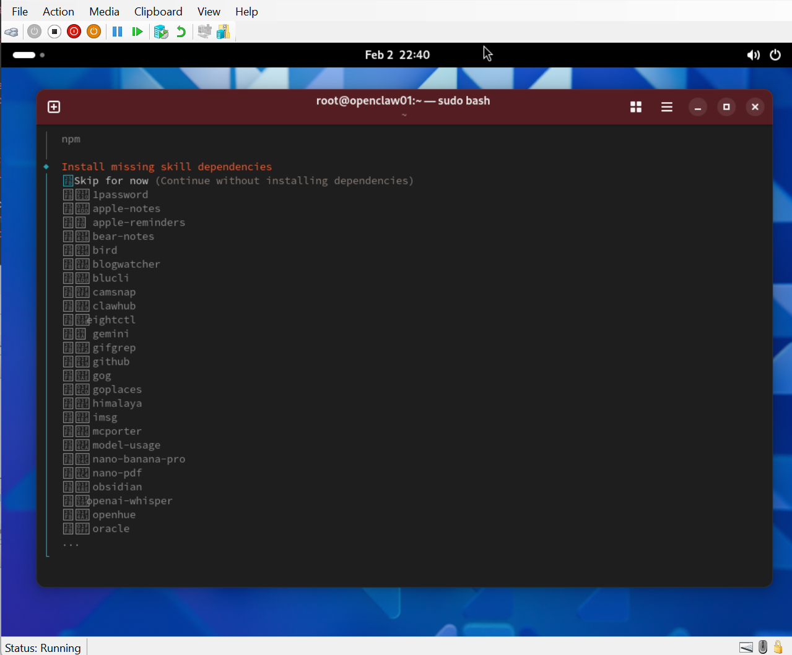

# Guest image setup — common pattern

> Shared lifecycle that every `host/<HOST>/guest.<GUEST>/` folder
> follows. Per-host READMEs document only the deltas (paths, package
> manager, ISO source, host-specific verification steps).

Placeholders used in this document:

| Placeholder    | Meaning                                                   | Examples                                          |
|----------------|-----------------------------------------------------------|---------------------------------------------------|
| `<HOST>`       | The host platform                                         | `windows.hyper-v`, `macos.utm`, `ubuntu.kvm`      |
| `<GUEST>`      | The guest identity used by the planner                    | `ubuntu.server.24`, `amazon.linux.2023`, ...      |
| `<CODENAME>`   | OS release codename for Ubuntu guests                     | `noble` (24.04), `resolute` (26.04)               |
| `<USERNAME>`   | The per-guest test user                                   | `yuuser24`, `yuuser26`, `yauser1`                 |

## Lifecycle stages

The same six stages apply across hosts. A per-host README that
diverges is documenting host-specific knowledge — keep that content;
don't duplicate the common stages.

### 1. Download / refresh the image

```
pwsh ./Get-Image.ps1                # macOS UTM, Ubuntu KVM
.\Get-Image.ps1                     # Windows Hyper-V (elevated PowerShell)
```

`Get-Image.ps1` is idempotent — it skips the download when the local
copy matches the upstream metadata (size + timestamp). The script
writes into `~/yuruna/image/<GUEST>.env/` (POSIX) or
`%USERPROFILE%\yuruna\image\<GUEST>.env\` (Windows). Architecture
(amd64 / arm64) follows the host automatically — there is no flag to
force a cross-architecture image.

Image source by host:

- **Hyper-V** — vendor ISO (Ubuntu live-server, Windows 11 media)
  pulled directly. Some publishers gate the download behind a
  short-lived URL; `Get-Image.ps1` prints manual fallback steps when
  the automated fetch is blocked.
- **macOS UTM** — same as Hyper-V for ISO-based guests. macOS guests
  use `.ipsw` (queried via the Virtualization framework rather than a
  stable URL).
- **Ubuntu KVM** — qcow2 cloud image for amazon.linux.2023; live-server
  ISO for ubuntu.server.\<N\>. The script resizes the qcow2 to the
  target size with `qemu-img resize`.

#### Agent-first image downloads

When a [download-agent service](download-agent.md) is running somewhere in
the lab, `Get-Image.ps1` asks it before touching the publisher. This
covers the Ubuntu live-server ISOs (24.04, 26.04), the shared
`ubuntu.extension.26` cloud image every extension-service VM boots,
Amazon Linux 2023, the KVM guest's virtio-win driver ISO, and — best
effort, see below — the Windows 11 media. macOS images are not part of
it (the Virtualization framework mints `.ipsw` URLs per Mac), and
neither is the UTM guest's SPICE guest-tools fetch.

The host sends the *identity* of what it wants — host type, guest key,
architecture, `stable` or `daily` — plus a fingerprint of the copy it
already holds, taken from the sentinel's filename and byte count. Three
things can come back:

- **"you already hold the current artifact"** — the script prints a skip
  line naming the agent and exits `0`. No index page is scraped, no HEAD
  probe sent, no bytes moved. The agent answers from its own record of
  the origin, so the answer holds even while it is busy refreshing that
  image for someone else.
- **verified bytes** — streamed from the agent (resumable, SHA-256
  checked against what the agent recorded at download time) into the same
  staging file the publisher download would have used. Everything after
  that is the same: previous generation preserved, zip extracted or
  qcow2 converted to VHDX where that applies, and the 4-line sentinel
  written — from the agent's record of the origin URL, byte count and
  Last-Modified, so the next run's skip guard compares the same four
  fields it always has.
- **anything else** — the origin path below runs instead.

**What an operator sees when there is no agent: nothing new.** The hooks
are guarded twice — the client module must be loaded *and* an endpoint
must resolve to a healthy agent — and no lab is required to run one. A
missing module, an agent VM that was never started, an agent that is
down, one whose pool share is unmounted, a request that fails a checksum
or runs out its deadline: each falls through to the resolve /
skip-if-same-source / publisher-download path below, with the same
output, sentinel, and exit codes. Failures of an agent that *did*
answer print one warning line and continue; an agent
that is simply not there says nothing. `-Verbose` shows the "no download
agent reachable" line to confirm which path a run took.

Discovery, the pool layout, and the agent's own board are in
[download-agent.md](download-agent.md).

#### Windows 11: the agent is asked last, and only sometimes answers

The three `guest.windows.11` scripts differ from the rest in two
deliberate ways.

**The agent is consulted only when the ISO is genuinely absent.** Those
scripts open with their own file-existence checks — the configured VHD
folder on Hyper-V, the download folder on UTM and KVM, plus the "adopt
any `Win11*.iso` the operator dropped here" step — and all of them run
first. Only with no media anywhere on the host does the agent get asked;
only if it cannot serve one does the fallback run (Fido on Hyper-V and
UTM, the manual-download instructions on KVM). These scripts also keep
their **2-line sidecar** (filename + source URL); they do not use the
4-line sentinel, so no byte-count fingerprint is sent — the existence
checks are the local-copy decision.

**The family is best effort, so "no" is a normal answer.** Microsoft
serves the media only through a short-lived signed URL, and the agent
mints one the same way a host does: by running Fido under PowerShell
inside its Linux VM. That is unproven, and either PowerShell or Fido can
be missing from an agent VM. When any of it fails the agent reports the
family absent and the scripts fall through **without a warning** — an
agent that does not hold Windows media is an ordinary state, not a fault.
Only an agent that took the request and then broke warns.

What this buys, when it works, is uneven: on Hyper-V and UTM it replaces
a repeated multi-gigabyte pull, and on **KVM it is a capability that host
never had** — that script has always exited non-zero with manual
instructions, and a pool holding the media makes it unattended. The
virtio-win ISO the same KVM script stages is *not* best effort: a plain
pinned URL, pooled and fingerprinted like the Ubuntu images, so a host
that already holds the current one transfers nothing.

#### Skip-if-same-source guard

`Test-DownloadAlreadyCurrent` (host/modules/Yuruna.HostDownload.psm1) returns
`$true` — and `Get-Image.ps1` exits without downloading — only when ALL of
the following match the on-disk state:

- the base image file exists, and
- the 4-line sentinel (`<baseImageName>.txt`: filename, source URL, byte
  count, Last-Modified) records the same filename, URL, byte count, AND
  Last-Modified date as a fresh HEAD probe of the source URL.

Any mismatch — including a legacy 3-line sentinel that lacks the
Last-Modified field — forces a re-download. The only manual way to force
one is to delete or rename the base image (or the sentinel).

The 4-line sentinel guards against the silent-skip regression class where a
release-codename URL bump (e.g. noble -> resolute) matches the previous byte
count by coincidence: the sentinel filename is derived from the URL the same
way the reader re-derives it, so a URL change can never be mistaken for
"already current".

`Write-ImageSentinel` (same module) is the one writer for every
`Get-Image.ps1`, keeping the sentinel shape in lockstep with the reader. It
captures the upstream Last-Modified header after the download finishes, so
the sentinel records what the server said at fetch time. Some CDNs
strip the header; a missing header records an empty 4th line and the reader
skips the date comparison in that direction (URL + size still gate the
skip).

### 2. Checksum verification

When the upstream publisher provides a `SHA256SUMS` (or equivalent)
file alongside the image, `Get-Image.ps1` downloads it and verifies
the local file before declaring success. Failures surface as a
script-level error, not a silent retry. If the publisher does not
publish a checksum (Apple IPSWs, some Windows ISO mirrors), the
script falls back to size + timestamp and prints a one-line warning.

### 3. Conversion (Hyper-V only, for cloud images)

Hyper-V requires VHDX. The caching-proxy-service and any other cloud-image-based
Hyper-V guests run `qemu-img convert ... -O vhdx` and then clear the
NTFS-sparse flag that qemu-img leaves on the output (otherwise
`Resize-VHD` fails with `0xC03A001A`). `Get-Image.ps1` encapsulates the
step for the hosts that need it.

### 4. Create / install the VM

```
pwsh ./New-VM.ps1                          # default VM name from the planner
pwsh ./New-VM.ps1 -VMName myhost           # custom VM name
pwsh ./New-VM.ps1 -CachingProxyServiceUrl http://192.168.122.10:3128
```

What `New-VM.ps1` does depends on the host:

- **virt-install (KVM)** — renders the shared `host/vmconfig/` user-data
  (base + per-host overlay) + meta-data with the per-cycle SSH key
  (`test/status/ssh/yuruna_ed25519`, auto-generated when missing),
  builds a CIDATA seed ISO with `genisoimage`, allocates an empty
  qcow2 install target, and runs `virt-install` against
  `qemu:///system` with the live ISO + seed CD attached.
- **New-VM (Hyper-V)** — calls `New-VM` / `Set-VMProcessor` /
  `Add-VMHardDiskDrive` directly. Contract names (`New-VM`,
  `Start-VM`, `Stop-VM`, `Remove-VM`) collide with the Hyper-V
  cmdlets; the Yuruna.Host module qualifies them with `Hyper-V\` to
  bypass the collision.
- **UTM (macOS)** — writes a `.utm` bundle in
  `~/yuruna/guest.nosync/` that the operator double-clicks in Finder
  to import. The bundle ships the same cloud-init seed content as
  the KVM path.

### 5. Unattended install + first boot

The install method depends on the guest family:

- **Ubuntu live-server** — subiquity autoinstall driven by the CIDATA
  seed, fully unattended (`interactive-sections: []`). After install
  the VM reboots and lands at a text-mode login.
- **Amazon Linux 2023** — boots straight from the cloud image; first
  boot triggers cloud-init, which lays down `<USERNAME>` on top of
  the default `ec2-user` and forces a password rotation.
- **Windows 11** — installer runs unattended via `autounattend.xml`
  (~15 min). First login auto-logs as `ywuser1`/`password`; a password
  change is forced at the next login.

### 6. SSH ready / first-cycle readiness

The harness considers a guest ready when:

1. The VM is in the `running` state (per the host driver's
   `Get-VMState`, polled by `Wait-VMRunning`).
2. The guest's IP is discoverable (`Wait-VMIp` / `Get-VMIp`; KVP on
   Hyper-V — an External vSwitch puts a third party in charge of DHCP,
   so KVP can be 5-15 min late and an active-probe of the subnet may
   be needed; `virsh domifaddr` on KVM).
3. SSH completes a real handshake — `Wait-SshReady`, not just TCP/22
   (a TCP-only check races a half-up sshd in the moments after a
   guest reboot).

For ad-hoc verification:

```
# Hyper-V
Get-VM -Name <VMName>
# KVM
virsh -c qemu:///system list
virsh -c qemu:///system domifaddr <VMName>
ssh -i ../../../test/status/ssh/yuruna_ed25519 <USERNAME>@<ip>
# UTM (after the .utm bundle is imported)
# IP via `arp -a` or the guest's serial console.
```

## Keeping a guest patched: `<GUEST>.update.sh`

Each `guest/<GUEST>/` folder ships a `<GUEST>.update.sh` script (e.g.
`ubuntu.server.24.update.sh`, `amazon.linux.2023.update.sh`,
`ubuntu.server.26.update.sh`). These run the guest's native package
manager non-interactively, clear stale state, and reboot if the
kernel was bumped. Two ways to invoke them:

- **Inside a cycle** — the framework's workload sequences call the
  matching update script during the per-guest workload phase.
- **Ad hoc** — to refresh a long-running VM without a full cycle:

  ```
  ssh -i ../../../test/status/ssh/yuruna_ed25519 <USERNAME>@<ip> \
      'bash -s' < ../../guest/<GUEST>/<GUEST>.update.sh
  ```

The scripts are idempotent — they're safe to re-run when a GUI lock
or settings-panel glitch needs a clean reboot to clear (the symptom in
[host/README.md](../host/README.md#troubleshooting-themes)).

## Guest workloads

`<GUEST>.update.sh` is one member of a family: every optional software
workload ships as a sibling script in the same `guest/<GUEST>/` folder and
installs the same way, by fetching and running one script inside the
booted guest. The fetcher honors `YurunaCacheContent`. See
[Yuruna Architecture](architecture.md) for the workload pattern, and each
guest folder's `README.md` for which workloads that guest supports.
Kubernetes has its own page ([kubernetes.md](kubernetes.md)).

### Code

Installs Java (JDK), .NET SDK, Git, [Visual Studio Code](https://code.visualstudio.com/),
and PowerShell.

| Guest | Command |
|---|---|
| **Amazon Linux 2023** | `/usr/local/lib/yuruna/fetch-and-execute.sh guest/amazon.linux.2023/amazon.linux.2023.code.sh` |
| **Ubuntu Server 24.04** | `/usr/local/lib/yuruna/fetch-and-execute.sh guest/ubuntu.server.24/ubuntu.server.24.code.sh` |
| **Ubuntu Server 26.04** | `/usr/local/lib/yuruna/fetch-and-execute.sh guest/ubuntu.server.26/ubuntu.server.26.code.sh` |
| **Windows 11** | `irm "…/guest/windows.11/windows.11.code.ps1$nc" \| iex` (see [Windows 11 ...](../guest/windows.11/README.md)) |

After install:

```
gh auth login
git config --global user.name "Your Name"
git config --global user.email "your@email.com"
```

Then open VS Code and sign in to each extension that needs it.

### n8n

Installs [n8n](https://n8n.io/) workflow automation.

| Guest | Command |
|---|---|
| **Amazon Linux 2023** | `/usr/local/lib/yuruna/fetch-and-execute.sh guest/amazon.linux.2023/amazon.linux.2023.n8n.sh` |
| **Ubuntu Server 24.04** | `/usr/local/lib/yuruna/fetch-and-execute.sh guest/ubuntu.server.24/ubuntu.server.24.n8n.sh` |
| **Ubuntu Server 26.04** | `/usr/local/lib/yuruna/fetch-and-execute.sh guest/ubuntu.server.26/ubuntu.server.26.n8n.sh` |

Verify + run:

```
n8n --version
n8n start     # open http://localhost:5678
```

Full docs: [n8n.io/docs](https://docs.n8n.io/).

### OpenClaw

Installs Git, Node.js, and [OpenClaw](https://docs.openclaw.ai/start/getting-started).

| Guest | Command |
|---|---|
| **Amazon Linux 2023** | `/usr/local/lib/yuruna/fetch-and-execute.sh guest/amazon.linux.2023/amazon.linux.2023.openclaw.sh` |
| **Ubuntu Server 24.04** | `/usr/local/lib/yuruna/fetch-and-execute.sh guest/ubuntu.server.24/ubuntu.server.24.openclaw.sh` |
| **Ubuntu Server 26.04** | `/usr/local/lib/yuruna/fetch-and-execute.sh guest/ubuntu.server.26/ubuntu.server.26.openclaw.sh` |

After reboot, configure:

```
openclaw onboard --install-daemon
```

**Careful: you are about to give AI some privileged access to your accounts!**



See [Getting Started](https://docs.openclaw.ai/start/getting-started).

### PostgreSQL

Installs [PostgreSQL](https://www.postgresql.org/).

| Guest | Command |
|---|---|
| **Amazon Linux 2023** | `/usr/local/lib/yuruna/fetch-and-execute.sh guest/amazon.linux.2023/amazon.linux.2023.postgresql.sh` |
| **Ubuntu Server 24.04** | `/usr/local/lib/yuruna/fetch-and-execute.sh guest/ubuntu.server.24/ubuntu.server.24.postgresql.sh` |
| **Ubuntu Server 26.04** | `/usr/local/lib/yuruna/fetch-and-execute.sh guest/ubuntu.server.26/ubuntu.server.26.postgresql.sh` |

Verify:

```
sudo -u postgres psql -c "SELECT version();"
```

Download guides: [Ubuntu](https://www.postgresql.org/download/linux/ubuntu/) ·
[Red Hat](https://www.postgresql.org/download/linux/redhat/).

## Credentials

The per-cycle test password lives in the authentication extension's
vault at `test/status/extension/authentication/vault.yml` (code under
[`test/extension/authentication/`](../test/extension/authentication/)).
The autoinstall / cloud-init configuration marks the password
**expired**, so the first interactive login asks for current / new /
retype before yielding a shell. The harness's `start.guest.*.yml`
sequence drives that rotation against the OS prompt.

For ad-hoc runs outside a cycle, set `$env:YURUNA_GUEST_PASSWORD` to
a known plaintext before `New-VM.ps1` to bypass the vault.

## Caching-proxy service

When a `guest.caching-proxy-service` VM is running on any host, pass its IP via
`-CachingProxyServiceUrl` to `New-VM.ps1` for supported guests. Ubuntu Server
guests (24.04, 26.04) accept the parameter and cloud-init / autoinstall
points apt at it for the install, much faster than hitting upstream
mirrors on every rebuild. Amazon Linux 2023 guests do
**not** support the caching-proxy service — their `New-VM.ps1` declares no
`-CachingProxyServiceUrl` parameter because templating a dnf proxy into
cloud-init proved unreliable. See the per-guest README files for
feature availability, and
[`docs/caching.md`](caching.md).

## Shared extension-service base image

The stash, pool-control, caching-proxy and download-agent service VMs all boot
the **same** Ubuntu server cloud image: same release, same arch, same publisher
URL. They differ only in cloud-init and in how large their disk needs to be. One
artifact per host type therefore serves all of them — a per-service copy would be
byte-identical, costing an extra download and an extra full-size disk each. The
nominal size is deliberately **not** baked into the shared artifact (see
`Expand-ExtensionVmDisk`): every consumer grows its own per-VM copy instead.

It is deliberately **not** the `guest.ubuntu.server.26` image. That one is the
live-server *installer* ISO driven by subiquity autoinstall, while these services
boot a pre-built cloud rootfs directly with no install pass.

The release is Ubuntu 26.04 LTS (Resolute Raccoon). A current LTS keeps these
long-lived service VMs inside the supported-LTS window, so the
`unattended-upgrades` their user-data enables keeps pulling security patches
rather than going EOL mid-cycle. It also has to be recent enough that the distro
Go toolchain satisfies the stash / pool-control daemons' `go.mod` directive.

The on-disk stem (`ubuntu.extension.26`) carries the release number too, so a
codename bump moves both — and the changed stem gives the new release a fresh
artifact rather than silently overwriting the one running VMs were built from.

## Shared host-driver modules

Modules under [`host/modules/`](../host/modules/) hold the parts of the
`New-VM.ps1` / `Get-Image.ps1` stack that are identical across the host
drivers, so a fix lands in one place instead of drifting between
`windows.hyper-v`, `macos.utm`, and `ubuntu.kvm`.

### Per-guest provisioning: `Yuruna.HostProvision.psm1`

Holds the `New-VM` child-process runner and the `Get-Image` console +
HTML-log line writer. A fix to the child-arg forwarding, the
%-complete line filter, or the log-line HTML encoding lands here once.

The **only** platform variable in the New-VM runner is the host
subdirectory string literal, so it is a plain `-HostSubdir` parameter
each driver's thin wrapper fills in with its constant value.

Each driver imports the module **non-Global**, into its own scope:
`New-VM` becomes a thin wrapper passing its host subdir, and
`Get-Image` calls the imported `Write-GetImageLine` directly. The
driver-private pieces a shared body cannot see are **injected** as
`CommandInfo` objects or scriptblocks rather than called by name:

- `Get-VMIp` (used by `Invoke-WaitVmIp`)
- `Get-ImagePath` (used by `Invoke-GetImage`)
- the KVM-only `Write-Information` log writer

Injection is required because a name typed inside the shared module
resolves in *that* module's session state, not the importing driver's
— a bare-name call to a driver-private command would silently fail to
bind. See `feedback_closure_foreign_module_command_resolution.md`.

The caching-proxy-service probe's cross-module dependencies are the exception:
`Get-CachingProxyServicePort`, `Test-IpAddress`, and `Format-IpUrlHost` from
`Yuruna.Common`, plus `Read-CachingProxyServiceState` from
`Test.CachingProxyService`, are called **by name**, so the module owns those
imports rather than assuming a driver imported them into a visible
scope, mirroring the `Yuruna.HostDownload.psm1` self-import pattern. A
load-time check warns if any of the four fails to resolve, so a broken
or moved module surfaces at import instead of on the one
caching-proxy-service probe per cycle — where it would look like a cache
outage.

### Cache-routed downloads: `Yuruna.HostDownload.psm1`

Holds the shared squid caching-proxy-service download stack:
`Test-DownloadAlreadyCurrent`, `Get-CacheProxyForHostDownload`,
`Save-CachedHttpUri`, `Invoke-HttpsViaSquidBump`, and the TCP port
probe. Centralizing them means a hardening fix to the X509
chain-validation callback cannot drift between drivers.

The one platform-specific piece — discovering the cache VM's IP — stays
per-driver as `Resolve-CacheHostIp` and is **injected** as a
scriptblock, so this module never reaches across a module boundary by
name; a by-name reach would be fragile under `-Force` re-imports (see
`feedback_module_force_import_evicts_global.md`).

Each driver imports the module non-Global into its own scope, keeps its
own `Resolve-CacheHostIp`, and re-exports the names its callers use.
The driver's thin `Save-CachedHttpUri` wrapper passes
`{ Resolve-CacheHostIp }` so the closure resolves the driver's own
discovery while executing inside the shared module.

### Ubuntu ISO downloads: `Yuruna.UbuntuImage.psm1`

Centralizes the resolve / download / verify / swap workflow for
`host/<HOST>/guest.ubuntu.server.<N>/Get-Image.ps1`.

`Save-CachedHttpUri` and `Test-DownloadAlreadyCurrent` are exported
from each per-host `Yuruna.Host.psm1` driver. With the driver imported,
`Save-UbuntuServerImage` routes downloads through the squid cache —
HTTPS via the SSL-bump port with per-process trust of
the freshly-fetched yuruna CA, HTTP via the proxy port, falling through
to a direct `Invoke-WebRequest` when no cache is reachable — and
reads/writes the shared 4-line sentinel. A bare caller that imports
only this module, with no host driver, falls back to a direct
`Invoke-WebRequest` with the inline 3-line same-source guard.

### Download-agent client: `Yuruna.DownloadAgent.psm1`

Finds a download-agent service (`Resolve-DownloadAgentEndpoint`, which
returns an empty string rather than throwing when there is none) and
fetches a pooled artifact from it (`Request-DownloadAgentImage`, which
reports `skipped` / `downloaded` / `unavailable` / `failed`). It is the
only thing the agent-first blocks call.

Each driver imports it **globally**, right next to
`Yuruna.HostDownload.psm1`, and that import is the whole switch: the
hooks resolve both functions by name with `Get-Command`, so a driver
that does not import this module never consults an agent and every
`Get-Image.ps1` behaves exactly as it does in a lab with none. The
module deliberately exports only its own uniquely-named functions and
imports nothing globally itself, so it cannot displace the driver's
cache-injecting `Save-CachedHttpUri` wrapper.

## Cleanup

Removing a guest is the inverse of stage 4:

```
# Hyper-V
Stop-VM -Name <VMName> -Force; Remove-VM -Name <VMName> -Force
Remove-Item "~\yuruna\vms\<VMName>" -Recurse -Force
# KVM
virsh -c qemu:///system destroy <VMName>
virsh -c qemu:///system undefine <VMName> --remove-all-storage
# UTM
# Right-click the VM in UTM -> Delete; then remove the bundle under
# ~/yuruna/guest.nosync/.
```

The image cache under `~/yuruna/image/<GUEST>.env/` is preserved
across deletes so the next `New-VM.ps1` need not re-download.

---

LICENSEURI https://yuruna.link/license

Copyright (c) 2019-2026 by Alisson Sol et al.

Last review: 2026.08.07

Back to [Yuruna](../README.md)
