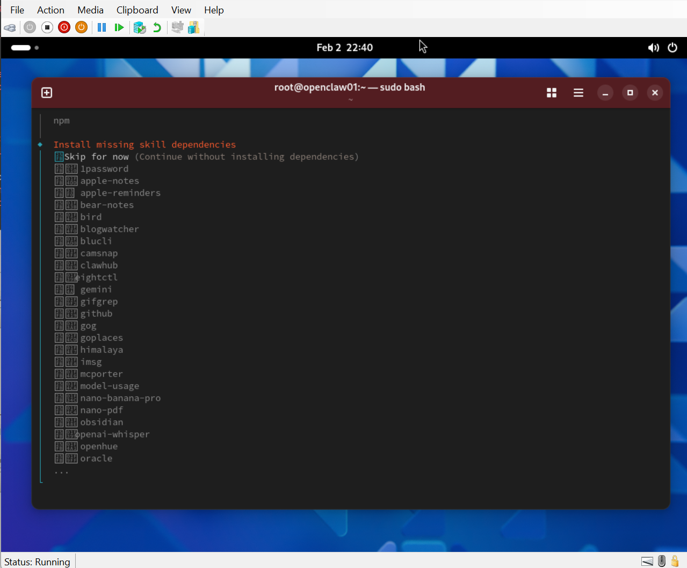

# OpenClaw

Installs Git, Node.js, and [OpenClaw](https://docs.openclaw.ai/start/getting-started).

| Guest | Command |
|---|---|
| **Amazon Linux** | `/automation/fetch-and-execute.sh virtual/guest.amazon.linux/amazon.linux.openclaw.sh` |
| **Ubuntu Desktop** | `/automation/fetch-and-execute.sh virtual/guest.ubuntu.desktop/ubuntu.desktop.openclaw.sh` |
| **Ubuntu Server** | `/automation/fetch-and-execute.sh virtual/guest.ubuntu.server/ubuntu.server.openclaw.sh` |

After reboot, configure:

```bash
openclaw onboard --install-daemon
```

**Careful: you are about to give AI some privileged access to your accounts!**



See [Getting Started](https://docs.openclaw.ai/start/getting-started).

Back to [[Amazon Linux](../guest.amazon.linux/README.md)] ·
[[Ubuntu Desktop](../guest.ubuntu.desktop/README.md)] ·
[[Ubuntu Server](../guest.ubuntu.server/README.md)]
