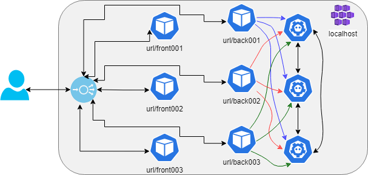

# `yuruna` cloudtalk example

Key/value replication across nodes using the [IronRSL - Key-Value Store](https://github.com/microsoft/Ironclad/blob/main/ironfleet/README.md#ironrsl---key-value-store).

Follow the instructions to create resources, build components and deploy the workloads. Connect to one of the frontends. Endpoints are exposed during the workloads deployment. Follow this playlist of videos for guidance: [2022-03 CloudTalk Deployment](https://www.youtube.com/playlist?list=PLkI9M1RY7tAu1SxfDvXhBuSjYWgx0CrfI).

## End-to-end deployment

Below are the end-to-end steps to deploy the `cloudtalk` project to `localhost` (assuming Docker is installed and Kubernetes enabled). The execution below is from the `automation` folder. You may need to start PowerShell (`pwsh`).

Before deploying, seek for `TO-SET` in the config files and set the required values. See section "Cloud deployment instructions".

**IMPORTANT**: Before proceeding, read the Connectivity section of the [Frequently Asked Questions](../../docs/faq.md).

- Create resources

```shell
./yuruna.ps1 resources ../examples/cloudtalk localhost
```

- Build the components

```shell
./yuruna.ps1 components ../examples/cloudtalk localhost
```

- Deploy the  workloads

```shell
./yuruna.ps1 workloads ../examples/cloudtalk localhost
```

### Functionality validation

Basic validation can be done by opening the browser against two different endpoints.
Set a key/value pair in one of the endpoints.
Enter the key in another endpoint and press get. You should retrieve that same value.

## Resources

Terraform will be used to create the following resources:

- Registry: {componentsRegistry}
- Clusters and corresponding local context. For localhost deployments, copies of the default context will be created.

As output, the following values will become available for later steps:

- ${env:registryName}.registryLocation
- ${context.name}.clusterIp
- ${context.name}.frontendIp
- ${context.name}.hostname

## Components

- A Docker container image for a .NET C# website.
- A component named grava, implementing a BFF (Backend For Frontend) API.
- A Docker container image for a key-value storage service, using the [IronRSL - Key-Value Store](https://github.com/microsoft/Ironclad/blob/main/ironfleet/README.md#ironrsl---key-value-store).
- [NGINX Ingress Controller](https://kubernetes.github.io/ingress-nginx)
- Azure Kubernetes Service (AKS) [HTTP application routing](https://docs.microsoft.com/en-us/azure/aks/http-application-routing)

## Workloads

- The frontend/website will be deployed to each cluster.
- The backend/BFF API will be deployed to each cluster.
- The key-value storage service will be deployed to each cluster.
- Ingress controller and redirect rules are deployed to each cluster (once only in localhost).

## Cloud deployment instructions

- Confirm [requirements](../../docs/requirements.md)
- [Authenticate](../../docs/authenticate.md) with your cloud provider

### Azure

After authentication, deploy to Azure using the following sequence. Make sure those values `TO-SET` are globally unique. The example automates the steps to deploy components and expose services, as explained in the MSDN article [Up and Running with Azure Kubernetes Services](https://docs.microsoft.com/en-us/archive/msdn-magazine/2018/december/containers-up-and-running-with-azure-kubernetes-services).

```shell
./yuruna.ps1 resources ../examples/cloudtalk azure
./yuruna.ps1 components ../examples/cloudtalk azure
./yuruna.ps1 workloads ../examples/cloudtalk azure
```

**IMPORTANT**: Remember to clean up the resources when no longer using them.

## Notes

In a localhost, using connected [IronRSLKVServer](https://github.com/microsoft/Ironclad/tree/main/ironfleet/src/IronRSLKVServer) nodes, all the components run in the same cluster. The collision is solved by different pathBase values for each instance. A difference is that each backend knows about all the RSL key-value servers.



Back to main [readme](../../README.md). Back to list of [examples](../README.md).
